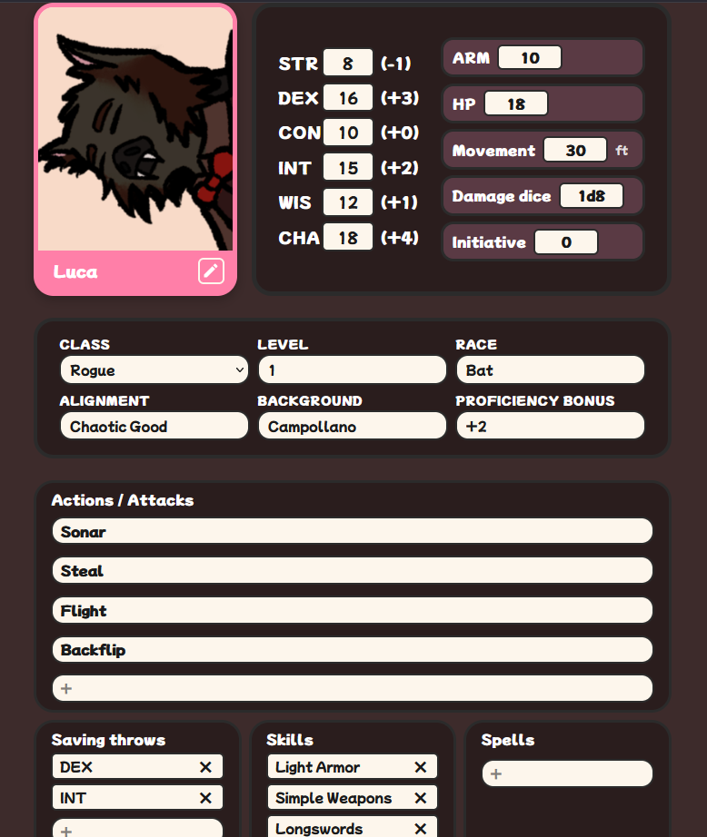
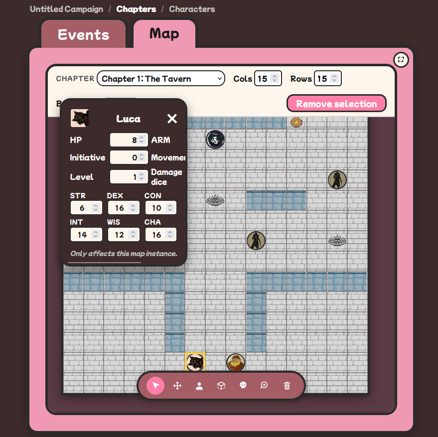

# DnDPlanner

Plataforma web para grupos que juegan **Dungeons & Dragons** y otros juegos de rol de mesa en persona. Sustituye la carpeta de hojas sueltas y los hilos de mensajes por una única aplicación con campañas, capítulos, mapas tácticos, fichas de personaje y sincronización en tiempo real entre los dispositivos de los jugadores.

🌐 **Producción:** [https://www.dndplanner.me](https://www.dndplanner.me)

---

## ¿Qué es?

DnDPlanner es un **asistente digital de campaña pensado para partidas presenciales**: el grupo se reúne físicamente, tira los dados sobre la mesa, y la aplicación se encarga de todo lo demás.

- **Campañas** con plantillas oficiales (Campollano, Resacón, GUERRA, Destinos Cruzados) o desde cero.
- **Hojas de personaje** completas: stats con modificadores automáticos, habilidades, inventario, retrato con recorte y descripción libre.
- **Mapa táctico** por cuadrícula con fichas arrastrables, sprites de terreno (paredes, trampas, objetos), fondo personalizable y anotaciones por casilla.
- **Capítulos y eventos** narrativos por campaña, con comentarios anidados entre miembros y bloques redimensionables.
- **Roles diferenciados:** DM, Co-DM y Jugador, con permisos aplicados tanto en cliente como en servidor.
- **Tiempo real** vía Socket.IO: las acciones del DM se reflejan instantáneamente en las pantallas de los jugadores.
- **Modo offline** (usuario `Testing` / `1234QWer`) para probar la aplicación sin necesidad de cuenta ni conexión.
- **Responsive completo** de 320 px (móvil pequeño) a escritorio 4K.
- **Multilingüe:** español e inglés, conmutables en caliente.

Una descripción detallada de cada funcionalidad está en [docs/02-descripcion.md](docs/02-descripcion.md).

---

## Arquitectura

```
┌─────────────────┐   HTTPS      ┌──────────────────┐   HTTP    ┌─────────────────┐
│    Navegador    │ ────────────▶│   web (nginx)    │ ─────────▶│  api (Express)  │
│  (React SPA)    │              │  · estáticos     │           │  · REST + WS    │
│                 │              │  · /api proxy    │           │  · JWT auth     │
└─────────────────┘              │  · /socket.io WS │           └────────┬────────┘
                                 └──────────────────┘                    │
                                                                         │ Mongoose
                                                                         ▼
                                                                  ┌─────────────┐
                                                                  │   MongoDB   │
                                                                  │   (Atlas    │
                                                                  │    o local) │
                                                                  └─────────────┘
```

- **Frontend:** React 18 + TypeScript + Vite + SCSS (ITCSS/BEM). [frontend/](frontend/)
- **Backend:** Express + Mongoose + Socket.IO + JWT. [backend/](backend/)
- **Base de datos:** MongoDB 7 (local en Docker Compose) o MongoDB Atlas M0 (producción).
- **Reverse proxy:** nginx 1.27 alpine sirve los estáticos y reenvía `/api/*` y `/socket.io/*` al backend.
- **Producción:** DigitalOcean App Platform con dominio propio y HTTPS automático (Let's Encrypt).

Documentación detallada de arquitectura, diagramas ER, casos de uso y diseño de API en [docs/05-diseno.md](docs/05-diseno.md).

---

## Requisitos previos

- **Node.js** ≥ 18 (recomendado 20 LTS) — para desarrollo local fuera de Docker.
- **Docker** ≥ 24 con Docker Compose v2 — para el stack completo en una sola línea.
- **Git** ≥ 2.40.
- Opcional: cuentas en **MongoDB Atlas** y **Cloudinary** para reproducir el entorno de producción.

---

## Quick start — Docker (recomendado)

```bash
# 1. Clonar el repositorio
git clone https://github.com/arodovi852/AROProyectoFinDeGrado2026.git
cd AROProyectoFinDeGrado2026

# 2. Copiar el fichero de variables de entorno y rellenar los secrets
cp .env.example .env
# Editar .env con valores reales (JWT_SECRET y JWT_REFRESH_SECRET aleatorios).

# 3. Levantar el stack completo
docker compose up -d --build

# 4. Comprobar que los tres servicios están "healthy"
docker compose ps

# 5. Abrir la app
#    http://localhost:8080
```

Verificación rápida con `curl`:

```bash
# Frontend (HTML del SPA)
curl -I http://localhost:8080

# Backend a través del proxy
curl http://localhost:8080/api/health

# Documentación OpenAPI navegable
#    http://localhost:8080/api/docs
```

Para detener:

```bash
docker compose down            # detiene contenedores, conserva la BD
docker compose down -v         # detiene Y borra el volumen Mongo (pierde datos)
```

---

## Quick start — desarrollo local sin Docker

```bash
# Backend
cd backend
cp .env.example .env             # rellenar MONGO_URI y JWTs
npm install
npm run dev                       # http://localhost:3000

# En otra terminal, frontend
cd frontend
cp .env.example .env              # VITE_API_URL=http://localhost:3000/api
npm install
npm run dev                       # http://localhost:5173
```

---

## Documentación

La documentación del proyecto vive en [docs/](docs/):

| # | Documento | Contenido |
|---|-----------|-----------|
| 01 | [Introducción](docs/01-introduccion.md) | Origen, motivación, objetivos y análisis comparativo. |
| 02 | [Descripción](docs/02-descripcion.md) | Funcionalidades, UI/UX, casos de uso. |
| 03 | [Instalación](docs/03-instalacion.md) | Setup paso a paso para desarrollo y producción. |
| 04 | [Guía de estilos](docs/04-guia-estilos.md) | Paleta, tipografías, espaciados, componentes y prototipo Figma. |
| 05 | [Diseño](docs/05-diseno.md) | Diagramas ER, casos de uso, flujos, arquitectura y diseño de API. |
| 06 | [Desarrollo](docs/06-desarrollo.md) | Cronología real, decisiones técnicas, dificultades resueltas. |
| 07 | [Pruebas](docs/07-pruebas.md) | Metodología, cobertura, resultados de la suite. |
| 08 | [Despliegue](docs/08-despliegue.md) | Proceso de despliegue paso a paso en DigitalOcean. |
| 09 | [Manual de usuario](docs/09-manual-usuario.md) | Guía completa para el usuario final. |
| 10 | [Conclusiones](docs/10-conclusiones.md) | Evaluación, lecciones aprendidas y roadmap. |

Documentación operativa adicional: [DEPLOYMENT.md](DEPLOYMENT.md).

---

## Integración y despliegue continuos

- [`.github/workflows/ci.yml`](.github/workflows/ci.yml) — en cada push y PR a `main`: lint y tests del backend (Jest + supertest + `mongodb-memory-server`), tests del frontend (Vitest + Testing Library), typecheck y build. Sube artefactos de cobertura y bundle.
- [`.github/workflows/cd.yml`](.github/workflows/cd.yml) — al pushear a `main`: build y publicación de las imágenes Docker en `ghcr.io/arodovi852/dndplanner-web` y `ghcr.io/arodovi852/dndplanner-api` con tags `:latest` y `:sha-<short>`.

DigitalOcean App Platform consume el repositorio en `main` y reconstruye los componentes en cada push gracias a `deploy_on_push: true` en [`.do/app.yaml`](.do/app.yaml).

---

## Estructura del repositorio

```
AROProyectoFinDeGrado2026/
├── .github/workflows/      # CI y CD
├── .do/app.yaml            # Spec de DigitalOcean App Platform
├── docs/                   # Documentación completa del proyecto
├── frontend/               # SPA React + Vite
│   ├── Dockerfile          # Multi-stage: Node builder + nginx runner
│   ├── nginx.conf          # Reverse proxy a /api y /socket.io
│   └── src/
├── backend/                # API Express + Socket.IO
│   ├── Dockerfile          # Node 20 alpine
│   ├── src/
│   └── tests/              # Tests Jest + supertest
├── docker-compose.yml      # Stack local completo (web + api + mongo)
├── .env.example            # Plantilla de variables de entorno
├── DEPLOYMENT.md           # Guía operativa de despliegue
└── README.md
```

---

## Capturas

| | |
|---|---|
|  |  |
|  |  |

Más capturas y vídeos en [docs/02-descripcion.md](docs/02-descripcion.md) y en el [manual de usuario](docs/09-manual-usuario.md).

---

## Licencia

ISC. Proyecto sin fines comerciales.
