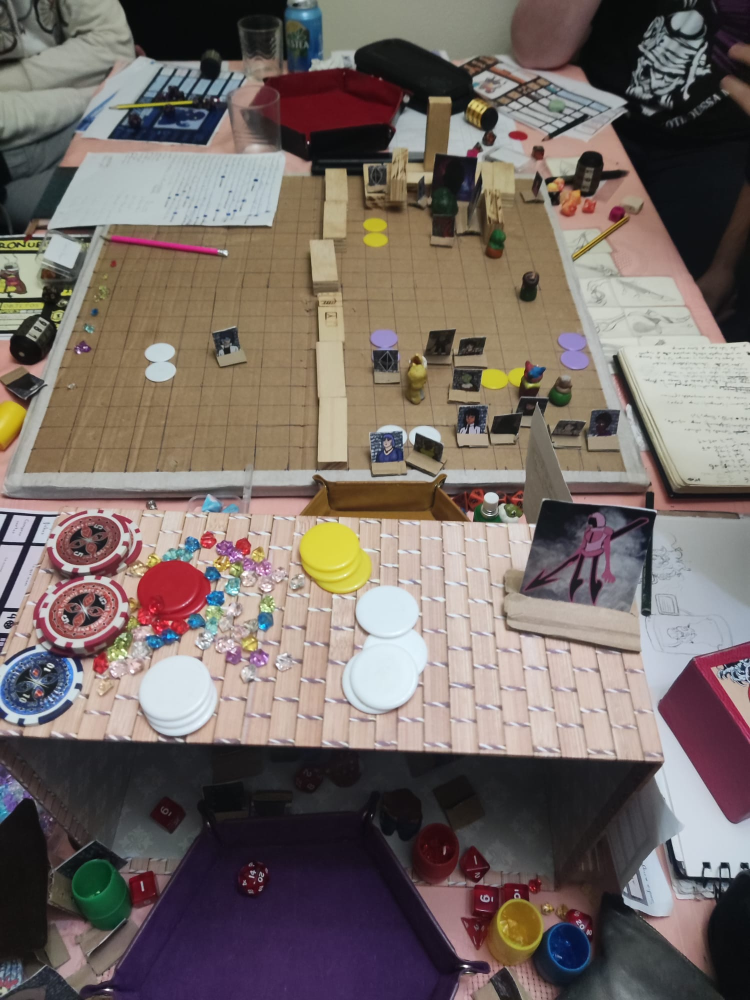
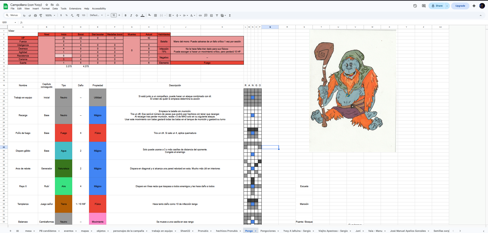
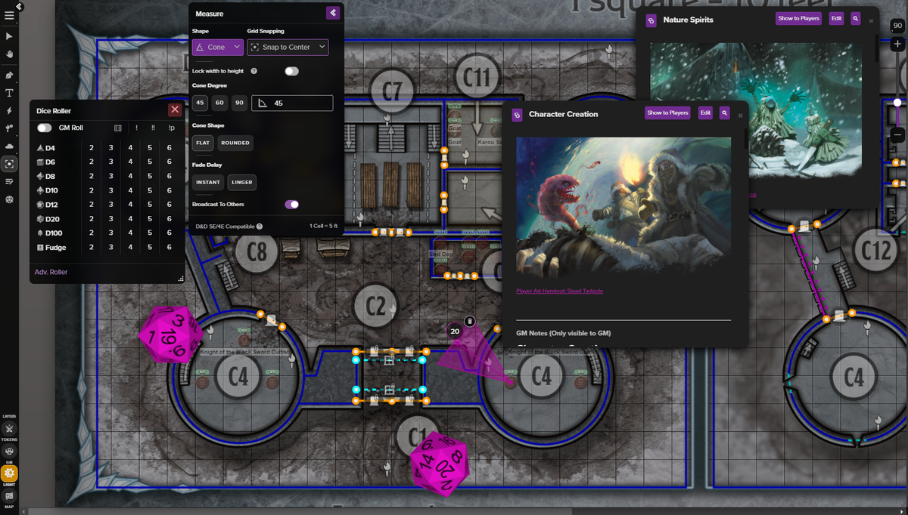
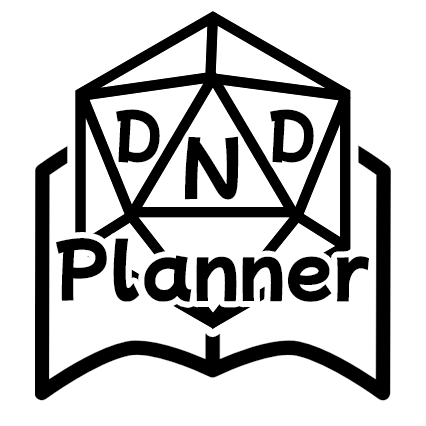
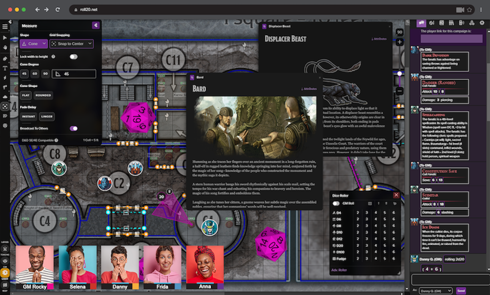
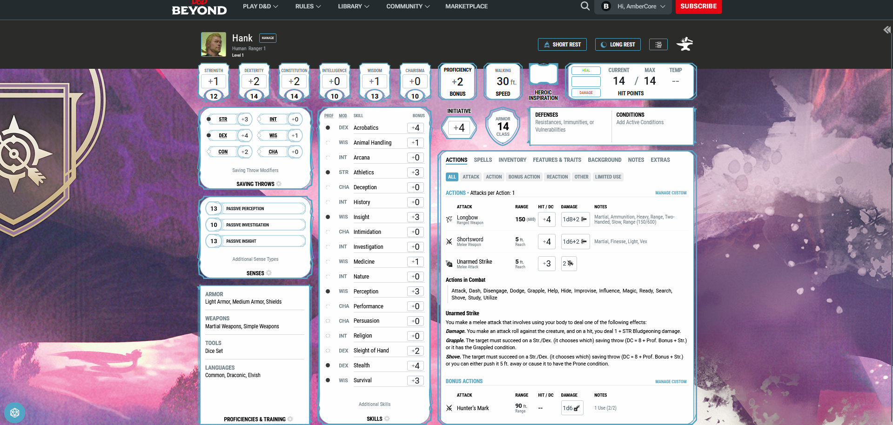

# 1. Introducción, objetivos y antecedentes

> **Proyecto:** DnDPlanner — Gestor integral de campañas para Dungeons & Dragons y otros juegos de rol de mesa.
> **Autor:** Alberto Rodríguez Oviedo
> **Curso:** 2º DAW — Proyecto Fin de Grado (2026)
> **Defensa:** principios de junio de 2026

---

## 1.1. Origen de la idea

La idea de **DnDPlanner** nace de una experiencia personal repetida durante varios años jugando *Dungeons & Dragons* (D&D 5e) con grupos de amigos. Al asumir el papel de **Dungeon Master (DM)** en distintas campañas, surgía siempre el mismo problema: la cantidad de información que un DM debe gestionar —fichas de personaje, mapas, anotaciones de sesión, secretos, NPCs, eventos pasados y futuros— rápidamente supera lo que las herramientas tradicionales (papel, hojas de cálculo, documentos sueltos) pueden organizar de manera cómoda.

Las **plataformas digitales existentes** suelen ir a uno de dos extremos:

- **Demasiado simples:** son meros generadores de hojas de personaje o repositorios de archivos PDF, sin coordinación entre jugadores ni progreso histórico de la campaña.
- **Demasiado complejas:** plataformas como *Roll20* o *Foundry VTT* ofrecen virtual tabletops completas con motores de dados, scripting, animaciones y combate por turnos, pero su curva de aprendizaje es muy alta y, sobre todo, **no están pensadas para jugar en persona**: están diseñadas para sesiones online.

DnDPlanner se posiciona deliberadamente **en el hueco intermedio**: una herramienta digital que asiste al DM y a los jugadores **durante una partida presencial**, sin sustituir el dado físico ni el mapa de cuadrícula sobre la mesa. Su rol es el de "asistente de campaña": guardar el estado, facilitar el acceso a la información, automatizar las tareas repetitivas (estadísticas, modificadores, modificación de mapas) y mantener una **memoria viva** de la campaña que sobreviva a las semanas que transcurren entre sesión y sesión.

## 1.2. Motivación

Más allá de la utilidad práctica para mis propias mesas, el proyecto sirve como **culminación técnica del ciclo formativo de Desarrollo de Aplicaciones Web (DAW)**. Reúne, en un único producto cohesionado, los tres módulos de proyecto:

| Módulo | Lo que aporta el proyecto |
|---|---|
| **Cliente Web (CW)** | SPA en React + TypeScript con interactividad rica: drag-and-drop de fichas en mapas, edición inline, validación de formularios, comunicación asíncrona y sincronización en tiempo real vía Socket.IO. |
| **Servidor Web (SW)** | API REST documentada con OpenAPI, arquitectura MVC, autenticación JWT con roles (DM, Co-DM, Jugador), modelo de datos relacional complejo en MongoDB. |
| **Diseño Web (DW)** | Sistema de diseño ITCSS + BEM con SCSS, totalmente responsive desde 320 px hasta escritorio, accesible (WCAG AA), con guía de estilos formal y prototipo en Figma. |
| **Despliegue (DAW)** | Imagen Docker, despliegue real en DigitalOcean App Platform, BBDD en MongoDB Atlas, CI/CD con GitHub Actions, dominio propio y certificado HTTPS. |

A nivel personal, el reto era construir algo **realmente terminado y desplegado**, no un prototipo "que funciona en mi máquina". Esta restricción guió todas las decisiones de arquitectura.

## 1.3. Objetivos

### 1.3.1. Objetivo general

> Diseñar, desarrollar y desplegar una aplicación web completa que permita a un grupo de jugadores de juegos de rol de mesa **gestionar el ciclo de vida completo de una campaña**: desde la creación inicial, la invitación de miembros, la composición de hojas de personaje, la planificación de capítulos y la gestión de mapas tácticos, hasta la conservación del histórico al cierre de la campaña.

### 1.3.2. Objetivos específicos

| ID | Objetivo | Criterio de éxito |
|----|----------|-------------------|
| O1 | Autenticación robusta y multi-rol | Login/registro, JWT con refresh, roles DM/Co-DM/Jugador con permisos diferenciados. |
| O2 | Modelo de datos para campañas | Persistencia en MongoDB de campañas, capítulos, eventos, personajes y mapas, con relaciones bien definidas. |
| O3 | Editor de hoja de personaje | Stats, habilidades, inventario, retrato, descripción libre. Edición inline con guardado automático. |
| O4 | Editor de capítulos y eventos | Línea temporal narrativa con anotaciones y comentarios entre miembros. |
| O5 | Mapa táctico con fichas | Mapa por celdas, fichas arrastrables, terreno editable, anotaciones, vista para jugadores con permisos restringidos. |
| O6 | Sincronización en tiempo real | Si dos miembros editan la misma campaña, los cambios se reflejan en ambas pantallas al instante (Socket.IO). |
| O7 | Modo offline / demo | Posibilidad de probar la aplicación sin servidor (usuario `Testing` que vive sólo en `localStorage`). |
| O8 | Internacionalización | Interfaz disponible en español e inglés, conmutable en caliente. |
| O9 | Diseño responsive completo | UX correcta desde 320 px (móvil pequeño) hasta 4K (escritorio). |
| O10 | Despliegue real y verificable | URL pública con HTTPS, dominio propio, CI/CD verde en cada push. |

### 1.3.3. Objetivos NO incluidos (alcance excluido)

Conscientemente fuera del alcance, para mantener el proyecto **terminado y no ambicioso e incompleto**:

- **Motor de dados.** El proyecto asume que los jugadores tiran dados físicos sobre la mesa.
- **Combate automatizado por turnos** (iniciativa, daño aplicado automáticamente, etc.).
- **Compendio de reglas** del manual del jugador. La aplicación es agnóstica al sistema de reglas: vale para D&D, Pathfinder, Call of Cthulhu o sistemas caseros.
- **Marketplace de campañas** o contenido generado por la comunidad.
- **App móvil nativa.** La web responsive cumple este rol.

## 1.4. Antecedentes y análisis comparativo

Antes de empezar realicé un análisis de las herramientas existentes para identificar qué hueco real podía cubrir DnDPlanner y qué decisiones de diseño me convenía tomar.

### 1.4.1. Roll20

> 🔗 https://roll20.net/

**Fortalezas:** virtual tabletop completa, motor de dados integrado, soporte oficial de sistemas (D&D 5e, Pathfinder, etc.), animaciones de hechizos, integración con DnDBeyond.

**Debilidades:** UI cargada y poco intuitiva, curva de aprendizaje alta, diseño pensado para jugar online (mapa central enorme, todos los jugadores conectados con webcam), modelo de precios freemium agresivo (los packs de contenido oficiales son de pago). **No está pensado para una mesa presencial** donde los jugadores miran sus propios móviles/tablets mientras el DM lleva la portátil.

### 1.4.2. Foundry VTT

> 🔗 https://foundryvtt.com/

**Fortalezas:** alternativa más potente y abierta que Roll20. Ecosistema enorme de módulos comunitarios. Pago único (no suscripción).

**Debilidades:** se ejecuta como un servidor que el DM debe alojar (en su PC o en un hosting). Requiere conocimientos técnicos. Aún más recargada visualmente que Roll20. Sigue siendo una herramienta de online play, no de presencial.

### 1.4.3. DnDBeyond

> 🔗 https://www.dndbeyond.com/

**Fortalezas:** la referencia para hojas de personaje de D&D 5e. Compendio oficial integrado. Lookup automático de hechizos y reglas.

**Debilidades:** **solo D&D 5e**, sin soporte para otros sistemas. Compras de manuales costosas (cada libro suelto cuesta varias decenas de euros). **No tiene mapas, ni anotaciones de campaña, ni planificación de sesiones**: es exclusivamente una vault de personajes y reglas.

### 1.4.4. World Anvil

> 🔗 https://www.worldanvil.com/

**Fortalezas:** worldbuilding (creación de mundos, geografía, historia, política). Útil para DMs creando lore.

**Debilidades:** no tiene fichas de personaje, ni mapas tácticos, ni gestión de sesiones. Es un "wiki" de mundo, no un asistente de partida.

### 1.4.5. Google Docs / Notion / OneNote

**Fortalezas:** gratis, ya conocidos por todos, sincronización en la nube, comentarios entre miembros.

**Debilidades:** genéricos. **Cero conocimiento de dominio**: no entienden qué es un personaje, una hoja, un mapa, un capítulo. Toda la estructura la tiene que montar el DM a mano cada vez. No hay validación de stats, ni cálculo automático de modificadores, ni visualización de mapa.

### 1.4.6. Tabla comparativa resumen

| Característica | Roll20 | Foundry | DnDBeyond | World Anvil | Google Docs | **DnDPlanner** |
|----------------|:------:|:-------:|:---------:|:-----------:|:-----------:|:--------------:|
| Hojas de personaje | ✅ | ✅ | ✅✅ | ❌ | Manual | ✅ |
| Mapa táctico | ✅ | ✅✅ | ❌ | ❌ | ❌ | ✅ |
| Capítulos / sesiones | Limitado | ✅ | ❌ | Limitado | Manual | ✅ |
| Sistema-agnóstico | ❌ | ✅ | ❌ | ✅ | ✅ | ✅ |
| Diseñado para mesa presencial | ❌ | ❌ | Parcial | ✅ | ✅ | ✅✅ |
| Curva de aprendizaje | Alta | Muy alta | Media | Alta | Baja | **Baja** |
| Gratuito | Freemium | Pago único | Caro | Freemium | Sí | **Sí** |
| Tiempo real entre miembros | ✅ | ✅ | Parcial | ❌ | ✅ | ✅ |
| Sin instalación | ✅ | ❌ | ✅ | ✅ | ✅ | ✅ |

### 1.4.7. Conclusión del análisis comparativo

Ninguna de las herramientas existentes cubre el caso "**asistente de campaña ligero, system-agnostic, para mesas presenciales, gratuito y accesible desde el móvil**". Roll20 y Foundry son demasiado pesados; DnDBeyond es exclusivo de D&D 5e y carece de mapas; los documentos genéricos no entienden de partidas. **Ese hueco es el que DnDPlanner pretende ocupar.**

## 1.5. Usuarios objetivo

- **DM amateur** que dirige una campaña de fin de semana con amigos. Necesita una herramienta que le ayude a no perder el hilo entre sesión y sesión, pero no quiere dedicar 20 horas a aprender Foundry.
- **Jugador habitual** que quiere acceder a su hoja desde el móvil durante la partida sin sacar un papel arrugado.
- **Grupos que mezclan presencial y remoto.** Algunos miembros físicamente en la mesa, otros conectados desde otra ciudad. DnDPlanner sirve a ambos por igual.
- **DMs experimentados que prueban sistemas distintos** y necesitan una herramienta que no les obligue a un sistema concreto.

## 1.6. Hipótesis del proyecto

> **Una aplicación web ligera, sincronizada en tiempo real y centrada en la gestión de información de campaña (no en la sustitución de la mesa física) puede ofrecer valor real al colectivo de jugadores de rol presencial sin caer en la complejidad de las virtual tabletops existentes.**

Las secciones posteriores (especialmente **10. Conclusiones**) evalúan en qué grado se ha confirmado o no esta hipótesis.

---

> 📁 **Carpeta de assets recomendada**
> Todas las imágenes/GIFs/vídeos referenciados desde la documentación se deben guardar en `docs/assets/` y nombrarse con el prefijo del documento que las referencia (`01-`, `02-`, etc.) para facilitar la trazabilidad.
