# 2. Descripción

Este documento describe **qué hace** DnDPlanner: cada funcionalidad principal, la interfaz de usuario que la expone, los tipos de usuarios que existen y los casos de uso para los que se ha diseñado.

---

## 2.1. Visión general del producto


DnDPlanner se organiza alrededor del concepto de **Campaña**. Una campaña es el contenedor maestro: agrupa miembros, capítulos, personajes y eventos. Una persona puede ser miembro de varias campañas, con un rol distinto en cada una.

El árbol mental del producto es:

```
Usuario
└── Campaña (DM, Co-DM o Jugador)
    ├── Miembros (con rol asignado)
    ├── Personajes (jugador o enemigo)
    │   └── Hoja de personaje (stats, inventario, retrato, descripción)
    ├── Capítulos (línea temporal de la campaña)
    │   ├── Eventos / anotaciones narrativas
    │   └── Mapa táctico (cuadrícula, fichas, terreno, anotaciones)
    └── Plantillas (capítulos predefinidos para campañas oficiales)
```

## 2.2. Tipos de usuario y roles

DnDPlanner distingue **tres tipos de usuario** desde el punto de vista del sistema, y **tres roles** desde el punto de vista de cada campaña.

### 2.2.1. Tipos de usuario del sistema

| Tipo | Descripción | Persistencia |
|---|---|---|
| **Anónimo** | Visitante no autenticado. Solo puede ver campañas marcadas como públicas y las páginas de información (about, terms, etc.). | Ninguna. |
| **Registrado** | Usuario con cuenta en MongoDB Atlas. Login con email + contraseña, sesión vía JWT con refresh token. | Permanente. Datos sincronizados entre dispositivos. |
| **Testing (demo)** | Usuario especial para probar la app sin backend. Credenciales fijas (`Testing` / `1234QWer`). Todos los datos viven en `localStorage`. | Local al navegador. Se pierden al limpiar caché. |

El **modo Testing** fue una decisión deliberada: permite mostrar la aplicación en una defensa, en una entrevista o en una demo sin depender de internet, sin que el evaluador tenga que registrarse y sin que el contenido de demo contamine la base de datos real.

### 2.2.2. Roles dentro de una campaña

| Rol | Permisos clave |
|---|---|
| **DM (Dungeon Master)** | Control total. Crea/edita/elimina capítulos, mapas, eventos. Edita cualquier personaje. Invita miembros, asigna roles. Cambia visibilidad y nombre de la campaña. Elimina la campaña. |
| **Co-DM** | Casi idénticos al DM. Usado para cuando hay dos personas dirigiendo conjuntamente. *No* puede eliminar la campaña. |
| **Jugador (Player)** | Solo edita los personajes que tiene asignados. Mapa y eventos son **solo lectura**. Ve a todos los personajes (incluidos enemigos), pero solo modifica los suyos. No invita miembros ni cambia configuración. |

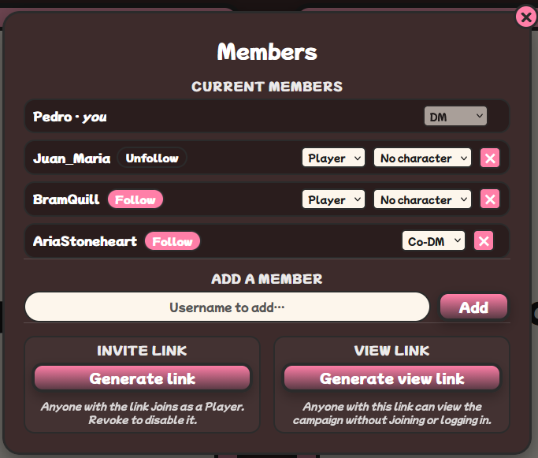

Las decisiones de UI reflejan estos permisos: por ejemplo, en el mapa táctico, un jugador ve la barra de herramientas (lápiz, mover, etc.) **deshabilitada** y un mensaje "solo lectura".

## 2.3. Funcionalidades principales

A continuación se describe cada una de las funcionalidades, agrupadas por área. Para cada una se indica una **ruta** (`/url`) y una **captura sugerida**.

### 2.3.1. Autenticación y gestión de cuenta

#### Registro


Formulario clásico con validación en cliente y servidor:
- Username único (3-30 caracteres alfanuméricos).
- Email con formato válido y único.
- Contraseña ≥ 8 caracteres, con al menos un número y una mayúscula.
- Confirmación de contraseña.

Tras el registro, se inicia sesión automáticamente y se redirige a `/main`.

#### Login

Formulario con username (o email) + contraseña. La respuesta del backend incluye un **access token** (15 min de vida) y un **refresh token** (7 días). El cliente refresca automáticamente el access token cuando expira.

#### Cambio de email y contraseña

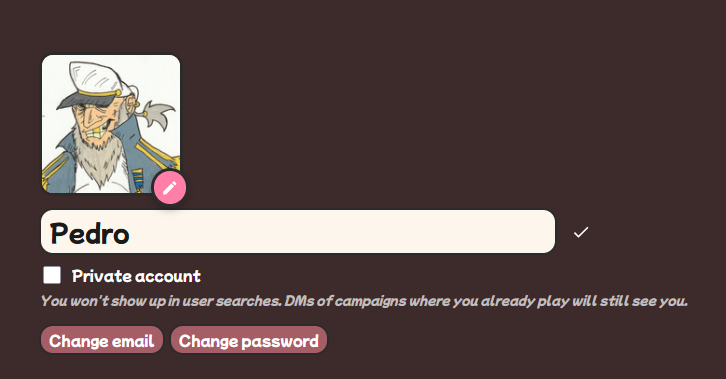

En [/profile](frontend/src/pages/ProfilePage.tsx) en modo edición, hay dos botones:
- **Change email** → input para el nuevo email.
- **Change password** → contraseña actual + nueva + confirmación.

Ambos producen un mensaje de éxito o error inline.

#### Modo Testing (demo offline)

Las credenciales `Testing` / `1234QWer` no llegan al backend: el `AuthContext` las intercepta y crea un usuario virtual con `id = 'demo-testing-user'`. Todas las operaciones (`createCampaign`, `updateCharacter`, etc.) se persisten en `localStorage` bajo claves namespaced (`dndplanner:demo:campaigns`, etc.).

### 2.3.2. Página principal (Dashboard)


La portada [/main](frontend/src/pages/MainPage.tsx) se adapta según el estado de sesión:

- **Visitante anónimo:** hero con eslogan ("Manage your campaigns…"), botones grandes de "Sign in" y "Register", y una fila inferior de campañas marcadas como públicas (vista de "qué se puede hacer aquí").
- **Usuario logueado:** se mantiene el hero pero se sustituyen los CTA por un buscador. Aparecen dos filas: "Tus campañas" (las propias) y "Campañas destacadas" (públicas de la comunidad). Cada fila es un **scroll horizontal** (con flechas en escritorio y swipe en móvil).

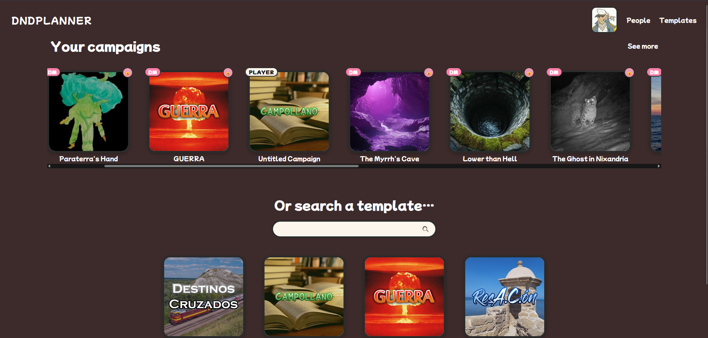

### 2.3.3. Perfil del usuario


[/profile](frontend/src/pages/ProfilePage.tsx) (propio) y [/profile/:userId](frontend/src/pages/UserProfilePage.tsx) (de otros usuarios) son simétricas excepto en las acciones disponibles. El perfil propio tiene un botón "✏ Editar" que activa:

- Avatar editable (botón pequeño en la esquina del retrato).
- Nombre editable inline.
- Descripción editable en un `<textarea>`.
- Toggle "Cuenta privada" (oculta perfil a usuarios anónimos).
- Sección "Seguridad" (ver 2.3.1).
- Cada campaña en modo edición muestra los controles `◀ ▶ ⤴ ×` (mover orden, cambiar imagen, eliminar) y un input para renombrar.


Los perfiles de **otros usuarios** muestran el botón "Seguir" / "Dejar de seguir" (sistema de followers documentado en [05-diseno.md](05-diseno.md)).

### 2.3.4. Creación de una campaña

El wizard [/creatorSelector](frontend/src/pages/CreatorSelectorPage.tsx) presenta **cinco plantillas**:

| Plantilla | Capítulos | Descripción |
|---|---|---|
| **Blank** | 0 | Campaña vacía, para empezar de cero. |
| **Campollano** | 12 | Plantilla pre-rellenada con la campaña *Campollano*. |
| **Resacón / ResA.C.ón** | 5 | Adaptación de la peli en clave de rol. |
| **GUERRA** | 4 | Campaña bélica corta. |
| **Destinos Cruzados** | 7 | Aventura clásica de fantasía. |

El usuario que crea la campaña es automáticamente **DM**.

### 2.3.5. Hub de campaña

Tras seleccionar (o crear) una campaña, se llega a [/chapterOrCharacter](frontend/src/pages/ChapterOrCharacterPage.tsx), el "hub" de la campaña. Dos tarjetas grandes (Capítulos / Personajes) en el centro, una barra superior con:

- Nombre de la campaña (clickable para renombrar, solo DM/Co-DM).
- Toggle 🔒/🌐 de visibilidad pública/privada.
- Botón 🖼 para cambiar la imagen de portada.
- Botón "Miembros · N".
- Botón "🗑 Eliminar campaña" (esquina inferior, solo DM).

### 2.3.6. Panel de miembros e invitaciones


El modal [MembersPanel](frontend/src/components/shared/MembersPanel.tsx) permite al DM:

1. **Ver** la lista actual de miembros.
2. **Asignar un rol** a cada miembro (DM / Co-DM / Player).
3. **Asignar un personaje** existente al miembro (sólo a Jugadores).
4. **Eliminar** a un miembro.
5. **Generar / regenerar** un link de invitación: `https://dominio/invite/<token>`. Cualquiera con el link y autenticado se une como Jugador.

#### Página de invitación

### 2.3.7. Capítulos y eventos


Los capítulos son la **línea temporal narrativa** de la campaña. Cada uno tiene:

- **Eventos** (anotaciones cronológicas): texto libre con autor, fecha y replies. Pensados para apuntar momentos importantes de la sesión.
- **Mapa táctico** (ver 2.3.8).


Los eventos son **públicos a todos los miembros** de la campaña. El DM puede marcar eventos como "secretos" (visibles solo para él), aunque por defecto todos los miembros ven todo.

### 2.3.8. Mapa táctico


El mapa táctico ([MapCanvas](frontend/src/pages/ChapterPage/MapCanvas.tsx)) es el componente más complejo del proyecto. Funcionalidades:

| Herramienta | Acción |
|---|---|
| ✋ **Mover** | Selecciona y arrastra fichas por la cuadrícula. |
| 🖌 **Pintar terreno** | Aplica un color/tipo a las celdas (montaña, agua, bosque…). |
| 📍 **Anotar** | Coloca un marcador con texto que aparece al hacer hover. |
| 🗑 **Borrar** | Elimina contenido de la celda (terreno, anotación o ficha). |
| 🔍 **Stats popup** | Click en una ficha → popup con HP, AC, stats y habilidades. |

Los **jugadores** ven el mapa pero todas las herramientas están deshabilitadas (banner "solo lectura"). Pueden hacer clic en cualquier ficha para ver sus stats (lo que se sabe en la mesa). Esta restricción se aplica tanto en cliente (UI gris) como en servidor (las mutaciones devuelven `403 Forbidden`).

### 2.3.9. Personajes y hoja de personaje


Cada personaje tiene una **hoja de personaje** completa accesible en [/character/:characterId](frontend/src/pages/CharacterSheetPage.tsx):


Secciones de la hoja:

1. **Cabecera**: retrato (editable con crop modal), nombre, clase, raza, alineamiento, background, nivel, proficiency bonus.
2. **Stats principales**: STR / DEX / CON / INT / WIS / CHA, cada uno con su modificador calculado automáticamente.
3. **Combat panel**: HP máximo / actual / temporal, AC, iniciativa, velocidad.
4. **Habilidades**: lista filtrable (Athletics, Acrobatics, etc.) con proficiency toggle.
5. **Listas**: hechizos, equipamiento, inventario. Cada item con nombre y descripción.
6. **Descripción libre**: textarea para backstory / notas.

Los **jugadores** solo pueden editar las hojas de los personajes que tienen asignados. Pueden **ver** las de los demás (incluidos enemigos, igual que en el mapa: lo que sabe la mesa).

#### Recorte de imagen (Image Crop Modal)

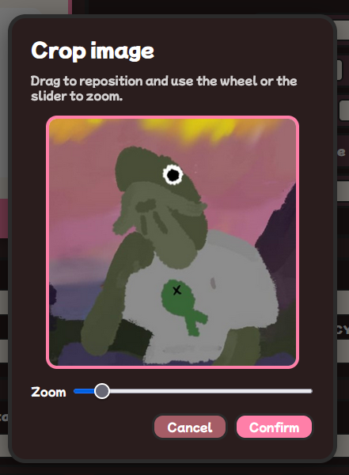

Al subir un retrato (avatar o portrait de personaje), se abre un modal de recorte con zoom y arrastre. El recorte final se exporta como base64 a 320×320 px.

### 2.3.10. Plantillas

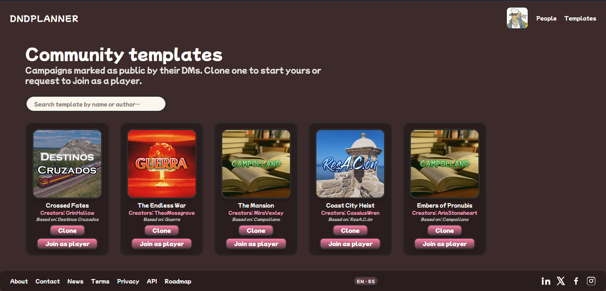

[/templates](frontend/src/pages/TemplatesPage.tsx) lista las plantillas oficiales con detalle. Se accede a ella desde el wizard de creación o directamente desde la barra de navegación.

### 2.3.11. Visibilidad pública y vista compartible

Cada campaña tiene un toggle **público / privado**:

- **Privado** (por defecto): solo miembros pueden verla.
- **Público**: aparece en el dashboard de "Campañas destacadas" del `/main`. Cualquier visitante (incluso sin login) puede acceder en modo lectura.

Adicionalmente, el DM puede generar un **link de vista** (`/view/:viewToken`) que permite a alguien NO miembro ver la campaña sin necesidad de cuenta. Útil para enseñarla a alguien sin que se cree usuario.

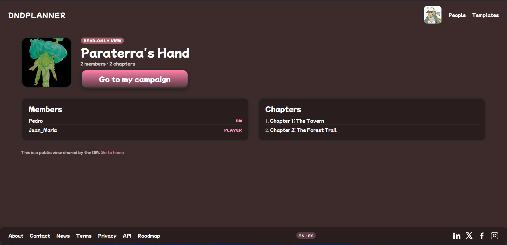

### 2.3.12. Usuarios y sistema de follow


[/users](frontend/src/pages/UsersPage.tsx) es el directorio público de usuarios (que no han marcado su perfil como privado). Buscador con autocompletado. Cada fila lleva al perfil del usuario.

Desde el perfil de otro usuario se puede **seguir / dejar de seguir**. Los usuarios seguidos no tienen una funcionalidad activa todavía (no hay feed de actividad); el sistema está preparado para extenderse.

### 2.3.13. Páginas de información

Las siguientes páginas son estáticas pero forman parte del producto:

- [/about](frontend/src/pages/info/AboutPage.tsx): quién hizo el proyecto y por qué.
- [/contact](frontend/src/pages/info/ContactPage.tsx): formulario de contacto.
- [/news](frontend/src/pages/info/NewsPage.tsx): registro de cambios visibles para el usuario.
- [/terms](frontend/src/pages/info/TermsPage.tsx): términos y condiciones.
- [/privacy](frontend/src/pages/info/PrivacyPage.tsx): política de privacidad.
- [/api](frontend/src/pages/info/ApiPage.tsx): referencia a la documentación OpenAPI pública (`/api/docs`).
- [/roadmap](frontend/src/pages/info/RoadmapPage.tsx): funcionalidades futuras planeadas.

### 2.3.14. Sincronización en tiempo real

Cuando dos miembros tienen abierta la misma campaña, los cambios se propagan en tiempo real vía **Socket.IO**:

- Mover una ficha en el mapa → todos lo ven al instante.
- Añadir un evento → aparece en el timeline de todos.
- Editar el HP de un personaje → se refleja en la hoja de quien la tenga abierta.

Si el socket se desconecta, el cliente sigue funcionando contra el caché local y reintenta la conexión con backoff exponencial.

### 2.3.15. Internacionalización (i18n)

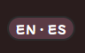

La interfaz está disponible en **español** y **inglés**, conmutable en caliente desde el selector del footer. La traducción se gestiona con `react-i18next` y los catálogos viven en `frontend/src/i18n/`.

## 2.4. Interfaz de usuario y experiencia (UI/UX)

### 2.4.1. Principios de diseño

1. **Temático sin sacrificar usabilidad.** El producto está orientado a un público de rol de mesa, por lo que la tipografía (Cinzel para títulos), la paleta (rosa-rojizo apagado, beige pergamino) y los iconos (escudos, dragones) evocan el mundo de fantasía sin caer en lo "cargado". Todo elemento decorativo debe seguir siendo legible.
2. **Mobile first real.** El proyecto se diseñó probando primero en 320 px (móvil pequeño) y escalando hacia escritorio, no al revés. Todas las decisiones de layout pasan por "¿esto cabe y es usable en un iPhone SE?".
3. **Permisos visibles en la UI.** Los botones que un usuario no puede pulsar **no se muestran ocultos**, se muestran deshabilitados con tooltip explicativo. El usuario entiende qué podría hacer si tuviera otro rol.
4. **Accesibilidad WCAG AA.** Outline visible en focus, contraste mínimo cumplido, labels en todos los inputs, navegación por teclado funcional.

### 2.4.2. Layout responsive

El producto se adapta a **tres breakpoints principales**:

| Breakpoint | Comportamiento clave |
|---|---|
| **≤ 360 px** | Móviles pequeños. Layouts en una sola columna, scrolls horizontales reemplazados por verticales, menú hamburguesa, modales casi a pantalla completa. |
| **≤ 480 px** | Móviles modernos. Hamburguesa activa, paddings reducidos, hub de campaña con toolbar en flujo (no flotante). |
| **≤ 768 px** | Tablets. Cards en columna, secciones apiladas. |
| **> 768 px** | Escritorio. Layouts en grid de 2-3 columnas, toolbar flotantes, scrolls horizontales en filas de campañas. |

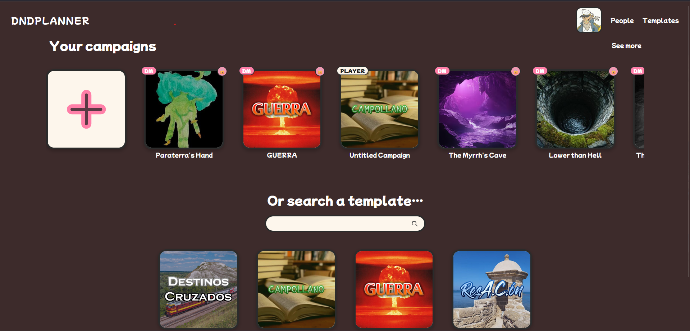

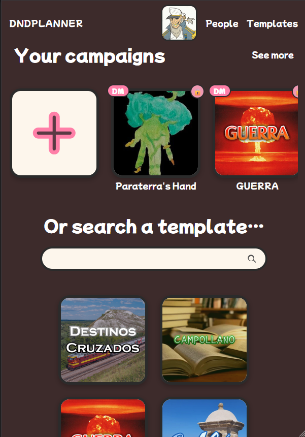

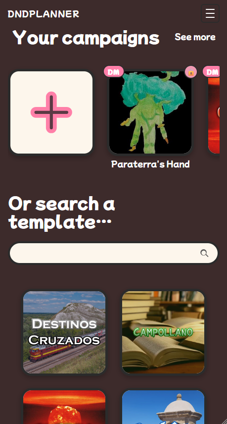

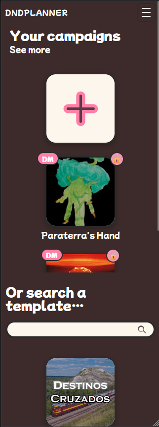

### 2.4.3. Navegación

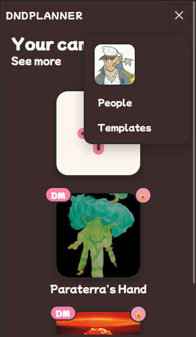

El header global (`Header.tsx`) tiene:

- Logo "DnDPlanner" (lleva a `/main`).
- Enlaces: Main, Campaigns, Users, Profile.
- Selector de idioma (en footer en algunas vistas, en header en otras).
- En móvil (≤ 480 px), los enlaces se ocultan tras un botón hamburguesa que despliega un panel.

### 2.4.4. Feedback al usuario

- **Confirmaciones destructivas:** eliminar una campaña, un personaje, un capítulo, cambiar visibilidad de público a privado abre un `ConfirmModal` con texto descriptivo.
- **Errores de red:** snackbar inline en formularios. Si el backend devuelve 401, se hace logout silencioso y se redirige al login.
- **Estados de carga:** spinner global mientras se valida el JWT al recargar.

## 2.5. Casos de uso típicos

### 2.5.1. Caso de uso 1: DM prepara una sesión

1. María se registra en DnDPlanner. Crea una nueva campaña usando la plantilla **Resacón**.
2. Genera un link de invitación y lo comparte por WhatsApp con sus tres jugadores.
3. Los jugadores se registran, abren el link y entran como Jugadores. María les asigna un personaje a cada uno.
4. María crea el **Capítulo 1**. Diseña el mapa de la primera escena: una taberna con tres mesas, dos NPCs (camarera y borracho) y una salida lateral.
5. Añade un evento "Los héroes despiertan en la taberna sin recordar la noche anterior" como prólogo.
6. Cierra sesión, satisfecha.

### 2.5.2. Caso de uso 2: jugadores en una partida presencial

1. Sábado por la noche. Los cuatro están alrededor de una mesa con sus móviles abiertos en DnDPlanner.
2. María comparte la pantalla de su portátil con el mapa táctico en una TV.
3. Los jugadores acceden a su hoja desde el móvil; pueden ver sus stats, tirar dados físicos y actualizar HP manualmente cuando reciben daño.
4. Cuando uno de ellos abre el inventario y añade una poción encontrada, los demás lo ven al instante en sus pantallas (Socket.IO).
5. María, desde la portátil, mueve las fichas en el mapa de la TV; los jugadores lo ven simultáneamente en sus móviles.

### 2.5.3. Caso de uso 3: visitante curioso

1. Carlos no juega rol, pero su prima le ha hablado de DnDPlanner.
2. Entra en `https://dndplanner.me`. No tiene cuenta.
3. Ve el hero con el eslogan, varias campañas públicas destacadas y un botón "Explora".
4. Hace clic en la campaña "Destinos Cruzados" (una pública compartida por la comunidad). Lee los capítulos y la lista de personajes sin necesidad de registrarse.
5. Decide registrarse para crear su propia campaña.

### 2.5.4. Caso de uso 4: defensa de proyecto en una facultad sin internet

1. Día de la defensa. La conexión wifi de la sala falla.
2. El proyector muestra la app local en `localhost:5173`.
3. Se hace login con `Testing` / `1234QWer`. Todo funciona contra `localStorage`.
4. Se crea una campaña delante del tribunal, se invita un "jugador" virtual, se diseña un mapa, se mueve una ficha. La sincronización en tiempo real **no** se muestra (requiere backend), pero el resto sí.
5. Tras la defensa, esos datos pueden borrarse limpiando el `localStorage` o quedarse, ya que no contaminan ninguna base de datos.

## 2.6. Lo que DnDPlanner NO hace

Para evitar expectativas equivocadas:

- **No tira dados.** Asume dados físicos en la mesa.
- **No aplica reglas.** No sabe si un hechizo concreto cura o daña; el DM lleva la interpretación.
- **No tiene IA.** No genera NPCs, ni descripciones, ni mapas automáticos.
- **No es un compendio.** No incluye reglas de D&D ni hechizos predefinidos.
- **No facturable.** Es un proyecto educativo. No hay planes premium ni anuncios.

---

> 📁 **Continuación**
> El detalle técnico de cómo se implementa cada funcionalidad se desarrolla en [05-diseno.md](05-diseno.md) (arquitectura y diagramas) y [06-desarrollo.md](06-desarrollo.md) (decisiones de implementación y código).
