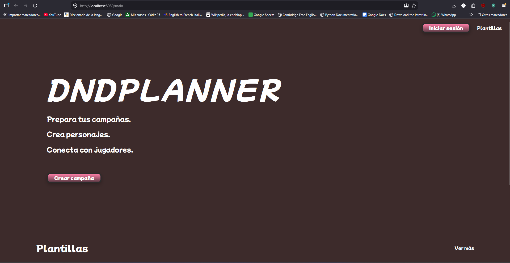
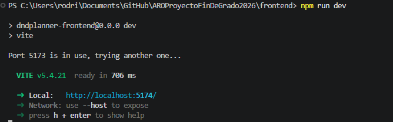
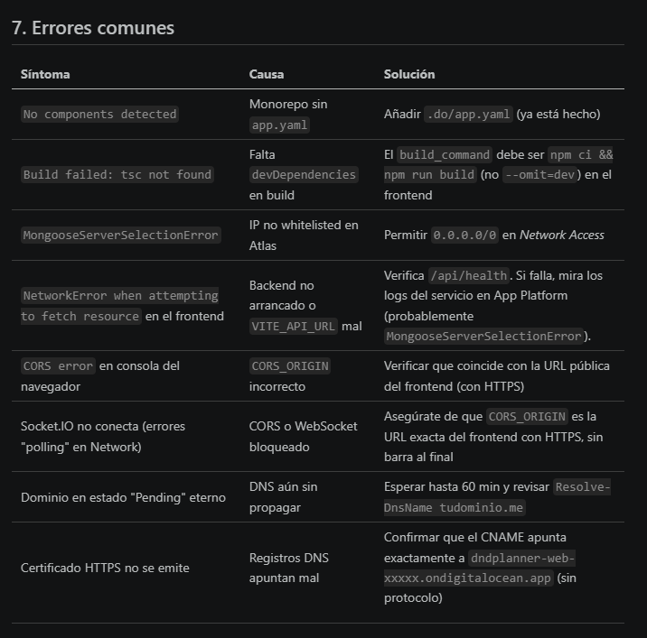

# 3. Instalación y preparación

Este documento explica, paso a paso, cómo poner DnDPlanner en marcha desde cero. Hay **dos vías**: la rápida con Docker (recomendada para evaluación y para cualquiera que quiera probar la aplicación entera en 5 minutos) y la de desarrollo local (necesaria si vas a tocar el código).

Para el despliegue en producción (DigitalOcean App Platform + MongoDB Atlas + dominio propio) hay un documento dedicado: [08-despliegue.md](08-despliegue.md).

---

## 3.1. Requisitos previos

Antes de empezar, asegúrate de tener instaladas las siguientes herramientas:

| Herramienta | Versión mínima | Recomendada | Para qué |
|---|---|---|---|
| **Node.js** | 18.x | 20 LTS | Backend (Express) y frontend (Vite). Solo necesario para la vía de desarrollo local. |
| **npm** | 9.x | 10.x | Viene con Node. Para instalar dependencias. |
| **Docker Desktop** | 24.x | 27.x | Para la vía recomendada (compose). Incluye Docker Compose v2. |
| **Git** | 2.40 | última | Para clonar el repositorio. |
| **PowerShell** (Windows) o **bash** (Linux/macOS) | — | — | Los snippets de esta guía están en PowerShell, pero todo es equivalente en bash. |

Opcionalmente, para reproducir el entorno de producción:

| Servicio | Plan | Para qué |
|---|---|---|
| **MongoDB Atlas** | M0 (gratis) | BBDD gestionada. Sustituye al contenedor `mongo` local. |
| **Cloudinary** | Free (25 GB) | Almacenamiento de imágenes (retratos de personaje). |
| **DigitalOcean** | App Platform Basic XXS | Hosting del backend (cubierto por créditos del GitHub Student Pack). |
| **GitHub Student Pack** | Gratis para estudiantes | Concentra los créditos anteriores: $200 en DO + dominio Name.com gratis. |


### Verificación rápida del entorno

```powershell
# Comprueba versiones (todos deben responder sin error):
node --version              # >= v18
npm --version               # >= 9
docker --version            # >= 24
docker compose version      # v2
git --version               # >= 2.40
```

Si alguno falla con *"no se reconoce como cmdlet"*, instálalo desde su web oficial y abre una nueva ventana de PowerShell (las variables de entorno solo se cargan al iniciar el shell).

---

## 3.2. Clonado del repositorio

```powershell
git clone https://github.com/arodovi852/DnDPlanner.git
cd DnDPlanner
```


Estructura clave del repositorio:

```
DnDPlanner/
├── frontend/              # React + TypeScript + Vite (SPA)
├── backend/               # Express + Socket.IO + Mongoose
├── docs/                  # Documentación del PFG (este archivo incluido)
├── .github/workflows/     # Pipelines CI y CD
├── .do/app.yaml           # Spec de DigitalOcean App Platform
├── docker-compose.yml     # Orquestación local de los 3 servicios
├── .env.example           # Plantilla de variables de entorno
├── DEPLOYMENT.md          # Guía de despliegue en producción
└── README.md              # Quick start
```

---

## 3.3. Vía A: Docker (recomendada)

Esta es la forma más rápida de tener la aplicación entera (frontend + backend + base de datos) funcionando en local. No necesitas instalar Node ni MongoDB: Docker se encarga de todo.

### 3.3.1. Preparar variables de entorno

```powershell
Copy-Item .env.example .env
```

El fichero `.env` contiene los secretos del stack. Hay que rellenar al menos:

- `JWT_SECRET`: clave para firmar los access tokens. Mínimo 32 bytes aleatorios.
- `JWT_REFRESH_SECRET`: clave para firmar los refresh tokens. Diferente a la anterior.

Para generar valores válidos en PowerShell 7+:

```powershell
[Convert]::ToHexString((1..32 | ForEach-Object { Get-Random -Maximum 256 }))
```

En PowerShell 5.1 (Windows por defecto), usa este equivalente:

```powershell
$bytes = New-Object byte[] 32
(New-Object System.Security.Cryptography.RNGCryptoServiceProvider).GetBytes($bytes)
($bytes | ForEach-Object { $_.ToString('x2') }) -join ''
```

Ejecuta el comando **dos veces** (una para cada secret) y pega los valores en `.env`.

Las variables de Cloudinary (`CLOUDINARY_*`) son **opcionales**: si las dejas vacías, los endpoints de subida de imágenes responderán con error pero el resto de la aplicación funciona perfectamente. Puedes añadirlas más tarde.


### 3.3.2. Levantar el stack

```powershell
docker compose up -d --build
```

El primer arranque tarda 30-60 segundos: descarga las imágenes base (`node:20-alpine`, `nginx:1.27-alpine`, `mongo:7`), construye las imágenes del proyecto e inicializa la base de datos.

### 3.3.3. Comprobar que todo está OK

```powershell
docker compose ps
```

Debes ver tres servicios en estado `(healthy)`:

```
NAME               IMAGE                  STATUS                  PORTS
dndplanner-api     dndplanner-api:local   Up 16 seconds (healthy) 3000/tcp
dndplanner-mongo   mongo:7                Up 22 seconds (healthy) 27017/tcp
dndplanner-web     dndplanner-web:local   Up 10 seconds (healthy) 0.0.0.0:8080->80/tcp
```


### 3.3.4. Verificación con curl

```powershell
# Frontend (debe responder 200 OK con HTML)
curl.exe -I http://localhost:8080

# Backend a través del proxy (debe responder con JSON)
curl.exe http://localhost:8080/api/health
# → {"success":true,"message":"DnDPlanner API is running","timestamp":"..."}

# Documentación OpenAPI
Start-Process http://localhost:8080/api/docs
```

### 3.3.5. Abrir la aplicación

```powershell
Start-Process http://localhost:8080
```

Verás la portada de DnDPlanner. Para probar sin registrarte, usa el botón **"Modo Testing"** o haz login con:

- Usuario: `Testing`
- Contraseña: `1234QWer`



### 3.3.6. Operaciones habituales

```powershell
# Ver logs de un servicio en vivo
docker compose logs -f api

# Reiniciar solo el backend (tras cambios en el código)
docker compose restart api

# Reconstruir tras cambios en Dockerfile o en package.json
docker compose up -d --build

# Detener el stack (conserva los datos de la BD)
docker compose down

# Detener Y borrar los datos (volumen incluido, IRREVERSIBLE)
docker compose down -v
```

---

## 3.4. Vía B: desarrollo local (sin Docker)

Esta vía es la que se usa para **modificar el código**. El frontend con Vite ofrece hot-reload, y el backend con `nodemon` se reinicia solo al guardar.

### 3.4.1. Backend

```powershell
cd backend
Copy-Item .env.example .env
# Edita .env y rellena al menos MONGO_URI, JWT_SECRET y JWT_REFRESH_SECRET.
npm install
npm run dev                    # http://localhost:3000
```

Variables del `.env` del backend:

```env
MONGO_URI=mongodb://localhost:27017/dndplanner    # o tu cluster Atlas
PORT=3000
JWT_SECRET=<32 bytes hex>
JWT_REFRESH_SECRET=<32 bytes hex>
JWT_EXPIRES_IN=15m
JWT_REFRESH_EXPIRES_IN=7d
CORS_ORIGIN=http://localhost:5173                 # origen del frontend de Vite
CLOUDINARY_CLOUD_NAME=
CLOUDINARY_API_KEY=
CLOUDINARY_API_SECRET=
```

Para tener una MongoDB local sin instalar nada, puedes lanzar **solo** el servicio `mongo` del compose:

```powershell
docker compose up -d mongo
# Luego en .env del backend: MONGO_URI=mongodb://localhost:27017/dndplanner
# Necesita publicar el puerto: descomentar `ports: ["27017:27017"]` en docker-compose.yml
```

Alternativa más limpia: usar MongoDB Atlas (M0 gratis). Crea un cluster, copia la URI con usuario/contraseña y úsala como `MONGO_URI`.

### 3.4.2. Frontend

En otra terminal:

```powershell
cd frontend
Copy-Item .env.example .env
# Edita .env y deja:
# VITE_API_URL=http://localhost:3000/api
npm install
npm run dev                    # http://localhost:5173
```

Vite levanta un servidor de desarrollo con hot-module-replacement (HMR): al guardar un componente React, el cambio aparece en el navegador sin recargar la página, conservando el estado.



### 3.4.3. Scripts útiles

#### Backend

```powershell
cd backend
npm run dev          # Servidor con nodemon (auto-restart)
npm start            # Servidor en modo producción
npm test             # Tests Jest contra mongodb-memory-server
npm run test:watch   # Tests en watch mode
npm run lint         # ESLint
```

#### Frontend

```powershell
cd frontend
npm run dev          # Vite dev server con HMR
npm run build        # tsc -b && vite build → /dist
npm run preview      # Sirve /dist localmente
npm run lint         # ESLint
```

---

## 3.5. Variables de entorno (referencia completa)

### 3.5.1. Variables del compose (`/.env`)

| Variable | Obligatoria | Por defecto | Descripción |
|---|:---:|---|---|
| `JWT_SECRET` | ✅ | — | Clave para firmar access tokens (≥32 bytes aleatorios). |
| `JWT_REFRESH_SECRET` | ✅ | — | Clave para firmar refresh tokens. Diferente a `JWT_SECRET`. |
| `CLOUDINARY_CLOUD_NAME` | ❌ | (vacío) | Nombre del cloud en Cloudinary. Si vacío, uploads desactivados. |
| `CLOUDINARY_API_KEY` | ❌ | (vacío) | Clave de API. |
| `CLOUDINARY_API_SECRET` | ❌ | (vacío) | Secreto de API. |

### 3.5.2. Variables del backend (`backend/.env`)

| Variable | Obligatoria | Por defecto | Descripción |
|---|:---:|---|---|
| `MONGO_URI` | ✅ | — | URI de conexión a MongoDB (`mongodb://...` o `mongodb+srv://...`). |
| `PORT` | ❌ | 3000 | Puerto interno del servidor Express. |
| `JWT_SECRET` | ✅ | — | Igual que en el compose. |
| `JWT_REFRESH_SECRET` | ✅ | — | Igual que en el compose. |
| `JWT_EXPIRES_IN` | ❌ | 15m | Vida del access token. |
| `JWT_REFRESH_EXPIRES_IN` | ❌ | 7d | Vida del refresh token. |
| `CORS_ORIGIN` | ❌ | http://localhost:5173 | Origen permitido para CORS. |
| `RATE_LIMIT_WINDOW_MS` | ❌ | 900000 | Ventana del rate-limit (ms). |
| `RATE_LIMIT_MAX_REQUESTS` | ❌ | 100 | Peticiones permitidas por ventana e IP. |
| `CLOUDINARY_*` | ❌ | — | Opcional, para uploads. |

### 3.5.3. Variables del frontend (`frontend/.env`)

| Variable | Obligatoria | Por defecto | Descripción |
|---|:---:|---|---|
| `VITE_API_URL` | ✅ | — | URL base del backend. En desarrollo local: `http://localhost:3000/api`. En compose: `/api`. |

> ⚠️ **Importante:** las variables que empiezan por `VITE_` se inyectan en el bundle **en tiempo de build**. Cambiarlas requiere `npm run build` de nuevo, no basta con reiniciar el servidor.

---

## 3.6. Troubleshooting de instalación

| Síntoma | Causa probable | Solución |
|---|---|---|
| `docker: command not found` | Docker Desktop no está instalado o el servicio no arranca. | Instala Docker Desktop desde https://www.docker.com/products/docker-desktop. Comprueba que el icono de la barra de tareas indique "Docker is running". |
| `JWT_SECRET es obligatorio` al hacer `docker compose up` | No has creado el `.env` o está vacío. | `Copy-Item .env.example .env` y rellena los JWT. |
| `MongooseServerSelectionError` en logs del backend | La URI de Mongo es incorrecta o el cluster Atlas no acepta tu IP. | Si usas Atlas: en *Network Access* añade `0.0.0.0/0` (cualquier IP) o tu IP pública. Si usas Docker: comprueba que `mongo` está `(healthy)`. |
| `EADDRINUSE :3000` | Otro proceso ocupa el puerto 3000. | `netstat -ano \| findstr :3000` para identificarlo. Mátalo o cambia `PORT` en el `.env`. |
| El frontend carga pero "Failed to fetch" en consola | `VITE_API_URL` apunta a una URL inalcanzable. | Comprueba que el backend está corriendo y que la URL coincide. Recuerda que `VITE_*` se congela en build. |
| `npm install` muy lento o falla en Windows | Antivirus o ruta muy larga. | Excluye `node_modules` del antivirus. Si la ruta supera 260 caracteres, mueve el repo a `C:\dev\` o similar. |
| `docker compose up` se queda colgado en "downloading" | Conexión lenta o Docker Hub con rate-limit. | Espera (puede tardar 5-10 min la primera vez). Si vuelve a fallar, `docker logout` y `docker login` con tu cuenta de Docker Hub. |
| HTTP 502 al entrar a `localhost:8080/api/...` | nginx arrancó antes de que el backend estuviese listo. | `docker compose restart web`. Si pasa siempre: revisa los logs del backend con `docker compose logs api`. |
| Errores de tipo en `npm run build` del frontend | Inconsistencia entre `node_modules` y el código. | `rm -r node_modules; npm ci`. |



---

## 3.7. Resumen visual

```
                  ┌──────────────────────┐
                  │   Requisitos         │
                  │   Node + Docker      │
                  └──────────┬───────────┘
                             │
                             ▼
                  ┌──────────────────────┐
                  │   git clone          │
                  │   cd <repo>          │
                  └──────────┬───────────┘
                             │
                ┌────────────┴────────────┐
                ▼                         ▼
        ┌──────────────┐         ┌──────────────────┐
        │  Vía A       │         │  Vía B           │
        │  Docker      │         │  Dev local       │
        ├──────────────┤         ├──────────────────┤
        │ Copy .env    │         │ Copy back/.env   │
        │ Generate JWT │         │ npm i + npm dev  │
        │ compose up   │         │ Copy front/.env  │
        │ verify curl  │         │ npm i + npm dev  │
        └──────┬───────┘         └────────┬─────────┘
               │                          │
               ▼                          ▼
        http://localhost:8080    http://localhost:5173
```

Si llegas hasta aquí con la app corriendo, ya puedes pasar a:
- [04. Guía de estilos](04-guia-estilos.md): para entender el sistema de diseño.
- [05. Diseño](05-diseno.md): para los diagramas ER, casos de uso y API.
- [06. Desarrollo](06-desarrollo.md): para las decisiones técnicas detrás del código.
- [09. Manual de usuario](09-manual-usuario.md): para usar la aplicación de extremo a extremo.

---

> 📁 **Carpeta de assets recomendada**
> Las capturas referenciadas en este documento se guardan en `docs/assets/` con los nombres `03-*.png`.
