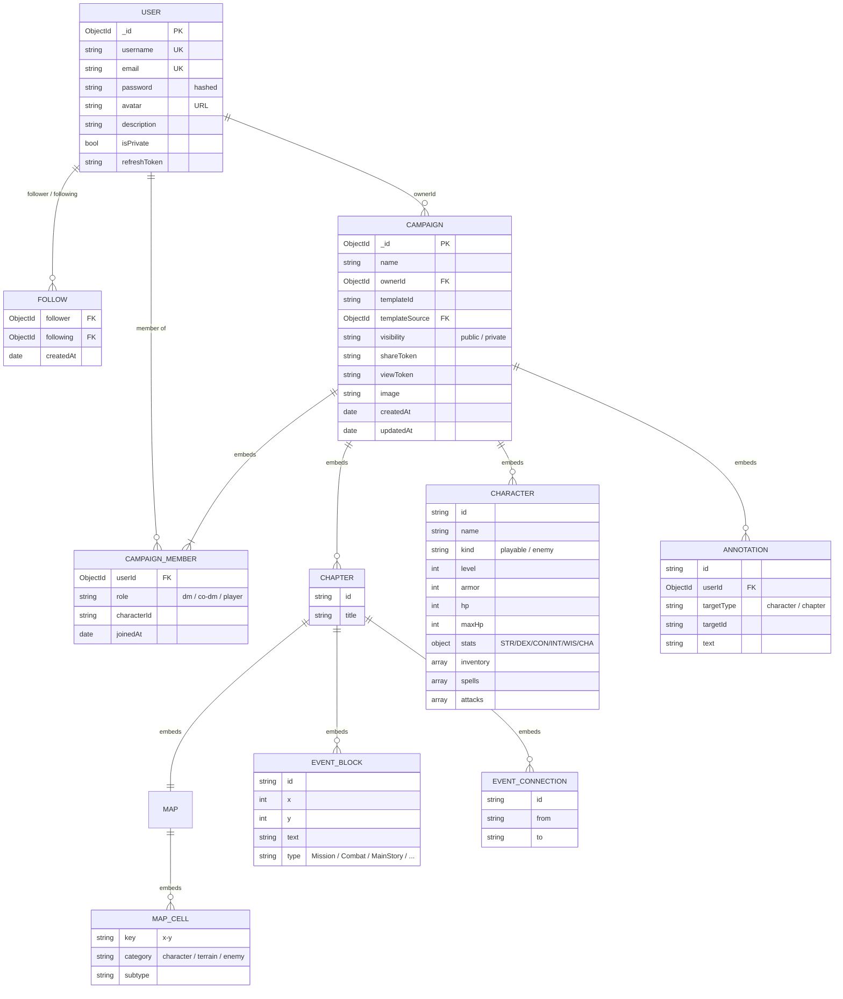
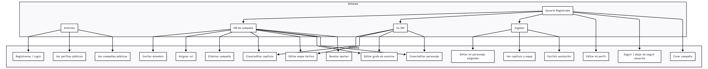
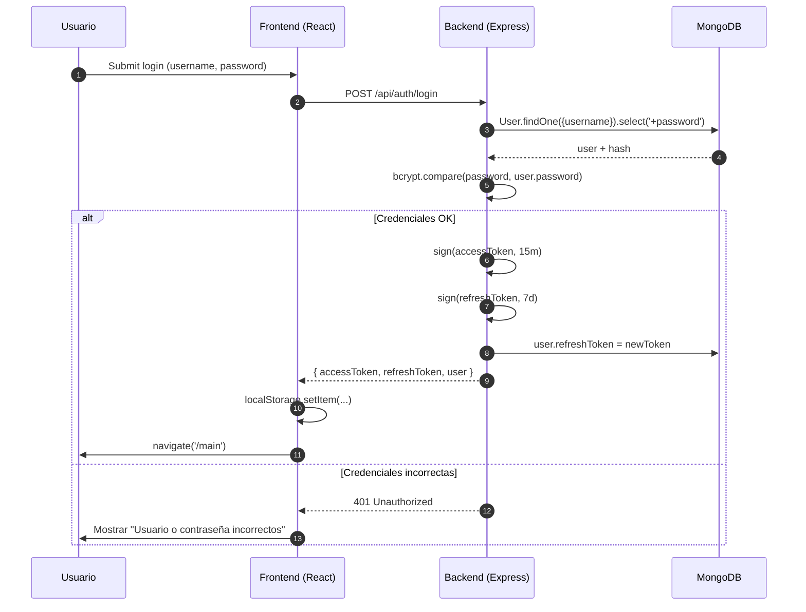
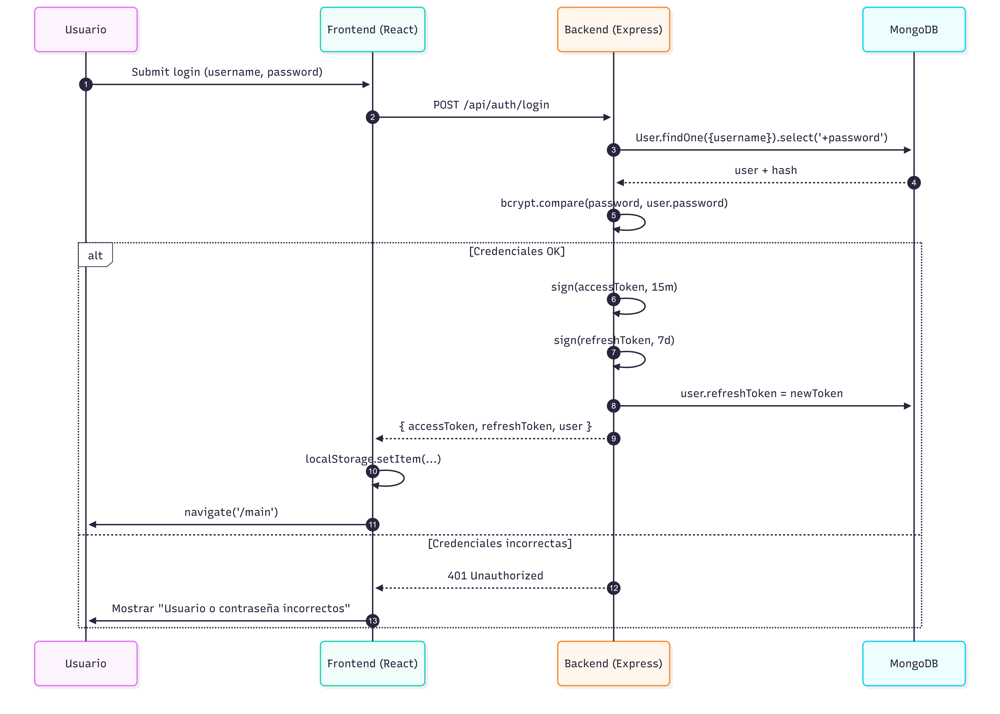
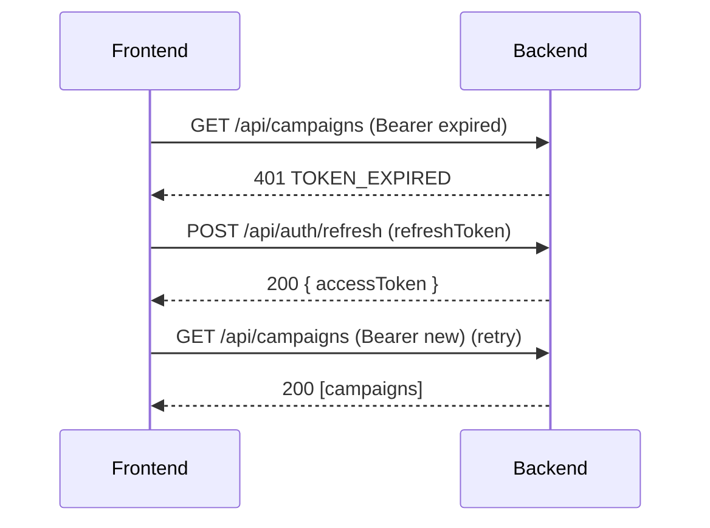
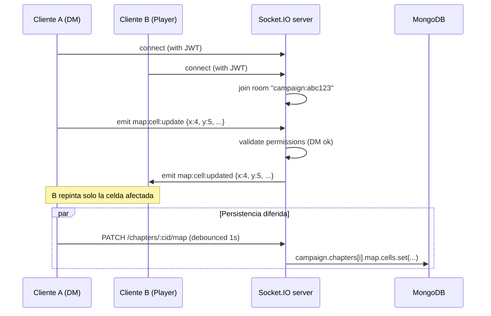
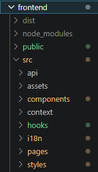

# 5. Diseño

Este documento explica **cómo está pensado por dentro** DnDPlanner: el modelo de datos, los casos de uso, los flujos principales, la arquitectura de servicios y el diseño de la API. Es el documento donde el código encuentra justificación racional.

Para la **guía visual** (paleta, tipografía, componentes), ver [04-guia-estilos.md](04-guia-estilos.md). Para la **descripción funcional** orientada al usuario, ver [02-descripcion.md](02-descripcion.md).

---

## 5.1. Arquitectura de la aplicación

### 5.1.1. Diagrama de servicios

```
┌─────────────────┐   HTTP/WS    ┌──────────────────┐   HTTP    ┌─────────────────┐
│    Navegador    │ ────────────▶│   web (nginx)    │ ─────────▶│  api (Express)  │
│  (React SPA)    │   :8080      │  · estáticos     │  :3000    │  · REST + WS    │
│                 │              │  · /api proxy    │           │  · JWT auth     │
└─────────────────┘              │  · /socket.io WS │           └────────┬────────┘
                                 └──────────────────┘                    │ Mongoose
                                                                         ▼
                                                                  ┌─────────────┐
                                                                  │   MongoDB   │
                                                                  │  (Atlas o   │
                                                                  │   contenedor)│
                                                                  └─────────────┘
```

### 5.1.2. Responsabilidades por servicio

| Servicio | Tecnología | Responsabilidad |
|---|---|---|
| **web** | nginx 1.27 alpine | Sirve los estáticos del SPA. Hace reverse proxy de `/api/*` y `/socket.io/*` al backend. Comprime con gzip, cachea assets con hash y deja `index.html` siempre fresco. |
| **api** | Node 20 + Express + Socket.IO | API REST con autenticación JWT, autorización por rol, validación de entrada. Servidor de WebSocket para sincronización en tiempo real entre miembros de una campaña. |
| **mongo** | MongoDB 7 | Almacenamiento persistente de usuarios, campañas (con capítulos, personajes, mapas, anotaciones embebidos) y relaciones de seguimiento entre usuarios. |

### 5.1.3. Decisiones arquitectónicas relevantes

| Decisión | Por qué |
|---|---|
| **SPA + API separadas** | Permite desplegar el frontend como sitio estático (gratis en App Platform) y escalar el backend de forma independiente. |
| **Reverse proxy en frente del backend** | Mismo origen → evita CORS, simplifica cookies/JWT. Una sola URL pública para el usuario. |
| **Documento "campaña" denormalizado** | Una campaña embebe sus capítulos, personajes, mapas y anotaciones. El frontend trabaja con esa misma forma de árbol, y un solo `findById` hidrata todo lo que el editor necesita. Se acepta el coste de tener documentos grandes (≤16 MB) a cambio de simplificar la sincronización. |
| **Backend stateless** | Las sesiones viven como JWT en el cliente. Permite escalado horizontal sin sticky sessions. |
| **Socket.IO sobre el mismo origen** | El cliente deriva la URL del WebSocket de `window.location`. No requiere variable adicional, y nginx hace el upgrade. |
| **MongoDB embebido vs SQL** | El dominio es documental (campañas, capítulos, mapas con propiedades heterogéneas). SQL obligaría a 8-10 tablas con JOINs complejos para hidratar lo que aquí es un `findById`. Trade-off aceptado: queries por miembro requieren índice secundario `members.userId`. |

---

## 5.2. Modelo de datos (Diagrama Entidad-Relación)

El modelo se compone de tres documentos principales en MongoDB: `User`, `Campaign` y `Follow`. La estructura interna de `Campaign` es muy rica por la naturaleza embebida del esquema.

### 5.2.1. Diagrama ER (estilo Mermaid)




> Cómo crearlo: copiar el bloque Mermaid en https://mermaid.live/ → Actions → PNG (high res).

### 5.2.2. Tabla de entidades

| Entidad | Tipo | Descripción |
|---|---|---|
| **User** | Documento raíz | Cuenta de usuario, credenciales hasheadas con bcrypt, perfil público. |
| **Campaign** | Documento raíz | Contenedor maestro. Embebe casi todo. |
| **Member** (embebido) | Subdocumento | Vincula un User a una Campaign con un rol y, opcionalmente, un personaje asignado. |
| **Chapter** (embebido) | Subdocumento | Unidad narrativa: tiene un grafo de eventos y un mapa táctico. |
| **Character** (embebido) | Subdocumento | Hoja de personaje (jugable o enemigo). Stats D&D 5e + inventario + ataques + hechizos. |
| **Annotation** (embebido) | Subdocumento | Comentario libre de un miembro sobre un personaje o capítulo. |
| **EventBlock** + **EventConnection** (embebidos en chapter) | Subdocumento | Grafo dirigido para la línea narrativa: nodos (eventos tipados) y aristas (conexiones temporales/causales). |
| **MapCell** (embebido en chapter.map) | Subdocumento | Celda del mapa identificada por `"x-y"` con una entidad: personaje, enemigo o terreno. |
| **Follow** | Documento raíz | Relación dirigida `follower → following` entre dos usuarios. Permite seguir DMs o jugadores con campañas públicas. |

### 5.2.3. Índices

```javascript
// User
{ username: 1 }    unique
{ email: 1 }       unique

// Campaign
{ ownerId: 1 }                  // queries "mis campañas"
{ "members.userId": 1 }         // queries "campañas en las que estoy"
{ visibility: 1 }               // listado público
{ shareToken: 1 }    sparse     // invitación por link
{ viewToken: 1 }     sparse     // link de solo lectura

// Follow
{ follower: 1, following: 1 }   unique   // evita follows duplicados
{ following: 1 }                         // queries "quiénes me siguen"
```

### 5.2.4. Métodos de instancia clave

```javascript
campaign.hasAccess(userId)          // ¿este usuario puede ver esta campaña?
campaign.getMemberRole(userId)      // 'dm' | 'co-dm' | 'player' | null
campaign.canEdit(userId)            // ¿es DM o co-DM?
```

Estas funciones centralizan la lógica de autorización: cualquier endpoint que toque una campaña la usa para verificar permisos antes de operar.

---

## 5.3. Diagrama de casos de uso

```mermaid
graph TB
    subgraph Actores
        A[Anónimo]
        R[Usuario Registrado]
        DM[DM de campaña]
        CODM[Co-DM]
        P[Jugador]
    end

    R --> DM
    R --> CODM
    R --> P

    subgraph Sistema
        UC1[Registrarse / Login]
        UC2[Ver perfiles públicos]
        UC3[Ver campañas públicas]
        UC4[Editar mi perfil]
        UC5[Seguir / dejar de seguir usuarios]
        UC6[Crear campaña]
        UC7[Invitar miembro]
        UC8[Asignar rol]
        UC9[Eliminar campaña]
        UC10[Crear/editar capítulo]
        UC11[Editar mapa táctico]
        UC12[Editar grafo de eventos]
        UC13[Crear/editar personaje]
        UC14[Editar mi personaje asignado]
        UC15[Ver capítulo y mapa]
        UC16[Escribir anotación]
        UC17[Revelar spoiler]
    end

    A --> UC1
    A --> UC2
    A --> UC3
    R --> UC4
    R --> UC5
    R --> UC6

    DM --> UC7
    DM --> UC8
    DM --> UC9
    DM --> UC10
    DM --> UC11
    DM --> UC12
    DM --> UC13
    DM --> UC17
    CODM --> UC10
    CODM --> UC11
    CODM --> UC12
    CODM --> UC13

    P --> UC14
    P --> UC15
    P --> UC16
```





### 5.3.1. Casos de uso detallados (los 4 principales)

#### CU-01: Crear campaña desde plantilla

| Campo | Valor |
|---|---|
| **Actor** | Usuario registrado |
| **Precondición** | Sesión iniciada (JWT válido). |
| **Postcondición** | Existe una nueva campaña en MongoDB con el usuario como `ownerId` y rol `dm`. La portada redirige al editor de la campaña recién creada. |
| **Flujo principal** | 1. Usuario pulsa "Nueva campaña". 2. Selecciona una plantilla pública o "Empezar de cero". 3. Introduce nombre y opcionalmente imagen de portada. 4. El cliente envía `POST /api/campaigns` con `{ name, templateId? }`. 5. El backend clona la plantilla (si la hay) o crea un documento vacío. 6. El cliente recibe la campaña y navega a `/campaign/:id`. |
| **Flujo alternativo** | Si el nombre supera 100 caracteres, validación cliente bloquea el envío. Si el servidor rechaza (409 nombre duplicado del mismo owner), se muestra mensaje. |

#### CU-02: Invitar a un miembro

| Campo | Valor |
|---|---|
| **Actor** | DM (o Co-DM) |
| **Precondición** | La campaña existe y el actor tiene permiso de edición. |
| **Postcondición** | La campaña tiene un `shareToken` activo y se ha emitido un enlace de invitación. |
| **Flujo principal** | 1. DM pulsa "Compartir" en el panel de miembros. 2. El cliente llama `POST /api/campaigns/:id/share-token` y recibe la URL. 3. DM copia la URL y la comparte. 4. El invitado abre la URL → `GET /api/campaigns/by-share/:token` → si está autenticado, se añade automáticamente como `player`. Si no, se le pide login/registro primero. |
| **Notas** | El token es opaco (UUID v4). Se puede revocar (`DELETE /api/campaigns/:id/share-token`). |

#### CU-03: Editar el mapa táctico en tiempo real

| Campo | Valor |
|---|---|
| **Actor** | DM o Co-DM |
| **Precondición** | Campaña abierta, capítulo seleccionado, otros miembros conectados a la misma sala de Socket.IO. |
| **Postcondición** | La modificación queda persistida en MongoDB y propagada a todos los miembros conectados. |
| **Flujo principal** | 1. Actor arrastra una ficha de la celda `(3,5)` a la `(4,5)`. 2. El cliente emite Socket.IO `map:cell:update`. 3. El servidor valida permisos, aplica el cambio en memoria, emite `map:cell:updated` al resto de la sala. 4. Cada cliente actualiza su estado local sin pedir nada al backend. 5. Cada N segundos (debounced), el cliente envía `PATCH /api/campaigns/:id/chapters/:cid/map` para persistir el snapshot. |
| **Notas** | El estado autoritativo es el de MongoDB. Si dos clientes hacen movimientos simultáneos en la misma celda, gana el último que llega al servidor (last-write-wins) y el resto recibe la actualización por broadcast. |

#### CU-04: Ver una campaña con link de solo lectura

| Campo | Valor |
|---|---|
| **Actor** | Anónimo o usuario registrado |
| **Precondición** | Existe un `viewToken` activo en la campaña. |
| **Postcondición** | El visitante puede navegar la campaña sin poder editar nada. |
| **Flujo principal** | 1. El visitante abre `https://app/campaign/view/:token`. 2. El cliente llama `GET /api/campaigns/by-view/:token`. 3. El backend devuelve los datos pero marca `readOnly: true`. 4. Toda la UI se renderiza con controles deshabilitados. |

---

## 5.4. Diagramas de flujo

### 5.4.1. Flujo de autenticación





### 5.4.2. Flujo de refresh automático del access token

Cada petición autenticada lleva `Authorization: Bearer <accessToken>`. El frontend tiene un interceptor que, si recibe un 401 con código `TOKEN_EXPIRED`, llama a `/api/auth/refresh` con el refresh token y reintenta la petición original.



### 5.4.3. Flujo de sincronización en tiempo real



### 5.4.4. Flujo de subida de imagen (retrato de personaje)

```mermaid
flowchart TD
    A[Usuario selecciona imagen] --> B{Tamaño < 10 MB?}
    B -- No --> X1[Error: imagen demasiado grande]
    B -- Sí --> C[Cliente recorta y comprime canvas → blob]
    C --> D[POST /api/upload con FormData]
    D --> E{Cloudinary configurado?}
    E -- No --> X2[500 Cloudinary not configured]
    E -- Sí --> F[Backend reenvía a Cloudinary API]
    F --> G[Cloudinary devuelve URL pública]
    G --> H[Backend responde { url }]
    H --> I[Cliente actualiza character.image = url]
    I --> J[PATCH /api/campaigns/:id]
```

---

## 5.5. Diseño de la API REST

La API se expone bajo el prefijo `/api`. Está documentada con **OpenAPI 3.0** servido por `swagger-ui-express` en `http://localhost:8080/api/docs`. Aquí solo se resume; los detalles (parámetros exactos, schemas, ejemplos) están en Swagger UI.

### 5.5.1. Convenciones

| Aspecto | Convención |
|---|---|
| Versión | No hay v1/v2 todavía. Cuando aparezca un breaking change, se introducirá `/api/v2/...`. |
| Formato | JSON en request y response. `Content-Type: application/json`. |
| Autenticación | `Authorization: Bearer <accessToken>` en cabecera. |
| Errores | Estructura uniforme: `{ success: false, message: string, code?: string }`. |
| Códigos | `200` OK, `201` Created, `400` Bad Request, `401` Unauthorized, `403` Forbidden, `404` Not Found, `409` Conflict, `429` Rate-limited, `500` Internal Error. |
| Paginación | Endpoints listables aceptan `?limit=10&offset=0`. |
| Rate limiting | 100 peticiones / 15 minutos por IP en `/api/*`. |

### 5.5.2. Mapa de endpoints

| Recurso | Método + ruta | Auth | Descripción |
|---|---|:---:|---|
| **Salud** | `GET /api/health` | ❌ | Liveness probe. |
| **Auth** | `POST /api/auth/register` | ❌ | Crea cuenta. |
| | `POST /api/auth/login` | ❌ | Login. Devuelve `{accessToken, refreshToken, user}`. |
| | `POST /api/auth/refresh` | ❌ | Renueva access token a partir del refresh. |
| | `POST /api/auth/logout` | ✅ | Revoca el refresh token actual. |
| | `GET /api/auth/me` | ✅ | Perfil del usuario autenticado. |
| **Usuarios** | `GET /api/auth/users` | ❌ | Búsqueda pública (respeta `isPrivate`). |
| | `GET /api/auth/users/:username` | ❌ | Perfil público por username. |
| | `PATCH /api/auth/me` | ✅ | Edita mi perfil (avatar, descripción, privacidad). |
| **Campañas** | `GET /api/campaigns` | ✅ | Lista las campañas en las que soy miembro. |
| | `POST /api/campaigns` | ✅ | Crea una campaña. Opcionalmente desde plantilla. |
| | `GET /api/campaigns/:id` | ✅ | Campaña completa con embebidos. |
| | `PATCH /api/campaigns/:id` | ✅ | Actualiza campos del documento. |
| | `DELETE /api/campaigns/:id` | ✅ | Borra (solo owner). |
| | `GET /api/campaigns/templates/public` | ❌ | 4 plantillas oficiales. |
| | `POST /api/campaigns/:id/members` | ✅ | Añade miembro por username. |
| | `PATCH /api/campaigns/:id/members/:userId` | ✅ | Cambia rol o personaje asignado. |
| | `DELETE /api/campaigns/:id/members/:userId` | ✅ | Expulsa miembro. |
| | `POST /api/campaigns/:id/share-token` | ✅ | Genera/regenera token de invitación. |
| | `POST /api/campaigns/:id/view-token` | ✅ | Genera token de solo lectura. |
| | `GET /api/campaigns/by-share/:token` | ✅* | Une al usuario como `player`. |
| | `GET /api/campaigns/by-view/:token` | ❌ | Acceso de solo lectura. |
| **D&D externo** | `GET /api/dnd/monsters` | ❌ | Proxy cacheado a `dnd5eapi.co`. |
| | `GET /api/dnd/monsters/:index` | ❌ | Detalle de un monstruo. |
| **Subida** | `POST /api/upload` | ✅ | Sube imagen a Cloudinary. Devuelve URL. |
| **Follow** | `POST /api/follows/:userId` | ✅ | Sigo a otro usuario. |
| | `DELETE /api/follows/:userId` | ✅ | Dejo de seguir. |
| | `GET /api/follows/me/followers` | ✅ | Mis seguidores. |
| | `GET /api/follows/me/following` | ✅ | A quién sigo. |

### 5.5.3. Ejemplo: `POST /api/auth/login`

**Request:**

```http
POST /api/auth/login HTTP/1.1
Host: localhost:8080
Content-Type: application/json

{
  "username": "Testing",
  "password": "1234QWer"
}
```

**Response 200:**

```json
{
  "success": true,
  "accessToken": "eyJhbGciOiJIUzI1NiIsInR5cCI6IkpXVCJ9...",
  "refreshToken": "eyJhbGciOiJIUzI1NiIsInR5cCI6IkpXVCJ9...",
  "user": {
    "_id": "651f3a...",
    "username": "Testing",
    "email": "testing@example.com",
    "avatar": null,
    "description": "",
    "isPrivate": false
  }
}
```

**Response 401 (credenciales incorrectas):**

```json
{
  "success": false,
  "message": "Invalid username or password",
  "code": "INVALID_CREDENTIALS"
}
```

### 5.5.4. Eventos de Socket.IO

Los WebSockets se usan **solo para sincronización entre miembros conectados a la misma campaña**. La persistencia siempre pasa por la API REST (los WebSockets nunca escriben directamente en MongoDB salvo en operaciones cortas).

| Evento | Dirección | Payload | Significado |
|---|---|---|---|
| `connection` | C → S | (JWT en handshake) | Cliente conecta. El servidor lo autentica y lo une a las salas de sus campañas. |
| `campaign:join` | C → S | `{ campaignId }` | Cliente declara que está abriendo una campaña concreta. |
| `campaign:leave` | C → S | `{ campaignId }` | Cliente cierra la pestaña/cambia de campaña. |
| `map:cell:update` | C → S | `{ campaignId, chapterId, x, y, entity }` | DM mueve/coloca una entidad en el mapa. |
| `map:cell:updated` | S → C (broadcast) | Igual que arriba | Notifica al resto de miembros del cambio. |
| `event:block:update` | C → S | `{ campaignId, chapterId, block }` | Edición del grafo de eventos. |
| `character:update` | C → S | `{ campaignId, characterId, patch }` | Cambio en una hoja de personaje. |
| `annotation:new` | C → S | `{ campaignId, annotation }` | Nueva anotación añadida. |
| `presence:update` | S → C | `{ users: [{userId, online}] }` | Estado online de los miembros. |

---

## 5.6. Diseño del frontend

### 5.6.1. Estructura de carpetas

El árbol real del frontend (compactado a las carpetas más relevantes):

```
frontend/
├── public/                 # Assets servidos tal cual (robots.txt, sitemap.xml, og-image, etc.)
├── dist/                   # Salida de `npm run build` (no versionada)
├── node_modules/           # Dependencias instaladas por npm (no versionado)
├── index.html              # Entry HTML con meta tags SEO + Open Graph
├── nginx.conf              # Configuración del reverse proxy del contenedor `web`
├── Dockerfile              # Build multi-stage (build de Vite + nginx alpine)
├── package.json            # Dependencias y scripts
├── tsconfig.json           # Configuración TypeScript estricta
├── vite.config.ts          # Configuración de Vite
└── src/
    ├── App.tsx             # Componente raíz: providers + rutas
    ├── main.tsx            # Bootstrap React + i18n
    ├── vite-env.d.ts       # Tipos del entorno Vite
    ├── api/                # Wrappers tipados de fetch contra el backend
    │   ├── client.ts       #   - Cliente axios con interceptor de auth
    │   ├── auth.ts         #   - register, login, refresh, profile
    │   ├── campaigns.ts    #   - CRUD de campañas, miembros, plantillas
    │   ├── follows.ts      #   - follow / unfollow / followers / following
    │   ├── socket.ts       #   - Cliente Socket.IO con auth por JWT
    │   └── index.ts        #   - Barrel
    ├── assets/             # Imágenes estáticas importadas desde TS/TSX
    │   ├── Example map.webp
    │   ├── campaigns/      #   - Portadas de las plantillas oficiales
    │   └── characters/     #   - SVGs por defecto de jugador y enemigo
    ├── components/
    │   ├── layout/         # Estructura global (Header, Footer)
    │   │   ├── Header/
    │   │   └── Footer/
    │   └── shared/         # Componentes reutilizables (BEM)
    │       ├── AnnotationThread/
    │       ├── AuthModal/
    │       ├── Button/
    │       ├── CampaignCard/
    │       ├── ConfirmModal/
    │       ├── FollowButton/
    │       ├── MembersPanel/
    │       ├── NewCampaignModal/
    │       ├── Profile/
    │       ├── Spoiler/
    │       ├── TextBox/
    │       └── TranslucidTextBox/
    ├── context/            # React Contexts globales
    │   ├── AuthContext.tsx        # Sesión: user, login, logout, updateUser
    │   ├── CampaignContext.tsx    # Estado de campañas y campaña activa
    │   └── UsersContext.tsx       # Directorio de usuarios y follow graph
    ├── hooks/              # Hooks personalizados
    │   ├── useCampaignSocket.ts   # Sincroniza la campaña activa vía Socket.IO
    │   ├── useDndClasses.ts       # Cache de clases de D&D 5e (API externa)
    │   ├── useDndMonsters.ts      # Cache de monstruos de D&D 5e
    │   ├── usePageTitle.ts        # Actualiza document.title por ruta
    │   └── useUndoableState.ts    # Estado con Ctrl+Z / Ctrl+Y
    ├── i18n/
    │   ├── index.ts        # Configuración i18next + sync de <html lang>
    │   └── locales/
    │       ├── es.json
    │       └── en.json
    ├── pages/              # Páginas montadas en rutas (1 fichero = 1 ruta)
    │   ├── MainPage.tsx
    │   ├── ProfilePage.tsx
    │   ├── UserProfilePage.tsx
    │   ├── UsersPage.tsx
    │   ├── CampaignsPage.tsx
    │   ├── CampaignViewPage.tsx
    │   ├── CreatorSelectorPage.tsx
    │   ├── ChapterOrCharacterPage.tsx
    │   ├── ChapterSelectorPage.tsx
    │   ├── CharacterSelectorPage.tsx
    │   ├── CharacterSheetPage.tsx
    │   ├── InvitePage.tsx
    │   ├── TemplatesPage.tsx
    │   ├── InfoPage.tsx           # Wrapper reutilizable para info/*
    │   ├── ChapterPage/           # Página /chapter/:id (3 ficheros)
    │   │   ├── ChapterPage.tsx
    │   │   ├── EventsCanvas.tsx
    │   │   └── MapCanvas.tsx
    │   └── info/                  # Páginas estáticas (About, Terms, …)
    │       ├── AboutPage.tsx
    │       ├── ContactPage.tsx
    │       ├── NewsPage.tsx
    │       ├── TermsPage.tsx
    │       ├── PrivacyPage.tsx
    │       ├── ApiPage.tsx
    │       └── RoadmapPage.tsx
    └── styles/             # SCSS con arquitectura ITCSS (ver doc 04)
        ├── 00-settings/    # Tokens (colors, typography, spacing)
        ├── 02-generic/     # Reset CSS
        ├── 03-elements/    # Estilos base de tags HTML
        ├── 05-components/  # ~30 partials BEM
        └── main.scss       # Entry point con @use de todas las capas
```

**No existen carpetas `types/` ni `utils/`**: los tipos compartidos viven junto a los contextos donde se usan (`CampaignContext.tsx` exporta los tipos `Campaign`, `Chapter`, `Character`...), y no hacían falta helpers puros independientes en este proyecto.

### 5.6.2. Patrones clave

- **Context + estado local con `useReducer` o `useState`**: cada `Context` expone su slice del estado global más los métodos para mutarlo. `CampaignContext` y `AuthContext` son los más grandes.
- **Drafts locales con persistencia en `onBlur`**: los campos de texto largo (descripción de perfil, nombre de campaña) usan estado local y solo llaman al backend al perder el foco, evitando una petición por keystroke.
- **i18n con hot-reload**: el idioma se almacena en `localStorage` y el cambio aplica inmediatamente sin recargar. El listener de `languageChanged` también sincroniza `document.documentElement.lang` para accesibilidad y SEO.
- **Modo Testing**: el `AuthContext` detecta credenciales del usuario `Testing` y persiste todo en `localStorage` sin tocar el backend. El resto de la app no necesita conocer este modo: ve un usuario y unas campañas como cualquier otro.
- **Hooks tipados sobre APIs externas**: `useDndClasses` y `useDndMonsters` encapsulan llamadas a `dnd5eapi.co` con caché en memoria para no repetir descargas.
- **Sincronización en vivo opcional**: `useCampaignSocket` conecta el Socket.IO solo cuando hay una campaña activa y un usuario autenticado. Si la conexión cae, las mutaciones siguen funcionando vía REST (el peer las verá al refrescar).



---

## 5.7. Diseño del backend

### 5.7.1. Estructura MVC

```
backend/src/
├── controllers/      # Lógica de cada endpoint
├── models/           # Schemas de Mongoose (User, Campaign, Follow)
├── routes/           # Definición de rutas y montaje del router
├── middleware/       # auth, errorHandler, rateLimit, validator
├── services/         # Lógica reutilizable (cloudinary, dnd-api, jwt)
├── socket/           # Handlers de Socket.IO
├── config/           # env, swagger, database
└── server.js         # Entry point
```

### 5.7.2. Patrones clave

- **Middleware chain** por endpoint: `authMiddleware` → `validateInput` → `controller`. El controller asume que la entrada es válida y que `req.user` existe.
- **Errores tipados**: clases `ApiError` con código y status. El `errorHandler` global las traduce a JSON.
- **Métodos sobre el documento** (`campaign.canEdit(userId)`) en lugar de lógica suelta en controllers: la lógica de autorización vive con los datos.
- **Tests de integración**: `supertest` levanta la app en memoria y `mongodb-memory-server` provee BD. Sin mocks de la BD para que los tests detecten errores reales de schema.

---

## 5.8. Consideraciones de seguridad

| Amenaza | Mitigación |
|---|---|
| **Brute-force de login** | Rate-limit 100 req / 15 min por IP. Bcrypt con cost factor 12 (≈250 ms por verificación). |
| **JWT robado** | Tiempos de vida cortos (15 min access, 7 días refresh). Refresh almacenado server-side para poder revocar. |
| **XSS** | React escapa todo el contenido renderizado por defecto. No usamos `dangerouslySetInnerHTML`. Cookies no se usan para sesión (JWT en localStorage). |
| **CSRF** | No aplica con JWT en `Authorization` header (mismo origen + sin cookies). |
| **NoSQL injection** | Mongoose tipa todas las queries. Validación adicional con `express-validator` en endpoints sensibles. |
| **Subida de archivos maliciosos** | Solo se acepta `image/*`, tamaño ≤10 MB, y el almacenamiento es Cloudinary (proceso de imagen propio que no ejecuta). |
| **Filtración de datos privados** | `User.password` y `User.refreshToken` con `select: false` por defecto. Lookups por username respetan `isPrivate`. |
| **Secrets en el repo** | `.env` en `.gitignore`. Compose aborta si falta un secreto crítico. CI tiene secrets propios (`GITHUB_TOKEN`). |

---

## 5.9. Cómo evoluciona el diseño

Decisiones que se han probado y descartado durante el desarrollo, documentadas para no repetir:

| Idea probada | Por qué se descartó |
|---|---|
| Documento `Campaign` con referencias a `Chapter` / `Character` separados | Forzaba 4-5 `populate()` por carga. La denormalización resultó más rápida y simple. |
| Cookies HttpOnly para JWT | Requeriría CSRF tokens. Con SPA + API + mismo origen el ahorro era nulo. |
| Redux para estado de campaña | Demasiado boilerplate. Context + reducer cumple lo mismo con menos código. |
| WebSocket persistiendo directo en MongoDB | Race conditions al editar la misma celda. Se pasó a "WS notifica, REST persiste con debounce". |
| Tailwind para estilos | Conflicto con la guía ITCSS / BEM definida en el módulo de Diseño Web. Se mantuvo SCSS modular. |

Más detalle en [06-desarrollo.md](06-desarrollo.md).

---

> 📁 **Carpeta de assets recomendada**
> Los diagramas y capturas de este documento se guardan en `docs/assets/` con los nombres `05-*.png`.
