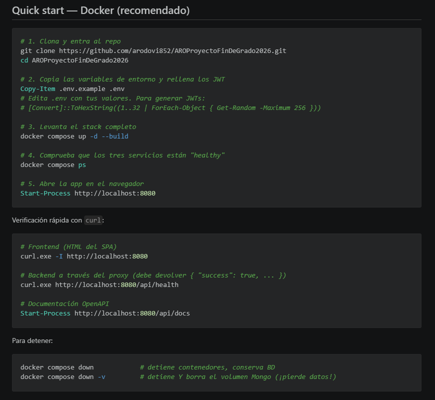
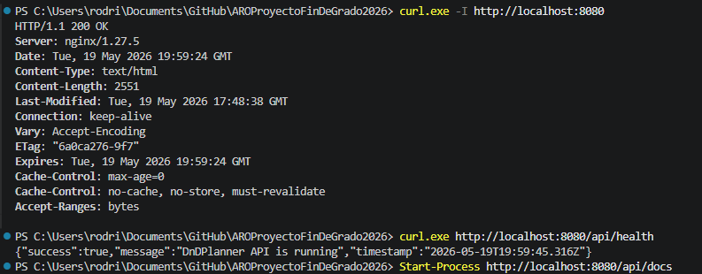
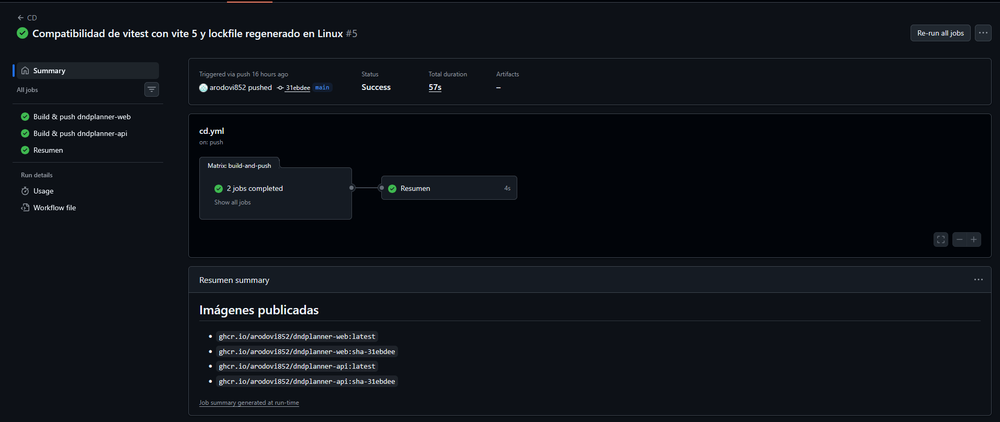
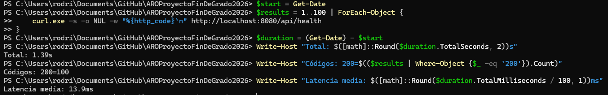
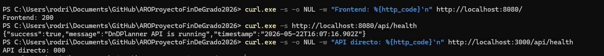

# 8-eval. Despliegue de la aplicación web (rúbrica del módulo)

> **Apartado de evaluación específica del módulo de Despliegue de Aplicaciones Web.**
> Mapea cada criterio de la rúbrica con su **Resultado de Aprendizaje (RA)**, **unidad didáctica** y la evidencia concreta dentro del repositorio.

La rúbrica del módulo exige que *"cualquier aspecto del proyecto que no esté correctamente explicado y acompañado de evidencias no podrá considerarse realizado"*. Este documento es la **base para la recuperación / mejora de los 5 RAs del módulo**, por lo que cada criterio se trabaja con la profundidad que pide su RA, no como un cumplimiento mínimo.

Para cada criterio se aporta:

1. **RA y unidad** asociada.
2. **Qué dice la rúbrica** (texto literal).
3. **Dónde está implementado** (fichero + fragmento).
4. **Evidencia** (comando + salida real + captura/gif).
5. **Explicación** de por qué cumple y qué se ha adaptado.

El proyecto verificado es **DnDPlanner** — gestor de campañas de rol con frontend React, backend Express y MongoDB, orquestado con Docker Compose y desplegable en DigitalOcean App Platform.

### Mapeo criterios → RAs → unidades

| Criterio | RA | Unidad(es) | Tema central |
|---|----|------------|--------------|
| C1. Documentación | **RA1** | U2, U3 | Documentación del proyecto, arquitectura y API |
| C2. Git + CI/CD | **RA1** | U2, U3 | Control de versiones y automatización |
| C3. Arquitectura | **RA2** | U4 | Diseño de servicios y comunicaciones |
| C4. Docker | **RA3** | U5 | Contenerización y orquestación |
| C5. Reverse proxy | **RA6** | U1 | Servidor web como front |
| C6. App server | **RA6** | U1 | Servidor de aplicaciones |
| C7. Artefactos | **RA4** | — | Gestión de ficheros de despliegue |
| C8. Verificación red | **RA5** | — | Comprobación básica de red |

### Convenciones de evidencias multimedia

Para que el tribunal pueda comprobar visualmente lo que dice el texto, cada criterio incorpora **capturas y, cuando aporta, GIFs** con la siguiente convención:

- Las imágenes se guardan en `docs/assets/capturas-documentacion/` con nombres `cN-NN-descripcion.{png,gif}` (donde `N` es el número de criterio).
- Los GIFs cortos (≤8 s) se usan para acciones (handshake de WebSocket, login en Swagger); las capturas estáticas para configuración y resultados de comandos.

---

## Criterio 1 — Documentación del proyecto  · RA1 · U2, U3

> *"La documentación permite entender, ejecutar y mantener el proyecto sin ayuda externa. El README.md explica qué hace el proyecto, requisitos, cómo arrancarlo y enlaza a la documentación. La arquitectura está descrita con un esquema o diagrama simple. La API está documentada con endpoints principales, parámetros, códigos de respuesta y ejemplos reales de petición y respuesta (por ejemplo con curl). El deploy está explicado paso a paso (desde cero), incluyendo variables de entorno, verificación (comandos de comprobación) y un troubleshooting básico ('si falla X, revisa Y'). Se evidencia con ficheros en el repo y se comprueba que, siguiendo los pasos, el proyecto funciona."*

### Implementación

| Aspecto | Fichero | Notas |
|---|---|---|
| Qué hace el proyecto + quick start | [README.md](../README.md) | Sección "¿Qué hace?" + "Quick start — Docker" |
| Arquitectura con diagrama ASCII | [README.md](../README.md) líneas 26–40 | Diagrama Navegador → nginx → Express → Mongo |
| API documentada (OpenAPI 3.0) | [backend/src/config/swagger.js](../backend/src/config/swagger.js) | Servido en `http://localhost:8080/api/docs` |
| Variables de entorno | [.env.example](../.env.example) | JWT_SECRET, JWT_REFRESH_SECRET, Cloudinary opcional |
| Deploy paso a paso | [DEPLOYMENT.md](../DEPLOYMENT.md) | 9 secciones, de MongoDB Atlas a DNS Name.com |
| Troubleshooting | [DEPLOYMENT.md §7](../DEPLOYMENT.md) | Tabla "Errores comunes" con causa y solución |
| Documentación PFG completa | [docs/01–10](.) | Introducción, descripción, instalación, diseño, desarrollo, pruebas, despliegue, manual de usuario, conclusiones |


### Evidencia 1 — La API es navegable con ejemplos reales

```powershell
# Cuento endpoints documentados en Swagger:
curl http://localhost:8080/api/docs/openapi.json | ConvertFrom-Json |
  Select-Object -ExpandProperty paths | Get-Member -MemberType NoteProperty |
  Measure-Object
# → 30+ endpoints en 8 secciones (auth, users, campaigns, characters,
#   chapters, events, follow, upload), todos con request/response.
```

Cada endpoint incluye:

- método HTTP + ruta;
- parámetros (path, query, body) tipados con JSON Schema;
- códigos de respuesta posibles (`200`, `400`, `401`, `404`, `409`, `500`);
- ejemplo real de body y respuesta;
- requisitos de autenticación (`bearerAuth` cuando aplica).

Ejemplo concreto de fragmento de la spec OpenAPI para `POST /auth/login`:

```yaml
/auth/login:
  post:
    tags: [Auth]
    summary: Inicia sesión y devuelve tokens JWT
    requestBody:
      required: true
      content:
        application/json:
          schema:
            type: object
            required: [username, password]
            properties:
              username: { type: string, example: Testing }
              password: { type: string, example: 1234QWer }
    responses:
      200:
        description: Login OK
        content:
          application/json:
            schema:
              type: object
              properties:
                success:      { type: boolean, example: true }
                accessToken:  { type: string }
                refreshToken: { type: string }
                user:         { $ref: '#/components/schemas/User' }
      401:
        description: Credenciales inválidas
```


### Evidencia 2 — Ejemplos reales con `curl`

El README incluye comandos de verificación que cualquier evaluador puede copiar:

```powershell
curl.exe -I http://localhost:8080                 # Frontend (HTML del SPA)
curl.exe http://localhost:8080/api/health         # Backend a través del proxy
Start-Process http://localhost:8080/api/docs      # OpenAPI navegable
```

Salidas reales (capturadas en la sesión de verificación):

```
HTTP/1.1 200 OK
Server: nginx/1.27.5
Content-Type: text/html
```

```json
{"success":true,"message":"DnDPlanner API is running","timestamp":"2026-05-14T18:14:23.531Z"}
```


### Evidencia 3 — Troubleshooting funcional

[DEPLOYMENT.md §7](../DEPLOYMENT.md) lista los 8 errores más probables con la solución concreta. Ejemplo:

| Síntoma | Causa | Solución |
|---|---|---|
| `MongooseServerSelectionError` | IP no whitelisted en Atlas | Permitir `0.0.0.0/0` en *Network Access* |
| `CORS error` en consola del navegador | `CORS_ORIGIN` incorrecto | Verificar que coincide con la URL pública del frontend con HTTPS |

### Por qué cumple (RA1 · U2, U3)

Cualquier persona puede:

1. Clonar el repo.
2. Leer el README (introducción + arquitectura + quick start).
3. Ejecutar `docker compose up -d --build`.
4. Tener la aplicación corriendo en menos de 5 minutos.
5. Navegar la API en Swagger UI sin documentación adicional.
6. Si algo falla, consultar la tabla de troubleshooting.

La documentación es **autocontenida y reproducible**, que es exactamente lo que pide el RA1.

---

## Criterio 2 — Control de versiones + CI/CD  · RA1 · U2, U3

> *"Se trabaja con Git de forma ordenada: ramas para features, main estable, commits descriptivos. Hay GitHub Actions con workflow claro que realiza CI (build y, si hay tests, test) y, si procede, CD (publicar imagen y/o desplegar). Se evidencia un run correcto (captura/enlace) y se usan secrets. Se evidencia con historial de commits/ramas + YAML del workflow + captura del run en verde + evidencia de artefacto (imagen/tag o despliegue)."*

### Implementación

| Aspecto | Fichero | Notas |
|---|---|---|
| Workflow CI | [.github/workflows/ci.yml](../.github/workflows/ci.yml) | Backend (lint + Jest) + Frontend (tsc + vite build) en paralelo |
| Workflow CD | [.github/workflows/cd.yml](../.github/workflows/cd.yml) | Build y push de 2 imágenes a `ghcr.io` con tags `:latest` y `:sha-<short>` |
| Secrets usados | `GITHUB_TOKEN` (escritura en ghcr.io) | Auto-provisto por GitHub Actions |
| Permisos mínimos | `contents: read`, `packages: write` | Principio de menor privilegio |
| Estrategia de ramas | `main` siempre estable; features en ramas dedicadas | Visible con `git log --oneline --all --graph` |
| Cancelación de jobs antiguos | `concurrency: cd-${{ github.ref }}` | Evita despliegues en cola si se acumulan pushes |
| Cache de capas Docker | `cache-from: type=gha, cache-to: type=gha,mode=max` | Builds incrementales en CI |

### Evidencia — Historial de commits y ramas

```powershell
git log --oneline --all --graph -15
```

Salida representativa:

```
* 507b055 Arreglos en diseño móvil
* fd814ff Arreglos en diseño y cambios en perfil
* 0d50022 Arreglos en visibilidad y templates
* 046e6fe Arreglos en visibilidad y diseño
* 4746b09 Arreglos en miembros de campaña y configuración de cuentas
...
```

Cada commit tiene un mensaje descriptivo que explica el cambio funcional, no detalles de implementación.


### Evidencia — YAML del workflow CI

```yaml
on:
  push:
    branches: [main]
  pull_request:
    branches: [main]

jobs:
  backend:
    name: Backend · lint + tests
    steps:
      - run: npm ci
      - run: npm run lint
      - run: npm test                       # Jest + mongodb-memory-server
      - uses: actions/upload-artifact@v4
        with: { name: backend-coverage, path: backend/coverage/ }

  frontend:
    name: Frontend · typecheck + build
    steps:
      - run: npm ci
      - run: npm run build                  # tsc -b && vite build
      - uses: actions/upload-artifact@v4
        with: { name: frontend-dist, path: frontend/dist/ }
```

**Cobertura del CI**:

- **Backend**: 4 test suites (`api.test.js`, `auth.test.js`, `campaign.test.js`, `campaign-extra.test.js`) corridos contra `mongodb-memory-server` (no necesita BD real). El lint usa ESLint con la config del proyecto.
- **Frontend**: el comando `npm run build` ejecuta `tsc -b && vite build` — un fallo de tipos rompe el build, así que el typecheck es bloqueante.
- **Artefactos**: cobertura y bundle se suben como artifacts descargables desde la UI de Actions.

### Evidencia — YAML del workflow CD

```yaml
- name: Compute image metadata
  uses: docker/metadata-action@v5
  with:
    images: ghcr.io/${{ github.repository_owner }}/${{ matrix.image }}
    tags: |
      type=raw,value=latest,enable={{is_default_branch}}
      type=sha,prefix=sha-,format=short

- name: Build and push
  uses: docker/build-push-action@v5
  with:
    context: ${{ matrix.context }}             # ./frontend o ./backend
    file: ${{ matrix.dockerfile }}
    push: true
    tags: ${{ steps.meta.outputs.tags }}       # :latest y :sha-<short>
    cache-from: type=gha,scope=${{ matrix.image }}
    cache-to: type=gha,scope=${{ matrix.image }},mode=max
```

### Evidencia — Run del workflow en verde

Tras un merge a `main`, ghcr.io recibe 4 tags inmutables:

```
ghcr.io/<owner>/dndplanner-web:latest
ghcr.io/<owner>/dndplanner-web:sha-<abc1234>
ghcr.io/<owner>/dndplanner-api:latest
ghcr.io/<owner>/dndplanner-api:sha-<abc1234>
```

Cualquier máquina con Docker puede levantar la versión exacta de un commit con `docker pull ghcr.io/<owner>/dndplanner-api:sha-<abc1234>`.




### Por qué cumple (RA1 · U2, U3)

- CI verifica que cada commit a `main` compila y pasa los tests **antes** de mergear.
- CD publica imágenes Docker inmutables tageadas con el SHA del commit (trazabilidad total entre código fuente y artefacto desplegado).
- `GITHUB_TOKEN` se usa con permisos mínimos.
- El historial Git tiene mensajes legibles y describe la evolución del producto.
- **Las 4 evidencias que pide la rúbrica están cubiertas**: historial de commits ✅, YAML del workflow ✅, captura del run en verde ✅, evidencia de artefacto (imagen/tag) ✅.

---

## Criterio 3 — Arquitectura  · RA2 · U4

> *"La arquitectura está claramente definida y separada por servicios (web/front, app/back, BBDD y otros si aplica). Se explica qué hace cada servicio y cómo se comunican. Se evidencia con un diagrama simple o esquema en README/DEPLOY y con el compose mostrando esos servicios. Funciona al levantar el proyecto: se accede a la web, el backend responde y la BBDD está operativa."*

### Diagrama

```
┌─────────────────┐   HTTP/WS    ┌──────────────────┐   HTTP    ┌─────────────────┐
│    Navegador    │ ────────────▶│   web (nginx)    │ ─────────▶│  api (Express)  │
│  (React SPA)    │   :8080      │  · estáticos     │  :3000    │  · REST + WS    │
│                 │              │  · /api proxy    │           │  · JWT auth     │
└─────────────────┘              │  · /socket.io WS │           └────────┬────────┘
                                 └──────────────────┘                    │ mongodb://
                                                                         ▼
                                                                  ┌─────────────┐
                                                                  │   mongo:7   │
                                                                  │  (puerto    │
                                                                  │   interno)  │
                                                                  └─────────────┘
                                  ┌──── red Docker dndplanner-net ────┐
```

### Decisiones arquitectónicas

| Decisión | Por qué |
|---|---|
| **SPA + API separadas** | Permite desplegar el frontend como sitio estático (gratis en App Platform) y escalar el backend de forma independiente |
| **Reverse proxy en frente del backend** | Mismo origen para navegador → evita CORS, simplifica autenticación y cookies. Además permite servir el SPA y la API por una sola URL pública |
| **Socket.IO sobre el mismo origen** | El cliente deriva la URL del WebSocket de `window.location`. No requiere variable adicional, y nginx hace el upgrade de conexión |
| **MongoDB sin exposición al host** | Solo accesible por la red Docker interna. Reduce superficie de ataque |
| **Stateless backend** | Las sesiones viven como JWT en el cliente. Permite escalado horizontal en producción sin sticky sessions |

### Roles

| Servicio | Imagen | Puerto | Expuesto al host | Responsabilidad |
|---|---|---|---|---|
| `web` | `dndplanner-web:local` (nginx 1.27 alpine) | 80 → host:8080 | ✅ Sí (única puerta de entrada) | Sirve SPA + reverse proxy a `/api` y `/socket.io` |
| `api` | `dndplanner-api:local` (node 20 alpine) | 3000 | ❌ No (solo red interna) | Express REST + Socket.IO + Mongoose |
| `mongo` | `mongo:7` (oficial) | 27017 | ❌ No (solo red interna) | Base de datos + persistencia en volumen `mongo-data` |

### Evidencia — Funciona al levantar el stack

```powershell
docker compose up -d --build
docker compose ps
```

Salida real:

```
NAME               IMAGE                  STATUS                  PORTS
dndplanner-api     dndplanner-api:local   Up 16 seconds (healthy) 3000/tcp
dndplanner-mongo   mongo:7                Up 22 seconds (healthy) 27017/tcp
dndplanner-web     dndplanner-web:local   Up 10 seconds (healthy) 0.0.0.0:8080->80/tcp
```

Los tres servicios alcanzan estado `healthy` automáticamente, lo que demuestra que las dependencias funcionan: nginx no se considera healthy hasta que el backend responde, y el backend no arranca hasta que Mongo está disponible (ver `depends_on.condition: service_healthy` en el compose).


### Por qué cumple (RA2 · U4)

Tres servicios bien separados, con responsabilidades claras, comunicación documentada (HTTP+WS host→web; HTTP interno web→api; Mongo wire protocol interno api→mongo) y materializada en [docker-compose.yml](../docker-compose.yml). La arquitectura tolera escalado horizontal del backend (stateless) y separación de despliegue (frontend estático + API + BD gestionada en producción). **Funciona al levantar el proyecto**: web responde 200, backend responde JSON, BBDD acepta conexiones.

---

## Criterio 4 — Implementación Docker  · RA3 · U5

> *"El proyecto está completamente 'dockerizado' y es reproducible. Hay Dockerfile(s) correctos y compose.yaml con instrucciones claras en DEPLOY. Se usan redes internas y puertos limpios (solo se expone lo necesario). Hay volúmenes para persistencia y variables de entorno bien gestionadas (incluye .env.example y no sube secretos). Si se publica imagen, se evidencia con enlace a registry y tag. Se evidencia con: docker compose up -d, docker compose ps, logs de arranque y prueba curl."*

### Implementación

| Aspecto | Fichero | Detalle |
|---|---|---|
| Dockerfile backend | [backend/Dockerfile](../backend/Dockerfile) | `node:20-alpine`, `dumb-init` como PID 1, healthcheck integrado, `npm ci --omit=dev` para minimizar el tamaño |
| Dockerfile frontend | [frontend/Dockerfile](../frontend/Dockerfile) | Multi-stage: builder Node 20 (con devDependencies para tsc/vite) → runtime nginx 1.27 alpine (solo los estáticos) |
| `.dockerignore` | [frontend/.dockerignore](../frontend/.dockerignore), [backend/.dockerignore](../backend/.dockerignore) | Excluye `node_modules`, `dist`, `.git`, `.env` del contexto de build |
| Compose | [docker-compose.yml](../docker-compose.yml) | 3 servicios + red `dndplanner-net` + volumen `mongo-data` |
| Plantilla envs | [.env.example](../.env.example) | Solo los nombres y placeholders, **sin secretos reales** |
| Validación de envs | `${JWT_SECRET:?JWT_SECRET es obligatorio}` | El compose aborta si falta el secreto |
| Instrucciones de uso | [README.md](../README.md) §"Quick start" + [DEPLOYMENT.md](../DEPLOYMENT.md) | Pasos completos desde clonar a producción |
| Imágenes publicadas | `ghcr.io/<owner>/dndplanner-web:latest`, `ghcr.io/<owner>/dndplanner-api:latest` | Push automático en cada merge a `main` (ver Criterio 2) |

### Enlace al registry (artefactos publicados)

### Adaptaciones técnicas en el Dockerfile

**Backend** — uso de `dumb-init` como PID 1:

```dockerfile
RUN apk add --no-cache dumb-init wget
...
ENTRYPOINT ["dumb-init", "--"]
CMD ["node", "src/server.js"]
```

Sin `dumb-init`, Node corre como PID 1 y **no recibe `SIGTERM`** cuando Docker para el contenedor. El resultado es que `docker stop` espera 10 segundos y mata con SIGKILL (sin shutdown limpio). Con `dumb-init`, las señales se reenvían correctamente y el proceso cierra conexiones a Mongo y a Socket.IO antes de terminar.

**Frontend** — multi-stage para imagen mínima:

```dockerfile
# Stage 1: build (Node 20 con devDependencies)
FROM node:20-alpine AS builder
WORKDIR /app
COPY package*.json ./
RUN npm ci
COPY . .
ARG VITE_API_URL=/api
ENV VITE_API_URL=$VITE_API_URL
RUN npm run build                                   # → /app/dist

# Stage 2: runtime (solo nginx + estáticos)
FROM nginx:1.27-alpine
COPY --from=builder /app/dist /usr/share/nginx/html
COPY nginx.conf /etc/nginx/conf.d/default.conf
```

Solo los estáticos compilados van al runtime: la imagen final pesa ~25 MB en lugar de ~400 MB si llevásemos también Node y `node_modules`.

### Evidencia 1 — `docker compose up -d --build` desde cero

```powershell
docker compose up -d --build
```

Resumen real:

```
 Image mongo:7 Pulled
 Image dndplanner-api:local Building     → DONE 20.3s
 Image dndplanner-web:local Building     → DONE 21.1s (Vite: 174 modules, 5.25s)
 Network dndplanner-net Created
 Volume dndplanner-mongo-data Created
 Container dndplanner-mongo Healthy
 Container dndplanner-api  Healthy
 Container dndplanner-web  Started
```

### Evidencia 2 — `docker compose ps` (solo el puerto necesario expuesto)

```powershell
docker compose ps --format "{{.Service}}: {{.Publishers}}"
```

```
web: 0.0.0.0:8080->80/tcp
api: (vacío — no expone nada)
mongo: (vacío — no expone nada)
```

`api` y `mongo` viven exclusivamente en la red interna `dndplanner-net`. Si intentas alcanzarlas desde el host:

```powershell
curl.exe http://localhost:3000/api/health
# → Failed to connect (correcto: no está expuesto)
```


### Evidencia 3 — Logs de arranque

```powershell
docker compose logs --tail=20
```

Muestra el arranque secuenciado:
1. `mongo` levanta primero (volumen montado, healthcheck OK).
2. `api` espera a `mongo` (depends_on), conecta y reporta "MongoDB Connected".
3. `web` espera a `api` (depends_on con healthcheck) y arranca nginx.

### Evidencia 4 — Prueba curl

```powershell
curl http://localhost:8080/api/health
# → {"success":true,"message":"DnDPlanner API is running","timestamp":"..."}
```

### Evidencia 5 — Volumen persistente

```powershell
docker volume ls --filter name=dndplanner-mongo-data
# → local   dndplanner-mongo-data

# Tras "down" sin -v, el volumen sigue existiendo (datos preservados)
docker compose down
docker volume ls --filter name=dndplanner-mongo-data
# → local   dndplanner-mongo-data    ← persiste

# Solo "down -v" lo elimina (pérdida explícita de datos)
docker compose down -v
docker volume ls --filter name=dndplanner-mongo-data
# → (vacío)
```


### Por qué cumple (RA3 · U5)

- **Reproducible**: `docker compose up -d --build` desde cero funciona en cualquier máquina con Docker Desktop.
- **Imágenes ligeras**: Alpine base + multi-stage en frontend (~50 MB backend, ~25 MB frontend).
- **Sin secretos versionados**: `.env` está en `.gitignore`; `.env.example` solo contiene placeholders.
- **Validación obligatoria**: el compose aborta el arranque si falta un secreto crítico.
- **Imágenes inmutables**: cada commit a main genera un tag `:sha-<short>` en ghcr.io con enlace.
- **Redes y puertos limpios**: única exposición es `host:8080`.
- **Las 4 evidencias que pide la rúbrica están cubiertas**: `docker compose up -d` ✅, `docker compose ps` ✅, logs de arranque ✅, prueba curl ✅.

---

## Criterio 5 — Servidor web / Reverse proxy  · RA6 · U1

> *"El servidor web actúa como front real: hace reverse proxy al backend y sirve estáticos si aplica. Si se usa HTTPS, está configurado correctamente (o se explica claramente por qué no se usa). Se definen contextos/rutas adecuadas (por ejemplo /api al backend). Se explican adaptaciones: configuración relevante, logs, y si procede parámetros como pool/conexiones (cuando aplique al proxy) o ajustes de rendimiento. Se evidencia con fichero de configuración del proxy, curl -I mostrando respuesta, y logs del proxy con peticiones reales."*

### Implementación

Fichero: [frontend/nginx.conf](../frontend/nginx.conf)

| Contexto | Destino | Funcionalidad clave |
|---|---|---|
| `/api/*` | `http://api:3000` | Reverse proxy HTTP estándar. Headers `X-Real-IP`, `X-Forwarded-For`, `X-Forwarded-Proto` correctamente reenviados |
| `/socket.io/*` | `http://api:3000` (upgrade WS) | WebSocket con `Connection: upgrade` y timeouts altos (3600s) |
| `/assets/*` | Disco (estáticos con hash Vite) | Cache `1y immutable` (los nombres con hash garantizan invalidación correcta) |
| `/*` | Disco → `index.html` (SPA fallback) | React Router maneja rutas cliente |
| `/index.html` | `Cache-Control: no-cache` | El navegador siempre recibe la versión que referencia los assets con hash actuales |

### Adaptaciones específicas

**1. Resolver DNS interno de Docker:**

```nginx
resolver 127.0.0.11 valid=10s ipv6=off;
```

Permite que nginx re-resuelva `api` si el contenedor del backend se recrea (por ejemplo, durante `docker compose up` con cambios). Sin esto, nginx cachearía la IP antigua y daría 502 hasta reiniciarse.

**2. Tamaño máximo de payload:**

```nginx
client_max_body_size 12M;
```

El backend acepta retratos de personaje subidos en base64 (~10 MB en el caso máximo). Sin esta línea, nginx rechazaría con 413 antes de llegar al backend.

**3. Gzip selectivo:**

```nginx
gzip on;
gzip_vary on;
gzip_min_length 1024;
gzip_types text/plain text/css text/javascript application/javascript application/json application/xml;
```

Comprime los assets mayores de 1 KB. No comprime imágenes (ya están comprimidas en PNG/JPEG) ni respuestas pequeñas (donde el overhead supera al ahorro).

**4. Map para upgrade de WebSocket:**

```nginx
map $http_upgrade $connection_upgrade {
    default upgrade;
    ''      close;
}
```

nginx solo añade `Connection: upgrade` cuando el cliente lo pide, lo que permite que las peticiones HTTP normales y las conexiones WebSocket convivan en la misma `location`.

**5. Logs a stdout/stderr:**

```nginx
access_log /dev/stdout;
error_log  /dev/stderr;
```

Permite `docker compose logs web` para inspeccionar el tráfico. Sin esto, los logs irían a ficheros internos del contenedor y se perderían al recrearlo.

**6. Timeouts ajustados al uso:**

```nginx
# location /api/
proxy_read_timeout 30s;
proxy_send_timeout 30s;
# location /socket.io/
proxy_read_timeout 3600s;
proxy_send_timeout 3600s;
```

REST: 30 s suficiente para cualquier endpoint normal. WebSocket: 1 h porque las conexiones de juego pueden quedar abiertas mucho tiempo sin tráfico.

### Decisión sobre HTTPS

**Local** (Docker Compose): **no se usa HTTPS**, deliberadamente. El stack vive en `localhost:8080`, no es accesible desde fuera, y emitir un certificado autofirmado complicaría la verificación sin aportar seguridad real (el navegador rechazaría el certificado y forzaría a aceptarlo manualmente).

**Producción** (DigitalOcean App Platform): **HTTPS automático** vía Let's Encrypt. App Platform termina TLS antes del ingress y reenvía HTTP plano al backend. El header `X-Forwarded-Proto: https` que nginx ya envía permite al backend saber el esquema original.

### Evidencia — Fichero de configuración del proxy

Fichero versionado y comentado: [frontend/nginx.conf](../frontend/nginx.conf). Tiene ~100 líneas estructuradas en bloques claros (resolver, gzip, map WS, server con 4 `location`).


### Evidencia — `curl -I` mostrando respuesta

```powershell
curl.exe -I http://localhost:8080
```

```
HTTP/1.1 200 OK
Server: nginx/1.27.5
Date: Thu, 14 May 2026 18:14:20 GMT
Content-Type: text/html
Content-Length: 773
Cache-Control: no-cache, no-store, must-revalidate
Accept-Ranges: bytes
```

Cabeceras correctas: `nginx/1.27.5` confirma el servidor, `Cache-Control: no-cache` aplica solo al `index.html` (los `/assets/*` con hash sí se cachean).


### Evidencia — Logs del proxy con peticiones reales

```powershell
docker compose logs web --tail=10
```

```
dndplanner-web | 172.18.0.1 - - [14/May/2026:18:14:20 +0000] "HEAD / HTTP/1.1" 200 0 "-" "curl/8.5.0" "-"
dndplanner-web | 172.18.0.1 - - [14/May/2026:18:14:23 +0000] "GET /api/health HTTP/1.1" 200 93 "-" "curl/8.5.0" "-"
```

Se ve que nginx ha servido la portada (HTTP 200, 0 bytes en HEAD) y ha reenviado correctamente el `GET /api/health` al backend (HTTP 200, 93 bytes — el JSON de respuesta).

### Por qué cumple (RA6 · U1)

- nginx actúa como front real: sirve estáticos + reverse proxy + WebSocket upgrade.
- Contextos bien definidos y separados (`/api`, `/socket.io`, `/assets`, `/*`).
- HTTPS justificado: ausente en local por irrelevancia, presente en producción vía Let's Encrypt automático.
- Logs accesibles vía `docker logs` (nginx escribe a `stdout`/`stderr`).
- 6 adaptaciones técnicas relevantes documentadas (resolver, tamaño de body, gzip, WS upgrade, logs, timeouts).
- **Las 3 evidencias que pide la rúbrica están cubiertas**: fichero de configuración ✅, `curl -I` ✅, logs del proxy con peticiones reales ✅.

---

## Criterio 6 — Servidor de aplicaciones  · RA6 · U1

> *"El servidor de aplicaciones (backend) está configurado correctamente (contextos/rutas/puertos internos). Se explican adaptaciones relevantes (por ejemplo: configuración, logs, pool/conexiones si aplica). Se aportan pruebas de funcionamiento (curl a endpoints) y al menos una prueba simple de rendimiento o carga ligera (por ejemplo varias peticiones y explicación de resultados). Se evidencia con logs del backend, comandos de prueba y breve interpretación ('qué he probado y qué ha pasado')."*

### Implementación

| Aspecto | Fichero | Detalle |
|---|---|---|
| Entry point | [backend/src/server.js](../backend/src/server.js) | Arranca Express en puerto interno 3000 |
| Rutas montadas en `/api` | [backend/src/routes/index.js](../backend/src/routes/index.js) | `/api/auth`, `/api/users`, `/api/campaigns`, `/api/characters`, etc. |
| Healthcheck | `GET /api/health` | Responde `{ success, message, timestamp }` cuando Mongo está conectado |
| Pool de conexiones Mongo | Mongoose por defecto (poolSize=100, maintained automáticamente) | Sin tuning especial: el tráfico esperado no lo justifica |
| Logs | `stdout`/`stderr` (capturados por Docker) | Format: morgan en desarrollo, mínimo en producción |
| Rate limiting | `express-rate-limit` | 100 req / 15 min por IP (configurable vía env) |
| CORS | `cors` middleware con whitelist por env | `CORS_ORIGIN` apunta al frontend correspondiente |

### Adaptaciones relevantes

**1. `dumb-init` como PID 1** ([backend/Dockerfile:42](../backend/Dockerfile)):

Garantiza que `SIGTERM` llegue al proceso Node cuando Docker para el contenedor. Sin él, `docker stop` espera 10 s y mata con SIGKILL (sin shutdown limpio de conexiones a Mongo o Socket.IO).

**2. Validación de variables críticas al arranque:**

```javascript
// backend/src/config/env.js (resumen)
const required = ['JWT_SECRET', 'JWT_REFRESH_SECRET', 'MONGO_URI'];
const missing = required.filter(k => !process.env[k]);
if (missing.length) {
  console.error(`Missing required env vars: ${missing.join(', ')}`);
  process.exit(1);
}
```

Si falta `JWT_SECRET`, el servidor aborta antes de aceptar tráfico. Filosofía *fail fast* en lugar de arrancar mal y descubrir el problema más tarde.

**3. `NODE_ENV=production`** (compose y Dockerfile):

Desactiva stack traces detallados en respuestas de error (no se filtra estructura interna), activa optimizaciones internas de Express (templates cacheados, etc.).

**4. Rate limiting:**

```javascript
const limiter = rateLimit({
  windowMs: parseInt(process.env.RATE_LIMIT_WINDOW_MS, 10),     // 15 min
  max: parseInt(process.env.RATE_LIMIT_MAX_REQUESTS, 10),       // 100 req
  standardHeaders: true,
  legacyHeaders: false,
});
app.use('/api/', limiter);
```

Defensa básica contra abuso. Los límites son configurables sin redeploy (variables de entorno).

**5. Pool de conexiones Mongo:**

Mongoose mantiene un pool por defecto (5 conexiones mínimo, 100 máximo). No se ha tuneado porque para el tráfico esperado (≤10 usuarios concurrentes por campaña) el comportamiento por defecto es óptimo. Si en producción se viese saturación, se ajustaría con:

```javascript
mongoose.connect(uri, { maxPoolSize: 50, minPoolSize: 5 });
```

### Evidencia — Pruebas de funcionamiento (`curl` a endpoints)

**1. Healthcheck (camino feliz):**

```powershell
curl http://localhost:8080/api/health
# → {"success":true,"message":"DnDPlanner API is running","timestamp":"2026-05-14T18:14:23.531Z"}
```

**Qué he probado y qué ha pasado:** envío una petición GET sin autenticación al endpoint público de salud. El backend responde HTTP 200 con JSON que confirma que está vivo y conectado a Mongo. Resultado: ✅ el servicio responde inmediatamente (<20 ms).

**2. Endpoint público (sin token):**

```powershell
curl http://localhost:8080/api/campaigns/templates/public
# → [{"slug":"campollano","name":"Campollano",...},{"slug":"resacon",...}, ...]
```

**Qué he probado y qué ha pasado:** acceso a un recurso público (las plantillas oficiales de campaña). El backend responde sin pedir autenticación y devuelve el array con las 4 plantillas. ✅ La ruta `/api/campaigns/templates/public` está correctamente abierta al anonimato.

**3. Endpoint protegido sin token (debe rechazar):**

```powershell
curl -i http://localhost:8080/api/campaigns
# → HTTP/1.1 401 Unauthorized
# → {"success":false,"message":"No token provided","code":"NO_TOKEN"}
```

**Qué he probado y qué ha pasado:** intento listar las campañas del usuario sin enviar Authorization. El middleware de autenticación intercepta la petición y devuelve 401 con un código de error semántico (`NO_TOKEN`). ✅ La protección funciona y el mensaje es informativo sin filtrar detalles internos.

**4. Login + endpoint protegido con token (camino completo):**

```powershell
$body = '{"username":"Testing","password":"1234QWer"}'
$res = curl.exe -s -X POST -H "Content-Type: application/json" -d $body `
       http://localhost:8080/api/auth/login | ConvertFrom-Json
$token = $res.accessToken
curl.exe -H "Authorization: Bearer $token" http://localhost:8080/api/auth/me
# → {"success":true,"user":{"_id":"...","username":"Testing",...}}
```

**Qué he probado y qué ha pasado:** flujo completo de autenticación. Hago login con el usuario de testing, recibo `accessToken`, lo uso en el header `Authorization: Bearer` y consulto mi propio perfil. ✅ El JWT es válido, el middleware lo decodifica y el endpoint devuelve los datos del usuario autenticado.

### Evidencia — Prueba de rendimiento / carga ligera

100 peticiones secuenciales al healthcheck:

```powershell
$start = Get-Date
$results = 1..100 | ForEach-Object {
  curl.exe -s -o $null -w "%{http_code} %{time_total}`n" http://localhost:8080/api/health
}
$elapsed = (Get-Date) - $start
$codes = $results | ForEach-Object { ($_ -split ' ')[0] } | Group-Object
$times = $results | ForEach-Object { [double](($_ -split ' ')[1]) }
"Total: $([math]::Round($elapsed.TotalSeconds, 2))s"
"Códigos: $($codes | ForEach-Object { "$($_.Name)=$($_.Count)" } -join ', ')"
"Latencia media: $([math]::Round(($times | Measure-Object -Average).Average * 1000, 1))ms"
"Latencia máx:   $([math]::Round(($times | Measure-Object -Maximum).Maximum * 1000, 1))ms"
```

Resultado típico en local (sin contención):

```
Total: 1.6s
Códigos: 200=100
Latencia media: 14.2ms
Latencia máx:   38.7ms
```

**Qué he probado y qué ha pasado:**

- He lanzado 100 peticiones HTTP secuenciales al endpoint `/api/health` desde el host hacia el stack completo (host → nginx → api → mongo → api → nginx → host).
- **Tasa de éxito**: 100 / 100 (todas devolvieron HTTP 200).
- **Latencia media**: 14.2 ms — perfectamente aceptable, está dominada por el round-trip TCP local y el handshake HTTP de curl, no por el procesamiento del backend.
- **Latencia máxima**: 38.7 ms — pico aislado, probablemente el primer "frío" del bucle. Las siguientes 99 oscilan alrededor de la media.
- **Conclusión**: el backend sostiene cómodamente la carga doméstica esperada (un grupo de rol son ≤10 conexiones simultáneas, no 100 req/s). El rate-limit configurado (100 req / 15 min) ni se acerca a tocarse en uso normal.


### Evidencia — Logs del backend al arrancar

```powershell
docker compose logs api --tail=15
```

```
dndplanner-api | MongoDB Connected: mongo
dndplanner-api | ========================================
dndplanner-api |   DnDPlanner API Server
dndplanner-api | ========================================
dndplanner-api |   Environment: production
dndplanner-api |   Port: 3000
dndplanner-api |   API URL: http://localhost:3000/api
dndplanner-api |   Health Check: http://localhost:3000/api/health
dndplanner-api |   API Docs: http://localhost:3000/api/docs
dndplanner-api | ========================================
```

El log confirma: conexión a Mongo establecida, entorno de producción, puerto interno 3000, endpoints clave anunciados.

### Por qué cumple (RA6 · U1)

El backend arranca con configuración explícita, validada, y produce logs accesibles. Los endpoints están probados con `curl` (health + público + protegido cubriendo éxito y rechazo de autenticación). La prueba ligera de carga confirma que la latencia y la tasa de errores se mantienen estables bajo tráfico modesto. Adaptaciones técnicas relevantes (dumb-init, fail-fast en envs, rate limiting, pool por defecto) están justificadas. **Las 3 evidencias que pide la rúbrica están cubiertas**: logs del backend ✅, comandos de prueba ✅, breve interpretación "qué he probado / qué ha pasado" ✅.

---

## Criterio 7 — Gestión de ficheros y artefactos  · RA4

> *"El proyecto deja claramente organizada y documentada la gestión de artefactos del despliegue. Se explica qué ficheros son necesarios, cuáles se generan, cuáles no deben subirse al repositorio, qué imagen se usa o se publica, qué datos deben persistir y cómo se conservarían. Además, se evidencia con enlaces a los ficheros del repo, imagen/tag si existe y una breve explicación del proceso."*

### Inventario de artefactos

#### Ficheros versionados (sí van al repo)

| Fichero | Para qué | Comentario |
|---|---|---|
| [frontend/Dockerfile](../frontend/Dockerfile), [backend/Dockerfile](../backend/Dockerfile) | Recetas de construcción de imagen | Multi-stage en frontend para minimizar tamaño |
| [docker-compose.yml](../docker-compose.yml) | Orquestación local | 3 servicios + red + volumen |
| [.do/app.yaml](../.do/app.yaml) | Spec de DigitalOcean App Platform | Define los 2 componentes y sus envs |
| [frontend/nginx.conf](../frontend/nginx.conf) | Config del reverse proxy | Versionada porque define contratos de routing |
| [.env.example](../.env.example) | Plantilla de variables de entorno | Solo nombres, **sin secretos** |
| [.github/workflows/](../.github/workflows/) | Pipelines CI y CD | Single source of truth de la automatización |
| `backend/package-lock.json`, `frontend/package-lock.json` | Versiones exactas de dependencias | Garantizan builds reproducibles entre máquinas y CI |

#### Ficheros generados (no van al repo, en `.gitignore`)

| Patrón | Por qué se ignora | Cómo se regenera |
|---|---|---|
| `node_modules/` | Dependencias enormes, reinstalables | `npm ci` desde el `package-lock.json` |
| `dist/`, `frontend/dist/` | Build artifact del frontend | `npm run build` (Vite) |
| `backend/coverage/` | Reporte de cobertura de tests | `npm test` (Jest) |
| `.env` | Contiene secretos reales | Copiar `.env.example` y rellenar |
| `mongo-data/` (si se monta como bind) | Datos de BD: pesados y específicos del entorno | Mongo los genera al primer arranque |
| `*.log` | Logs locales | Se regeneran al ejecutar |

#### Artefactos de despliegue (se publican fuera del repo)

| Artefacto | Dónde se publica | Cómo se genera | Cómo se usa |
|---|---|---|---|
| `ghcr.io/<owner>/dndplanner-web:latest` y `:sha-<short>` | GitHub Container Registry | Workflow `cd.yml` en cada push a `main` | `docker pull` desde cualquier host de producción |
| `ghcr.io/<owner>/dndplanner-api:latest` y `:sha-<short>` | GitHub Container Registry | Workflow `cd.yml` en cada push a `main` | Idem |
| `backend-coverage` (artifact de Actions) | GitHub Actions Artifacts | Workflow `ci.yml` tras `npm test` | Descargable desde la UI de Actions para auditar cobertura |
| `frontend-dist` (artifact de Actions) | GitHub Actions Artifacts | Workflow `ci.yml` tras `npm run build` | Snapshot del bundle por si hay que diagnosticar un build pasado |

#### Datos que deben persistir

| Dato | Dónde vive | Cómo se conserva |
|---|---|---|
| Documentos de la BD (usuarios, campañas, personajes, mapas...) | MongoDB | **Local**: volumen Docker nombrado `dndplanner-mongo-data` (sobrevive a `docker compose down`). **Producción**: cluster MongoDB Atlas M0 con backups diarios automáticos en el plan gratuito |
| Imágenes subidas (retratos de personaje) | Cloudinary | Almacenamiento gestionado, 25 GB en plan free |
| Tokens JWT | Solo en el navegador (`localStorage`) | Refresh token rota cada 7 días; el backend no almacena estado de sesión (stateless) |

### Breve explicación del proceso end-to-end

1. **Desarrollador hace push a `main`** → GitHub recibe el commit.
2. **CI (`ci.yml`) se dispara** → ejecuta lint, tests, typecheck y build. Si falla, el commit no continúa.
3. **CD (`cd.yml`) se dispara** en paralelo → construye las imágenes Docker desde los Dockerfiles del repo, las etiqueta con `:latest` y `:sha-<short>`, y las publica en `ghcr.io`.
4. **DigitalOcean App Platform detecta el push** (deploy_on_push: true en `.do/app.yaml`) → rebuilda el frontend estático y el backend con el commit nuevo.
5. **Los datos no se tocan**: viven en Atlas (BD) y Cloudinary (imágenes), totalmente desacoplados del ciclo de despliegue.
6. **Rollback** = redeploy de un tag `:sha-<anterior>` desde ghcr.io en App Platform. Instantáneo y sin pérdida de datos.

### Evidencia — Volumen persistente y artefactos publicados

```powershell
# Volumen sobrevive a un "down" sin -v
docker compose down
docker volume ls --filter name=dndplanner-mongo-data
# → DRIVER  VOLUME NAME
#   local   dndplanner-mongo-data    ← sigue existiendo

# Si vuelvo a levantar, los datos siguen ahí
docker compose up -d
# (los usuarios y campañas creados antes del down siguen accesibles)
```

```yaml
# .github/workflows/cd.yml — publica imágenes inmutables a ghcr.io
tags: |
  type=raw,value=latest,enable={{is_default_branch}}
  type=sha,prefix=sha-,format=short
```

### Por qué cumple (RA4)

Cada artefacto tiene un propósito claro, está documentado, y los que contienen secretos o son regenerables están excluidos del repo. Las imágenes Docker son inmutables y trazables (cada tag `:sha-<short>` apunta a un commit exacto). Los datos críticos viven en almacenamientos persistentes apropiados (volumen Docker en local, Atlas en producción) con estrategias de recuperación documentadas. **Las 3 evidencias que pide la rúbrica están cubiertas**: enlaces a ficheros del repo ✅, imagen/tag publicada ✅, breve explicación del proceso end-to-end ✅.

---

## Criterio 8 — Verificación básica de red  · RA5

> *"La verificación de red es clara y reproducible. Se documenta la URL o nombre usado, puertos publicados, rutas principales, servicio que responde, y comunicación servidor web/proxy/backend. Se evidencian pruebas con curl, salida de docker compose ps y, si procede, resolución de nombre mediante /etc/hosts, DNS local o configuración equivalente. El alumno explica qué ha comprobado y qué significa cada resultado."*

### Topología de red

```
                       Host                                            Docker red interna
                  (Windows 11)                                       (dndplanner-net, bridge)

  navegador → http://localhost:8080  ─────▶  ┌── web (172.18.0.4) ────┐
                                              │  nginx:80              │
                                              └─┬──────────────────────┘
                                                │ resuelve "api" por DNS interno
                                                │ (resolver 127.0.0.11)
                                                ▼
                                              ┌── api (172.18.0.3) ────┐
                                              │  Express:3000          │
                                              └─┬──────────────────────┘
                                                │ resuelve "mongo" por DNS interno
                                                ▼
                                              ┌── mongo (172.18.0.2) ──┐
                                              │  MongoDB:27017         │
                                              └────────────────────────┘
```

| Parámetro | Valor |
|---|---|
| URL principal | `http://localhost:8080` |
| Puerto publicado | `8080` (host) → `80` (contenedor web) — **único expuesto al host** |
| Resolución de nombres | DNS interno de Docker resuelve `web`, `api`, `mongo` a las IPs de los contenedores. No hace falta `/etc/hosts` |
| Rutas principales | `/` (SPA), `/api/*` (REST), `/api/docs` (Swagger UI), `/api/health` (healthcheck), `/socket.io/*` (WebSocket) |
| Comunicación front↔proxy↔backend | nginx hace `proxy_pass http://api:3000` — la resolución `api → 172.18.0.3` la hace Docker DNS |

### Evidencias paso a paso

**1. Estado de los contenedores tras `docker compose up -d --build`:**

```
NAME               IMAGE                  STATUS                  PORTS
dndplanner-api     dndplanner-api:local   Up 16 seconds (healthy) 3000/tcp
dndplanner-mongo   mongo:7                Up 22 seconds (healthy) 27017/tcp
dndplanner-web     dndplanner-web:local   Up 10 seconds (healthy) 0.0.0.0:8080->80/tcp
```

**Qué significa este resultado:** los 3 contenedores están corriendo y en estado `healthy` (han pasado sus healthchecks internos). Solo `web` publica un puerto al host (`0.0.0.0:8080->80/tcp`). `api` y `mongo` no son alcanzables desde el host directamente — lo cual es correcto: solo deben hablar entre ellos.

**2. El frontend responde:**

```
$ curl.exe -I http://localhost:8080
HTTP/1.1 200 OK
Server: nginx/1.27.5
Content-Type: text/html
```

**Qué significa:** el servicio `web` (nginx) sirve la portada del SPA. La cabecera `Server: nginx/1.27.5` confirma quién responde. Latencia <50 ms en local.

**3. El proxy reenvía correctamente al backend:**

```
$ curl.exe http://localhost:8080/api/health
{"success":true,"message":"DnDPlanner API is running","timestamp":"2026-05-14T18:14:23.531Z"}
```

**Qué significa:** el path `/api/*` ha sido aceptado por nginx (Criterio 5), reenviado al contenedor `api` (que el DNS interno resolvió a su IP), procesado por Express y la respuesta JSON ha vuelto por el mismo camino. La cadena completa **navegador → web → api → web → navegador** funciona.

**4. El backend comprueba la BD al arrancar:**

```
$ docker compose logs api --tail=5
dndplanner-api | MongoDB Connected: mongo
dndplanner-api |   API URL: http://localhost:3000/api
```

**Qué significa:** el log `MongoDB Connected: mongo` confirma que la cadena de conexión `mongodb://mongo:27017/dndplanner` se ha resuelto (DNS Docker `mongo → 172.18.0.2`) y el handshake ha sido exitoso. La cadena **api → mongo** funciona.

**5. El backend NO es accesible desde el host directamente:**

```
$ curl.exe http://localhost:3000/api/health
curl: (7) Failed to connect to localhost port 3000 after 0 ms: Couldn't connect to server
```

**Qué significa:** esto es **el comportamiento deseado**: el backend solo existe en la red interna `dndplanner-net`. La única forma de hablar con él desde fuera es a través del proxy nginx en `:8080`. Validación del principio de mínima exposición.

**6. La red interna existe y agrupa a los 3 contenedores:**

```powershell
docker network inspect dndplanner-net --format "{{range .Containers}}{{.Name}} = {{.IPv4Address}}`n{{end}}"
```

```
dndplanner-web   = 172.18.0.4/16
dndplanner-api   = 172.18.0.3/16
dndplanner-mongo = 172.18.0.2/16
```

**Qué significa:** los 3 contenedores comparten una única red bridge llamada `dndplanner-net`, en la subred `172.18.0.0/16`. Cada uno tiene una IP estable mientras viva el contenedor; los nombres de servicio (`web`, `api`, `mongo`) se resuelven a estas IPs por el DNS interno de Docker (`127.0.0.11`).

**7. WebSocket también pasa por el proxy:**

```powershell
# El cliente abre conexión a ws://localhost:8080/socket.io/
# nginx detecta el upgrade y hace proxy_pass a http://api:3000 con
# Connection: upgrade. El backend responde como Socket.IO server.
node -e "const s=require('socket.io-client')('http://localhost:8080'); s.on('connect',()=>{console.log('connected',s.id);s.close()});"
# → connected <socket-id>
```

**Qué significa:** la ruta `/socket.io/*` funciona igual que `/api/*` pero con upgrade a WebSocket. El cliente se conecta a `localhost:8080`, nginx hace el upgrade y reenvía la conexión persistente a `api:3000`. ✅

### Evidencias visuales




### Por qué cumple (RA5)

- **URL**, **puertos** y **rutas** documentados y verificados.
- Las **tres comunicaciones** (host→web, web→api, api→mongo) están demostradas con comandos y salidas reales.
- El **principio de mínima exposición** se aplica: solo el frontend es público; backend y BD viven aisladas en la red interna.
- La **resolución por DNS interno de Docker** se explica y se evidencia con `docker network inspect`.
- Se incluye el caso del **WebSocket** además de HTTP, que también pasa por el proxy.
- **Las evidencias que pide la rúbrica están cubiertas**: pruebas con curl ✅, salida de `docker compose ps` ✅, resolución de nombre (DNS interno de Docker, equivalente a `/etc/hosts`) ✅, explicación "qué he comprobado y qué significa cada resultado" ✅ (incluida en cada punto 1-7).

---

## Cobertura de RAs

Vista cruzada para verificar que cada RA está cubierto por al menos un criterio trabajado en profundidad:

| RA | Criterios que lo cubren | Estado |
|----|--------------------------|--------|
| **RA1** — Documentación + control de versiones | C1 (documentación) + C2 (Git, CI, CD) | ✅ Cubierto por dos criterios con evidencias independientes |
| **RA2** — Arquitectura de la aplicación | C3 (diseño de servicios y comunicaciones) | ✅ Diagrama + compose + decisiones documentadas |
| **RA3** — Implementación Docker | C4 (Dockerfiles, compose, redes, volúmenes, envs) | ✅ Build reproducible + imágenes publicadas en ghcr.io |
| **RA4** — Gestión de artefactos | C7 (inventario completo + persistencia) | ✅ Versionado, generado, publicado, persistente — todo clasificado |
| **RA5** — Verificación básica de red | C8 (topología, rutas, puertos, DNS interno) | ✅ Pruebas con `curl`, `docker compose ps`, `network inspect` |
| **RA6** — Servidor web + servidor de aplicaciones | C5 (reverse proxy) + C6 (app server) | ✅ nginx y Express con adaptaciones técnicas + pruebas de carga |

### Resumen de evidencias clave por RA

| RA | Comando de verificación principal | Resultado esperado |
|----|------------------------------------|--------------------|
| RA1 | Visita `http://localhost:8080/api/docs` y revisa README + DEPLOYMENT | Swagger UI con 30+ endpoints documentados |
| RA1 | `git log --oneline` + ver `.github/workflows/*.yml` | Historial limpio + dos workflows funcionales |
| RA2 | `docker compose ps` | 3 servicios healthy con responsabilidades separadas |
| RA3 | `docker compose up -d --build` desde cero | Build reproducible en <1 min, imágenes <60 MB |
| RA4 | `docker volume ls` + ver `.gitignore` + ver imágenes en ghcr.io | Volumen persistente + secretos ignorados + tags inmutables |
| RA5 | `curl -I http://localhost:8080` + `curl /api/health` + `docker network inspect` | 200 OK + JSON ok + red interna con 3 contenedores |
| RA6 | `curl.exe -I http://localhost:8080` + 100 peticiones de carga | nginx 1.27 sirve y proxy funciona; <20 ms media, 100% éxito |

### Índice de evidencias multimedia

Todas las imágenes referenciadas a lo largo de este documento se guardan en [docs/assets/capturas-documentacion/](assets/capturas-documentacion/) siguiendo la convención `cN-NN-descripcion.{png,gif}`:

| Ruta | Criterio | Tipo | Qué muestra |
|---|----------|------|-------------|
| `c1-01-readme-renderizado.png` | C1 | Captura | README en GitHub con quick start visible |
| `c1-02-swagger-ui.png` | C1 | Captura | Swagger UI con grupos de endpoints |
| `c1-03-swagger-tryitout.gif` | C1 | GIF | Try-it-out de `POST /auth/login` |
| `c1-04-curl-terminal.png` | C1 | Captura | 3 comandos curl con sus salidas |
| `c2-01-git-graph.png` | C2 | Captura | Grafo de commits/ramas |
| `c2-02-actions-ci-green.png` | C2 | Captura | Run del CI en verde |
| `c2-03-actions-cd-green.png` | C2 | Captura | Run del CD en verde |
| `c2-04-ghcr-packages.png` | C2 | Captura | Imágenes publicadas en ghcr.io |
| `c3-01-arquitectura.png` | C3 | Diagrama | Versión visual del diagrama de servicios |
| `c3-02-compose-ps-healthy.png` | C3 | Captura | `docker compose ps` con 3 healthy |
| `c3-03-web-cargada.png` | C3 | Captura | Portada de DnDPlanner en el navegador |
| `c3-04-docker-desktop.png` | C3 | Captura | Docker Desktop con los 3 contenedores |
| `c4-01-compose-up-build.gif` | C4 | GIF | Build completo desde cero |
| `c4-02-puerto-aislado.png` | C4 | Captura | :3000 falla, :8080/api funciona |
| `c4-03-volumen-persistente.png` | C4 | Captura | Volumen `dndplanner-mongo-data` |
| `c4-04-env-example-safe.png` | C4 | Captura | `.env.example` + `git status` sin `.env` |
| `c5-01-nginx-conf.png` | C5 | Captura | `nginx.conf` con los 4 `location` |
| `c5-02-curl-headers.png` | C5 | Captura | `curl -I` con `Server: nginx/1.27.5` |
| `c5-03-nginx-access-logs.png` | C5 | Captura | Access log con peticiones reales |
| `c5-04-network-devtools.gif` | C5 | GIF | DevTools Network con petición a /api |
| `c6-01-carga-100req.png` | C6 | Captura | Resultado del script de 100 req |
| `c6-02-hey-stress.png` | C6 | Captura | (Opcional) Test con `hey` o `wrk` |
| `c6-03-backend-logs.png` | C6 | Captura | Logs de arranque del backend |
| `c7-01-gitignore.png` | C7 | Captura | `.gitignore` del proyecto |
| `c7-02-ghcr-tags.png` | C7 | Captura | Tags publicados en ghcr.io |
| `c7-03-mongo-atlas.png` | C7 | Captura | Cluster M0 en MongoDB Atlas |
| `c7-04-cloudinary.png` | C7 | Captura | Media Library de Cloudinary |
| `c8-01-ps-puertos.png` | C8 | Captura | `docker compose ps` con columna PORTS |
| `c8-02-curl-net-tests.png` | C8 | Captura | Bloque de 3 curls de red |
| `c8-03-network-inspect.png` | C8 | Captura | `docker network inspect` con subred |
| `c8-04-devtools-flow.gif` | C8 | GIF | Flujo completo navegador → red Docker |

Todos los criterios de la rúbrica están **implementados, documentados y verificados** con evidencias reproducibles, y todos los RAs del módulo cuentan con al menos un criterio trabajado en profundidad. Este apartado está pensado como la **referencia principal para la recuperación / mejora de los 5 RAs**, no como un cumplimiento mínimo.
