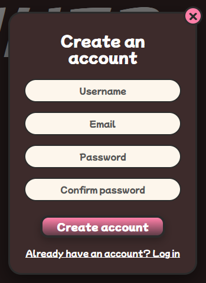
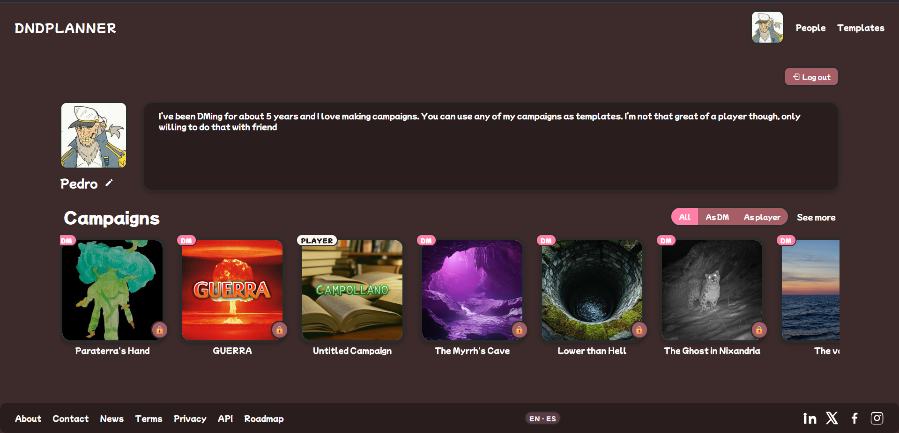
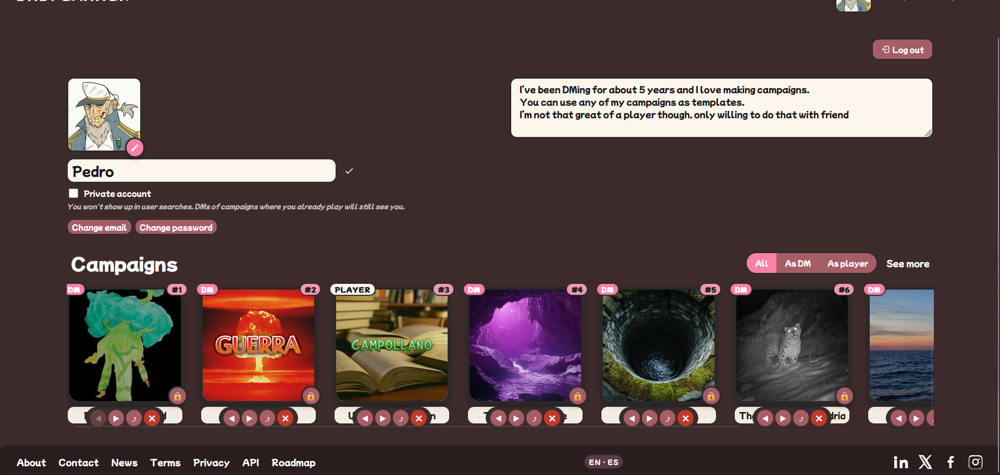
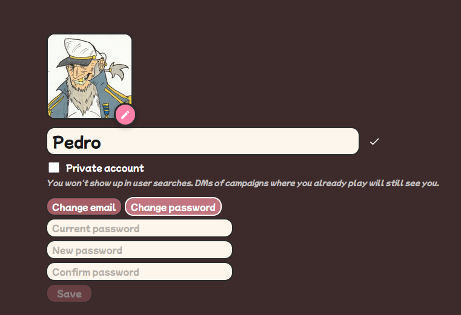
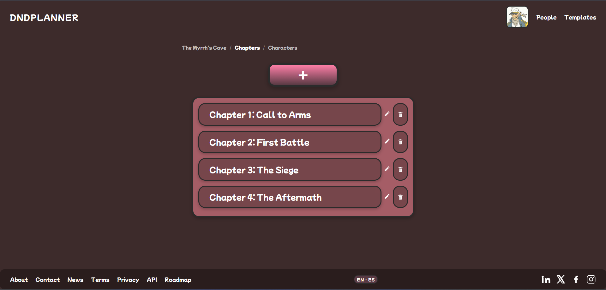
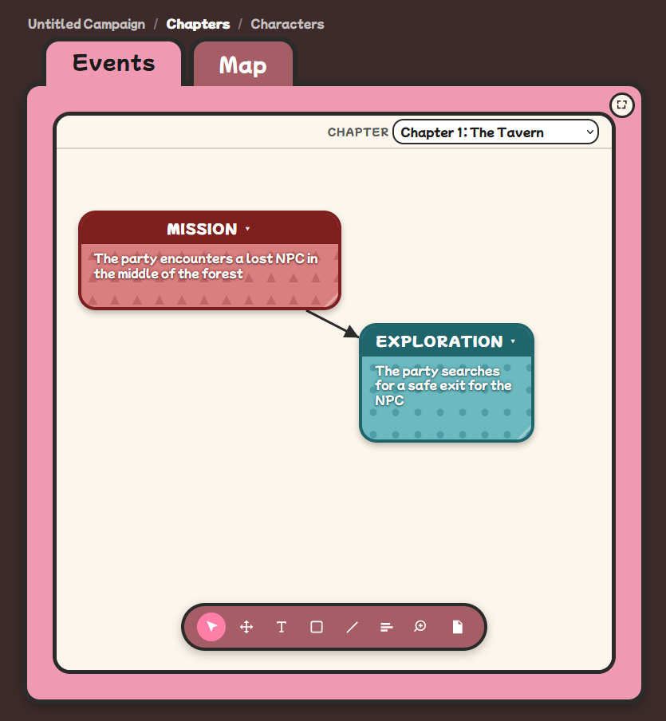
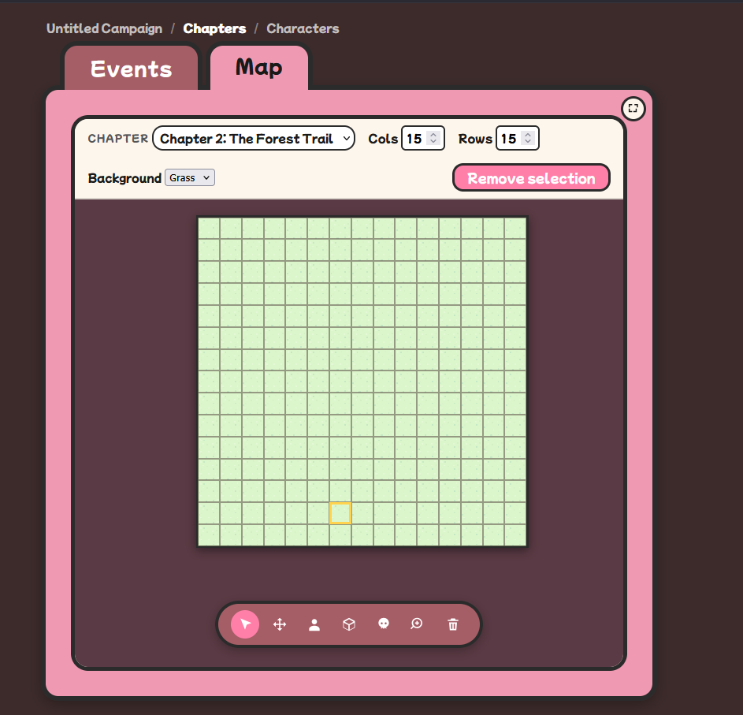
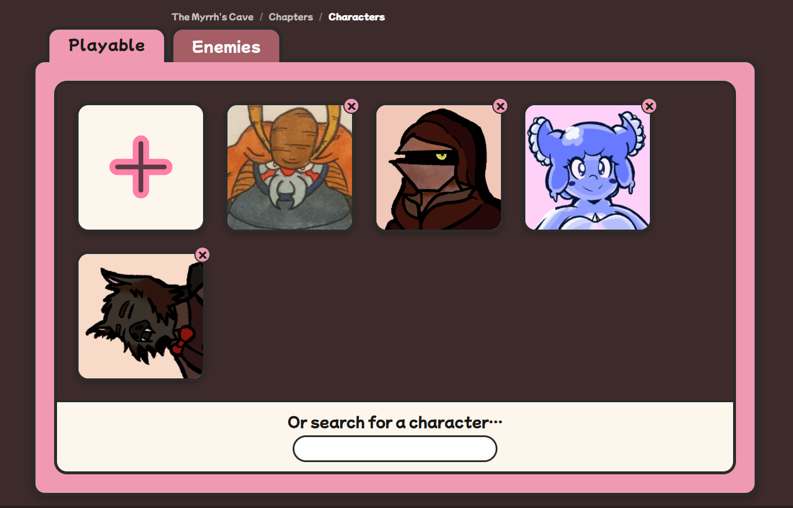
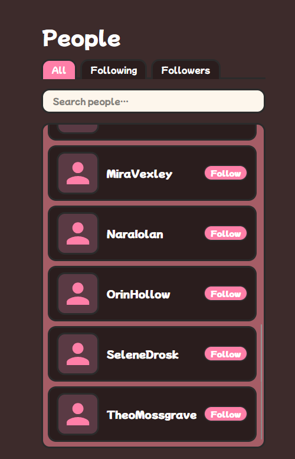

# 9. Manual de usuario

Este manual está pensado para una persona que **abre DnDPlanner por primera vez** y quiere usarlo para llevar su campaña de rol. No requiere conocimientos técnicos: si has usado Instagram o Discord, sabrás usar esto.

Si lo que buscas es **cómo instalar** la aplicación, ve a [03-instalacion.md](03-instalacion.md). Si quieres entender **cómo funciona por dentro**, lee [05-diseno.md](05-diseno.md).

---

## 9.1. Primer contacto

Al abrir DnDPlanner verás una página de bienvenida con dos botones grandes y, debajo, una fila horizontal con algunas **campañas públicas destacadas** (puedes hacer scroll lateral para curiosear sin registrarte).

Tienes tres caminos posibles desde aquí:

| Opción | Para quién | Cómo |
|---|---|---|
| **Registrarse** | Si vas a usar la app en serio. | Botón "Register" → formulario corto. |
| **Iniciar sesión** | Si ya tienes cuenta. | Botón "Sign in". |
| **Modo Testing** | Si solo quieres probar la app sin crear cuenta. | Sign in con usuario `Testing` y contraseña `1234QWer`. |

> 💡 **Sobre el modo Testing**
> Es una cuenta de demostración que **vive solo en tu navegador**: todo lo que crees, edites o borres se guarda en tu propio dispositivo (no en la nube). Es ideal para probar la aplicación sin compromiso. Al cambiar de navegador o limpiar la caché, esos datos desaparecen.

---

## 9.2. Crear una cuenta

Tras pulsar **Register**, rellena:

| Campo | Requisitos |
|---|---|
| **Username** | 3–30 caracteres, letras y números. Será visible para otros usuarios. |
| **Email** | Formato válido. Solo se usa internamente, no se publica. |
| **Contraseña** | Mínimo 8 caracteres, con al menos una mayúscula y un número. |
| **Confirmar contraseña** | Debe coincidir con la anterior. |

Al pulsar "Crear cuenta" entrarás automáticamente. No hay correo de confirmación: la cuenta queda lista al instante.

> ⚠️ **Si el username ya existe**, verás un mensaje en rojo bajo el campo. Prueba otro nombre.

---

## 9.3. Tu página principal (`/main`)

Una vez con sesión iniciada, la portada cambia: arriba sigue el banner pero **debajo aparecen dos filas**:

1. **Tus campañas**: las que has creado o en las que eres miembro.
2. **Campañas destacadas**: campañas públicas de otros usuarios.

Cada fila es un carrusel horizontal: en móvil deslizas con el dedo; en escritorio aparecen flechas a izquierda y derecha.

En la **barra superior** (header) tienes:

| Icono / botón | Para qué |
|---|---|
| 🏠 Logo | Vuelve a `/main`. |
| 🔍 Buscador | Encuentra campañas o usuarios por nombre. |
| 👤 Tu avatar | Menú con "Mi perfil", "Usuarios", "Plantillas", idioma ES/EN, "Cerrar sesión". |

---

## 9.4. Tu perfil

Pulsa tu avatar (esquina superior derecha) → **Mi perfil**.

La página muestra:

- **Tu avatar** (puedes subir uno desde el botón ✏ Editar).
- **Tu nombre** y **descripción** (también editables).
- **Tus campañas**, cada una con una etiqueta de tu rol (DM / Co-DM / Player) y un orden personalizable.
- **Seguidores** y **seguidos**.

### 9.4.1. Editar tu perfil

Pulsa **✏ Editar** y el modo edición se activa:

Puedes:

- **Cambiar tu avatar** (clic en la cámara sobre el retrato).
- **Renombrarte** y **cambiar la descripción** (clic en el texto y escribir).
- **Activar el modo privado** (toggle): tu perfil dejará de aparecer en la página de Usuarios y solo será accesible para quienes ya te siguen.
- **Reordenar tus campañas** con las flechas `◀ ▶` debajo de cada una.
- **Cambiar la portada** de cada campaña con el botón 🖼.
- **Eliminar una campaña** con el botón ×. ⚠️ Esta acción es **irreversible**.
- **Renombrar una campaña** escribiendo en su nombre.

### 9.4.2. Cambiar email o contraseña

En modo edición, busca la sección **🔒 Seguridad** al final.

- **Cambio de email**: introduce el nuevo email. Se aplica de inmediato.
- **Cambio de contraseña**: introduce la contraseña actual + la nueva + confirmación.

Si te equivocas, aparecerá un mensaje en rojo bajo el formulario.

---

## 9.5. Crear tu primera campaña

Desde tu perfil o desde el menú, pulsa **+ Nueva campaña**.

Verás un wizard con cinco opciones:

| Plantilla | Para qué |
|---|---|
| **Blank** | Campaña totalmente vacía. Empiezas de cero. |
| **Campollano** | 12 capítulos pre-rellenados de una campaña casera. |
| **Resacón** | 5 capítulos basados en la peli "Resacón". |
| **GUERRA** | 4 capítulos de campaña bélica corta. |
| **Destinos Cruzados** | 7 capítulos de fantasía clásica. |

Pulsa la que quieras, escribe el nombre y confirma. Llegarás al **hub de tu nueva campaña** como **DM**.

> 💡 **¿Cuál plantilla elegir?**
> Si no estás seguro, empieza con **Blank**. Las demás son útiles si quieres ver cómo se ve una campaña ya rellena, o si vas a jugar una de esas aventuras concretas.

---

## 9.6. Dentro de una campaña

El hub es la pantalla principal de una campaña. Tiene **dos tarjetas grandes**:

- **📖 Capítulos**: la línea narrativa de la campaña.
- **👥 Personajes**: fichas de jugadores y enemigos.

Y una **barra superior** con (solo visible si tienes permisos):

| Elemento | Para qué | Quién puede |
|---|---|---|
| **Nombre de campaña** | Clic para renombrar. | DM / Co-DM |
| **🔒 / 🌐** | Cambia visibilidad pública/privada. | DM / Co-DM |
| **🖼** | Cambia la imagen de portada. | DM / Co-DM |
| **Miembros · N** | Abre el panel de miembros. | Todos (pero solo DM/Co-DM editan). |
| **🗑 Eliminar campaña** | Borra la campaña por completo. | Solo DM (owner) |

---

## 9.7. Invitar a tus amigos

Pulsa **Miembros · N** en la barra superior del hub.

Si eres DM o Co-DM puedes:

1. **Cambiar el rol** de cada miembro con el dropdown:
   - **DM**: control total.
   - **Co-DM**: como DM pero no puede eliminar la campaña.
   - **Player**: solo edita su(s) personaje(s) asignado(s); el resto en solo lectura.
2. **Asignar un personaje** a un jugador (dropdown junto al rol).
3. **Expulsar** a un miembro con el botón **×**.
4. **Compartir** la campaña: pulsa **🔗 Generar link de invitación**. Se crea una URL con un token único. Cualquiera con ese link y autenticado se une automáticamente como Jugador.

> 💡 **¿Cómo invitar a alguien que aún no tiene cuenta?**
> Mándale el link igualmente: al abrirlo, la página le pedirá registrarse / iniciar sesión y, en cuanto lo haga, se le añadirá automáticamente como miembro.

> ⚠️ **Regenerar el link**
> Si crees que el link se ha filtrado o quieres dejar de aceptar gente, pulsa "Regenerar". El antiguo deja de funcionar al instante.

---

## 9.8. Trabajar con capítulos y eventos

Desde el hub, pulsa **📖 Capítulos** para ver la lista.

Cada capítulo representa una **sesión** o **bloque narrativo** de la campaña.

Para crear uno nuevo: **+ Nuevo capítulo** (solo DM/Co-DM). Para entrar en uno: clic en su fila.

### 9.8.1. Dentro de un capítulo

Al entrar a un capítulo verás dos pestañas:

- **📝 Eventos**: el timeline narrativo.
- **🗺 Mapa**: el mapa táctico (sección 9.9).

Los **eventos** son anotaciones narrativas. Sirven para apuntar:

- "Los jugadores conocieron a Drizzt en el bosque."
- "Combate contra el goblin chamán: HP -8."
- "Se descubrió el mapa al tesoro escondido."

Cualquier miembro puede **leer** los eventos. Para **crear / editar / borrar** se necesita ser DM o Co-DM.

Cada evento puede tener **comentarios anidados** (replies), pensados para que los jugadores hagan acotaciones desde el punto de vista de su personaje.

### 9.8.2. Tipos de evento

Al crear un evento puedes asignarle un tipo (icono y color):

| Tipo | Para qué |
|---|---|
| Mission | Misión / objetivo. |
| Combat | Combate. |
| MainStory | Hilo principal. |
| CharacterArc | Arco de personaje. |
| Exploration | Exploración. |
| Social | Interacción social / diálogo. |
| Rest | Descanso. |
| Other | Cualquier otra cosa. |

---

## 9.9. El mapa táctico

El componente más potente (y divertido) de la aplicación. Desde un capítulo, pulsa la pestaña **🗺 Mapa**.

### 9.9.1. La barra de herramientas

| Herramienta | Qué hace |
|---|---|
| ✋ **Mover** | Selecciona y arrastra fichas por la cuadrícula. |
| 🖌 **Pintar terreno** | Aplica un color/tipo a las celdas: montaña, agua, bosque, llano, lava, etc. |
| 📍 **Anotar** | Coloca una chincheta con texto. Hover para ver. |
| 🗑 **Borrar** | Elimina contenido de la celda (terreno, anotación o ficha). |
| ➕ **Añadir ficha** | Abre el selector de personajes para colocar una nueva ficha. |

### 9.9.2. Popup de stats

Click en cualquier ficha → se abre un **popup** con la información básica del personaje: HP, AC, iniciativa, stats principales. Útil durante el combate.

### 9.9.3. Los jugadores en el mapa

Los **jugadores** ven el mapa pero no pueden editarlo: la barra de herramientas aparece en gris con un mensaje "solo lectura". Pueden, sin embargo, abrir el **popup de stats** de cualquier ficha (representa la información que sabe la mesa).

> 💡 **¿Por qué los jugadores no pueden mover fichas?**
> El control del mapa pertenece al DM, igual que en una mesa física donde el DM controla las miniaturas. Si quieres que un jugador pueda mover su propia ficha, dale rol **Co-DM** temporalmente.

### 9.9.4. Sincronización en tiempo real

Si dos miembros tienen el mismo mapa abierto, **los cambios se ven al instante** en ambas pantallas. No hace falta refrescar.

---

## 9.10. Hojas de personaje

Desde el hub, pulsa **👥 Personajes**. Verás dos pestañas: **Jugadores** y **Enemigos**.

Para **crear un personaje** pulsa **+ Nuevo personaje** (solo DM / Co-DM). Para **abrir una hoja** existente, clic en su tarjeta.

### 9.10.1. Anatomía de la hoja

| Sección | Contenido |
|---|---|
| **Cabecera** | Retrato, nombre, clase, raza, nivel, alineamiento, background. |
| **Stats principales** | STR / DEX / CON / INT / WIS / CHA con su modificador calculado automáticamente. |
| **Panel de combate** | HP actual / máximo / temporal, AC, iniciativa, velocidad. |
| **Habilidades** | Lista (Athletics, Perception, Stealth…) con toggle de competencia. |
| **Hechizos** | Lista editable. |
| **Inventario** | Items con nombre y cantidad. |
| **Ataques** | Lista de ataques con bonus y dado de daño. |
| **Descripción** | Texto libre para backstory y notas. |

### 9.10.2. Edición inline

Casi todos los campos son **editables haciendo clic en ellos**. No hay un botón "Guardar": los cambios se guardan automáticamente con un pequeño retraso (~1 segundo de espera tras la última edición).

### 9.10.3. Retrato del personaje

Pulsa el retrato → se abre el **modal de recorte**. Sube una imagen (máximo 10 MB), encuádrala con el slider de zoom y el cuadrado de recorte, y confirma. La imagen se redimensiona automáticamente a 320×320 px.

### 9.10.4. Permisos de edición

| Rol | Puede editar |
|---|---|
| **DM / Co-DM** | Cualquier personaje (jugadores y enemigos). |
| **Player** | Solo el personaje que tiene asignado. |

Los jugadores **ven** todas las hojas (incluidos enemigos), pero solo **modifican** la suya.

---

## 9.11. Plantillas

En el menú del avatar → **Plantillas**, o navegando a `/templates`.

Esta página muestra las **plantillas oficiales** (Campollano, Resacón, GUERRA, Destinos Cruzados) con su descripción completa. Puedes:

- **Ver** los capítulos que incluye cada una.
- **Crear una campaña** a partir de cualquiera de ellas con un solo clic.

---

## 9.12. Compartir tu campaña con el mundo

Si quieres que **gente no miembro** pueda ver tu campaña (por ejemplo, para mostrarla en redes o entre amigos sin que se registren), tienes dos opciones:

### 9.12.1. Campaña pública

En el hub, pulsa el icono 🔒 para cambiar a 🌐. Tu campaña aparecerá:

- En la fila "Campañas destacadas" de la portada (`/main`).
- Será accesible para cualquiera, incluso sin login, en **modo lectura**.

### 9.12.2. Link de vista privada

Si prefieres compartirla con **personas concretas** sin hacerla pública, puedes generar un **link de vista** que solo conocen ellas:

1. En el hub → Miembros → "Generar link de vista".
2. Cualquiera con ese link verá la campaña en modo lectura, **sin necesidad de cuenta**.

> 💡 **Diferencia entre los dos**
> "Pública" = aparece en el listado público.
> "Link de vista" = no aparece en listados, solo lo ven quienes tienen el link.

---

## 9.13. Otros usuarios y follow

En el menú del avatar → **Usuarios**, o en `/users`.

Esta página es el **directorio público de usuarios**. Verás:

- A todos los usuarios que **no** han marcado su perfil como privado.
- Un buscador con autocompletado.

Click en cualquier usuario → vas a su perfil.

### 9.13.1. Seguir a alguien

En el perfil de otro usuario, pulsa **Seguir**. Las campañas públicas de quienes sigues aparecen recomendadas en tu portada con prioridad. Puedes ver:

- Tus **seguidores** (quienes te siguen) en tu perfil.
- A quién **sigues** (tus following) también en tu perfil.

Para dejar de seguir: pulsa **Siguiendo ✓** (cambia a "Dejar de seguir").

---

## 9.14. Idioma

DnDPlanner está disponible en **español** e **inglés**. Para cambiar:

- Menú del avatar → **ES** / **EN**.
- El cambio es **inmediato**: no hace falta refrescar la página.

Tu preferencia se guarda y se aplicará la próxima vez que abras la app.

---

## 9.15. Casos de uso típicos

### 9.15.1. "Quiero preparar una sesión nueva"

1. Abre tu campaña.
2. Entra en **Capítulos** → crea uno nuevo con el título de la sesión (p.ej. "Sesión 7: La cueva de los goblins").
3. En la pestaña **Eventos**, añade los eventos planificados.
4. En la pestaña **Mapa**, prepara el escenario: pinta el terreno y coloca las fichas de los enemigos.
5. Cuando empiece la sesión, comparte el link con tus jugadores y al jugarla los DM/Co-DM van anotando lo que pasa en eventos.

### 9.15.2. "Soy jugador y quiero subir el HP de mi personaje"

1. Abre la campaña.
2. **Personajes** → tu personaje (debe estar asignado a ti).
3. En el panel de combate, clic en el HP actual y escribe el nuevo valor.
4. El cambio se guarda automáticamente. El DM lo ve al instante si está conectado.

### 9.15.3. "Quiero invitar a un amigo nuevo a mi campaña"

1. Hub de la campaña → **Miembros**.
2. Pulsa **Generar link de invitación**.
3. Copia el link y mándaselo por WhatsApp / Discord.
4. Cuando lo abra y se loguee (o se registre), aparecerá como miembro en la lista.

### 9.15.4. "Quiero mostrarle mi campaña a alguien sin que se registre"

1. Hub → **Miembros** → **Generar link de vista**.
2. Manda el link.
3. La persona puede ver toda la campaña en modo lectura sin necesidad de cuenta.

### 9.15.5. "Vamos a jugar en una mesa presencial con móviles"

1. El DM abre la campaña en su portátil.
2. Cada jugador abre la campaña en su móvil.
3. El DM gestiona el mapa y los eventos; cada jugador puede consultar su hoja, anotar cosas, ver el mapa.
4. Los cambios del DM aparecen al instante en los móviles (Socket.IO).
5. No hace falta WiFi local: cada dispositivo se conecta a internet por su cuenta.

---

## 9.16. Preguntas frecuentes (FAQ)

**¿Puedo usar DnDPlanner sin internet?**
Sí, pero **solo con el usuario `Testing`**. Los demás usuarios necesitan conexión porque los datos viven en el servidor.

**¿Mis datos están seguros?**
Las contraseñas se guardan hasheadas con bcrypt (nunca en claro). Los tokens de sesión tienen vida corta y se pueden revocar. La BD vive en MongoDB Atlas con backups automáticos diarios.

**¿Puedo borrar mi cuenta?**
Por ahora no hay un botón de "borrar cuenta" en la UI; está previsto como mejora futura (ver [10-conclusiones.md](10-conclusiones.md)). Mientras tanto, puedes activar el modo privado para ocultar tu perfil.

**¿Hay app para móvil?**
No hay aplicación nativa, pero la web es **completamente responsive**. Funciona en cualquier móvil moderno desde 320 px de ancho.

**¿Funciona en Safari? ¿Y en Firefox?**
Sí, en todos los navegadores modernos (Chrome, Edge, Firefox, Safari) en sus últimas dos versiones mayores.

**¿Hay alguna limitación de tamaño?**
- Cada **campaña** puede tener hasta **16 MB** (límite de MongoDB). En la práctica caben cientos de capítulos.
- Cada **retrato** se redimensiona a 320×320 px y se sube a Cloudinary (máximo 10 MB de origen).
- No hay límite del número de campañas por usuario.

**¿Puedo exportar mi campaña?**
Aún no hay un botón de exportación en la UI, pero la API REST devuelve la campaña en JSON (`GET /api/campaigns/:id`). Está en el roadmap.

**¿Y si quiero contribuir o reportar un bug?**
El proyecto es open source. Repositorio: https://github.com/arodovi852/DnDPlanner. Issues bienvenidos.

---

## 9.17. Resolución de problemas

| Síntoma | Posible causa | Qué hacer |
|---|---|---|
| "Username o contraseña incorrectos" pero estoy seguro de que están bien | Mayúsculas/minúsculas, o cuenta no creada | Verifica caps lock; si crees que la cuenta no existe, regístrate. |
| Subir un retrato falla con "Cloudinary not configured" | El servidor no tiene las claves de Cloudinary | Es una limitación del despliegue; pide al administrador que las configure. |
| El mapa no se sincroniza con otro miembro | Uno de los dos perdió la conexión a Socket.IO | Refresca la página; el cliente reconecta automáticamente. |
| "No tienes permisos para esta acción" | Tu rol en esa campaña es Player | Pide al DM que te suba a Co-DM si necesitas editar. |
| La campaña no aparece en mi listado | Has sido expulsado o el DM la borró | Pregúntale al DM. Si la campaña fue eliminada, no hay forma de recuperarla. |
| Pierdo todo el progreso al cerrar pestaña (modo Testing) | El modo Testing guarda solo en `localStorage`; al limpiar caché se pierde | Para datos persistentes, créate una cuenta real. |
| Aparece "Cannot read property... undefined" en pantalla blanca | Bug del frontend | Recarga la página; si persiste, abre un issue. |

---

> 📁 **Carpeta de assets recomendada**
> Las capturas y GIFs referenciados en este documento se guardan en `docs/assets/` con los nombres `09-*.png` / `09-*.gif`.
