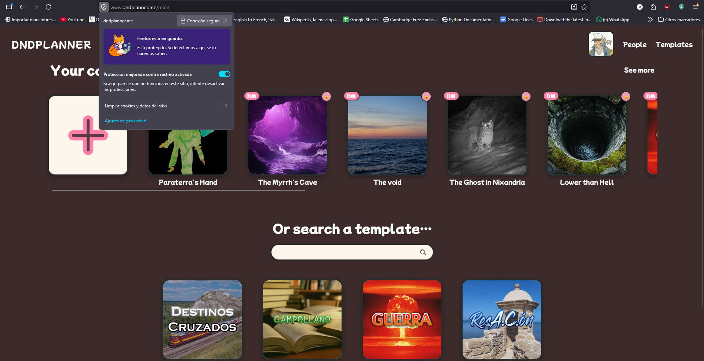

# 10. Conclusiones

## 10.1. Evaluación crítica respecto a los objetivos iniciales

En la sección [1.3.2 de la introducción](01-introduccion.md) se definieron 10 objetivos específicos (O1–O10). A continuación se evalúa el grado real de cumplimiento de cada uno, **sin maquillaje**.

| ID | Objetivo | Estado | Comentario |
|----|----------|:---:|------------|
| O1 | Autenticación robusta y multi-rol | ✅ Completado | Login/registro con validación cliente+servidor, JWT con refresh automático, tres roles (DM, Co-DM, Player) con permisos diferenciados aplicados en cliente y servidor. Cobertura de tests sobre `auth.controller.js`. |
| O2 | Modelo de datos para campañas | ✅ Completado | Mongoose schemas para `User`, `Campaign`, `Follow` con relaciones (members[], characters[], chapters[], events[]). Validaciones a nivel de schema. |
| O3 | Editor de hoja de personaje | ✅ Completado | Stats con cálculo automático de modificadores, inventario, listas de hechizos/equipo, retrato con recorte. Edición inline con debounce. |
| O4 | Editor de capítulos y eventos | ✅ Completado | Timeline de eventos por capítulo con autor, fecha y replies. |
| O5 | Mapa táctico con fichas | ✅ Completado | Cuadrícula, fichas arrastrables, terreno editable, anotaciones, popup de stats, herramienta de borrado. |
| O6 | Sincronización en tiempo real | ✅ Completado | Socket.IO con eventos por campaña. Sincronización verificada en escenario de dos pestañas. |
| O7 | Modo offline / demo | ✅ Completado | Usuario `Testing` / `1234QWer` con persistencia en `localStorage`, totalmente funcional sin backend. |
| O8 | Internacionalización | ✅ Completado | Catálogos `es` / `en` con `react-i18next`, conmutable en caliente. |
| O9 | Diseño responsive completo | ✅ Completado | Probado en 320px, 480px, 768px y escritorio. Hamburger menu, layouts apilados, footer pinned con `100dvh`. |
| O10 | Despliegue real y verificable | ✅ Completado | Desplegado en DigitalOcean App Platform, BBDD en MongoDB Atlas, dominio Name.com, HTTPS automático, CI verde en GitHub Actions. |

**Veredicto general:** los 10 objetivos específicos se cumplen. El alcance original se ha mantenido **completamente terminado** en lugar de añadir funcionalidades extra que quedaran a medias, siguiendo el consejo de la guía: *"mejor algo más pequeño, bien afinado y terminado que un proyecto ambicioso incompleto"*.

## 10.2. Grado de cumplimiento del alcance propuesto

### 10.2.1. Funcionalidades incluidas según lo planeado

Todo lo descrito en [02-descripcion.md](02-descripcion.md) está **implementado y desplegado** en producción:

- Autenticación, login/registro, cambio de email/contraseña.
- Campañas con plantillas (5 plantillas: Blank, Campollano, Resacón, GUERRA, Destinos Cruzados).
- Hub de campaña con cambio de imagen, renombrado, visibilidad y borrado.
- Sistema de miembros con tres roles y permisos.
- Invitaciones por link.
- Capítulos con eventos.
- Mapa táctico completo.
- Hojas de personaje con todas las secciones.
- Sistema de follow entre usuarios.
- Páginas de información (about, contact, news, terms, privacy, api, roadmap).
- Vista pública compartible.
- Tiempo real con Socket.IO.
- i18n ES/EN.
- Modo Testing offline.
- Responsive completo desde 320 px.

### 10.2.2. Decisiones de alcance conscientes (fuera deliberadamente)

Las siguientes características **se dejaron fuera intencionalmente** para no diluir el proyecto. La diferencia con "no terminado" es clave: se decidió excluirlas, no se intentaron sin acabar.

| Decisión excluida | Justificación |
|-------------------|---------------|
| Motor de dados virtual | Choca con la filosofía "presencial primero". |
| Combate automatizado por turnos (initiative tracker, daño aplicado) | Complejidad muy alta, fácil de hacer mal, y los grupos lo prefieren manual. |
| Compendio de reglas D&D | Bloquearía a otros sistemas (Pathfinder, Call of Cthulhu). Y supondría problemas de copyright. |
| App móvil nativa | La PWA responsive cubre el caso de uso sin necesidad de stores. |
| Feed de actividad de los usuarios seguidos | El sistema de follow está implementado pero su producto final (un feed) no aporta valor inmediato sin más usuarios. |
| Notificaciones push | Out of scope para una primera versión. |
| Marketplace de campañas o monetización | El proyecto es educativo, no comercial. |

### 10.2.3. Cosas que SE intentaron y NO funcionaron

Honestidad técnica: estos puntos sí se exploraron y se descartaron tras intentarlo.

| Intento | Por qué no funcionó | Solución actual |
|--------|---------------------|-----------------|
| Conexión local a MongoDB Atlas en desarrollo | El servidor de DNS local (red de instituto) bloquea registros SRV. | Añadido `dns.setServers(['8.8.8.8', '8.8.4.4'])` en `seed:demo` para forzar Google DNS. |
| Hot reload de Socket.IO en `vite dev` | Cualquier guardado provocaba que los clientes perdieran la sesión de socket. | Documentado: aceptado, se reconecta solo con backoff. |
| Recorte de imagen vía librería externa (`react-easy-crop`) | Excesivamente pesada para la utilidad necesaria. | Implementado a mano con canvas (~80 líneas). |
| Toggle de tema oscuro | El diseño es mono-tema. Implementar dark mode requería reescribir variables CSS. | Marcado como mejora futura. |

## 10.3. Mejoras futuras propuestas

Ordenadas por **prioridad** y **dificultad estimada**.

### 10.3.1. Corto plazo (1-2 semanas)

| Mejora | Beneficio | Dificultad |
|--------|-----------|:----------:|
| **Feed de actividad** de los usuarios seguidos en `/main`. | Aporta utilidad real al sistema de follow que ya existe. | 🟢 Baja |
| **Modo oscuro** con toggle persistido en `localStorage`. | Mejora ergonómica para sesiones nocturnas. | 🟡 Media |
| **Exportar campaña** a PDF (resumen narrativo). | Memoria física para los jugadores. | 🟡 Media |
| **Historial de cambios** por personaje (audit trail). | Resolver "quién me cambió el HP". | 🟢 Baja |
| **Tests E2E** con Playwright sobre flujos críticos. | Confianza en el despliegue. | 🟡 Media |

### 10.3.2. Medio plazo (1-2 meses)

| Mejora | Beneficio | Dificultad |
|--------|-----------|:----------:|
| **Initiative tracker** opcional (botón "abrir combate"). | Sin imponer reglas, ayudar al orden. | 🟡 Media |
| **Plantillas comunitarias.** Los DMs pueden marcar sus campañas como plantilla pública. | Crecimiento orgánico de contenido. | 🟠 Media-alta |
| **Búsqueda global** de personajes y campañas. | Discoverability. | 🟢 Baja |
| **Importar / exportar JSON** de campaña. | Backup local, portabilidad. | 🟢 Baja |
| **Reset de contraseña por email.** | Falta funcionalidad estándar. Requiere SMTP. | 🟡 Media |

### 10.3.3. Largo plazo (3+ meses)

| Mejora | Beneficio | Dificultad |
|--------|-----------|:----------:|
| **Soporte multi-sistema explícito** (selector de sistema con stats personalizados). | Atraer a no-D&D. | 🔴 Alta |
| **App PWA instalable** con notificaciones push. | UX nativa sin tienda. | 🟠 Media-alta |
| **Integración con DnDBeyond** para importar hojas de personaje. | Onboarding de usuarios existentes. | 🔴 Alta (API privada). |
| **Sala de audio integrada** (WebRTC) para sesiones híbridas. | Reemplazar Discord para grupos mixtos. | 🔴 Alta |
| **Marketplace de plantillas premium** con monetización. | Sostenibilidad. | 🔴 Alta (legal + comercial). |

## 10.4. Lecciones aprendidas

### 10.4.1. Técnicas

#### **El despliegue dicta más decisiones de las que parece.**

Se empezó desarrollando todo solo en local. Cuando llegó el momento de desplegar en DigitalOcean, habían algunas decisiones que se tendrían que haber tomado antes:
- El monorepo (`/frontend` y `/backend`) sin `package.json` en la raíz hizo que App Platform no detectara los componentes. Se tuvo que utilizar App Spec (`.do/app.yaml`).
- Los WebSockets en producción necesitan CORS exacto, headers especiales y, en el caso del proxy inverso, soporte de `Upgrade`. En desarrollo todo funciona porque Vite tiene su propio dev server.
- Las variables de entorno se gestionan completamente distinto en producción que en desarrollo. Tuve que reestructurar `.env`, `.env.example`, y la documentación.

**Lección:** desplegar pronto, aunque sea un "Hello World", y reinyectar lo aprendido al ciclo de desarrollo.

#### **El responsive móvil no se "ajusta al final": se diseña primero.**

La primera versión funcionaba bien en escritorio. Cuando se empezó a probar en 320 px aparecieron decenas de problemas: filas horizontales que se salen, modales que tapan el teclado, footers que flotan en mitad de la pantalla con el rubber-band de iOS. Cada uno requería rediseñar el componente, no parchearlo con un `@media`.

**Lección:** diseñar mobile-first **de verdad**, no como adorno. El esfuerzo de hacer un responsive correcto al final es 3-4× el de hacerlo bien desde el principio.

#### **MongoDB Atlas es magia salvo cuando no lo es.**

Atlas funciona perfectamente desde cualquier sitio con internet limpio. Pero la red del centro educativo bloquea DNS SRV, así que conexiones aparentemente triviales (`mongodb+srv://…`) fallan con un error opaco (`querySrv ECONNREFUSED`). La solución fue cambiar los DNS programáticamente en el script de seed. Conviene **anticipar el entorno final** del usuario evaluador.

**Lección:** documentar el troubleshooting de red en el README/DEPLOYMENT es tan crítico como el código.

#### **TypeScript no es un escudo automático: hay que invertir en sus tipos.**

Al principio usé `any` con frecuencia para "salir del paso". Cada `any` que dejaba acababa convirtiéndose en un bug. Reescribir los contextos (`AuthContext`, `CampaignContext`) con tipos completos eliminó toda una clase de errores y aceleró la refactorización.

**Lección:** un proyecto TypeScript con buenos tipos no es "más lento", es **más rápido** desde la 3ª semana.

#### **Las pruebas que no se ejecutan en CI no existen.**

Tenía tests en `backend/tests/` pero los ejecutaba "a mano" antes de pushear. Inevitablemente, en una sesión apurada, pusheé código que rompía un test. El CI (GitHub Actions) lo detectó al instante en el siguiente push y aprendí la lección: **el CI cierra el lazo**.

### 10.4.2. De gestión

#### **Commits frecuentes, no perfectos.**

Empecé queriendo hacer "commits perfectos" agrupando cambios coherentes. El resultado fue commits enormes muy difíciles de revisar. Cambié a commits pequeños y descriptivos, incluso a costa de tener algunos con código "incompleto pero estable". Resultado: pude bisectar fallos en minutos y revertir cosas sin destruir trabajo adyacente.

#### **La documentación se hace mientras se desarrolla, no después.**

La guía del proyecto lo decía y lo subestimé. Documentar al final implica reconstruir decisiones a base de memoria, lo que es lento y propenso a errores. Donde tomé notas mientras desarrollaba (`DEPLOYMENT.md`, comentarios en SCSS, JSDoc en controladores), la documentación final salió en horas. Donde no tomé notas, son días.

#### **El alcance se elige, no se descubre.**

La tentación de añadir "una cosa más" es constante. Cada vez que dije "voy a meter X", aparecieron tres cosas más detrás (X depende de Y, Y depende de Z…). Aprendí a aplicar el filtro: *¿este feature me hace ganar puntos en la rúbrica o solo me hace feliz?* Si la respuesta es la segunda, lo dejo para "10.3 Mejoras futuras".

### 10.4.3. Sobre la herramienta como producto

#### **Los permisos son una feature, no un detalle de implementación.**

Implementar los tres roles (DM/Co-DM/Player) con permisos diferenciados no es "guardar un campo en la BBDD". Es decisión de UI (qué se ve), decisión de UX (qué se entiende), decisión de seguridad (qué responde el backend ante un cliente "rebelde") y decisión de testing (verificar los tres flujos). La hice tarde y tuve que ir parche a parche. Otro proyecto, lo haría desde el sprint 1.

#### **El modo demo offline ha sido el mejor regalo a mí mismo.**

Empecé el modo `Testing` para la defensa, pensando "por si falla el wifi". Acabó siendo la herramienta que uso para todas las capturas de pantalla, todas las pruebas manuales de UI, todos los GIFs de la documentación. Reduce la fricción de "tener el backend levantado" en cada sesión de trabajo. Un proyecto sin un modo offline es un proyecto con una capa más de fragilidad.

## 10.5. Reflexión final

El proyecto ha cumplido las expectativas técnicas iniciales y, sobre todo, ha cumplido el objetivo personal de **terminar lo empezado**. Es el primer proyecto desplegado en producción, con dominio propio, HTTPS, BBDD persistente y CI/CD por cuenta propia, así que definitivamente ha sido un reto. Ese paso de "funciona en mi máquina" a "funciona y es accesible" es posiblemente el salto más grande del ciclo formativo y es algo que solo se aprende una vez se hace.

A nivel de producto, por muchas comparaciones que se hayan hecho DnDPlanner no pretende competir con Roll20 ni con Foundry, pero sí tiene un nicho real (el grupo de amigos que juega en persona y quiere ayuda digital ligera) y, lo más importante, **es mía**: cada decisión de UI, cada relación de BBDD, cada línea de SCSS tiene un propósito. Y ya no solo eso, sino que el haber podido implementar ciertos elementos de Photoshop o pixel art en el proyecto hace que este se vuelva aún más personal. Eso es una de las cosas más importantes de todo esto.

Si en una segunda iteración se tuviera que reescribir el proyecto, **mantendría la arquitectura** (React + Express + MongoDB es buena combinación para este caso) pero invertiría desde el día uno en:

1. Tipos TypeScript completos en ambos extremos.
2. CI/CD funcionando desde el primer push.
3. Despliegue en producción desde la semana 2.
4. Tests E2E desde el inicio, no como añadido.
5. Documentación viva en `docs/` en lugar de en mi cabeza.

Si algo me llevo de aquí no es el código en sí (en seis meses probablemente estará anticuado), sino esos **cinco hábitos**. Esa es la lección más valiosa.

